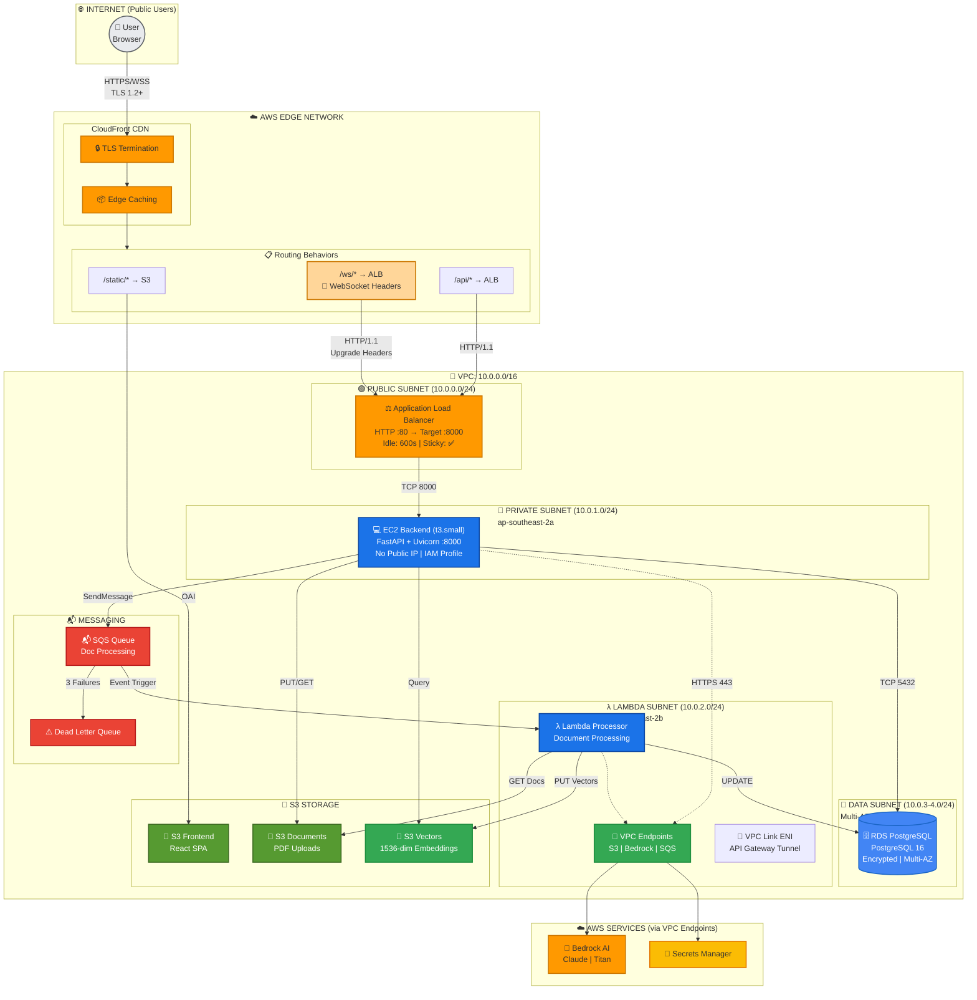
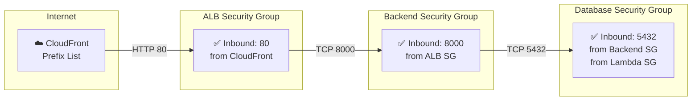
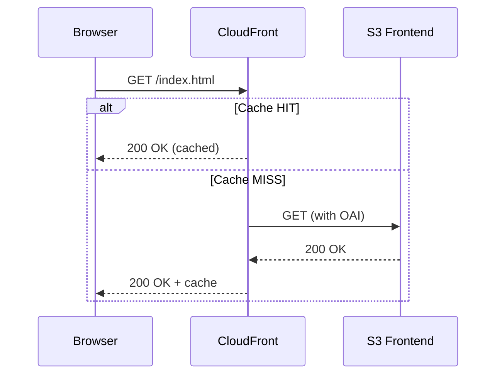
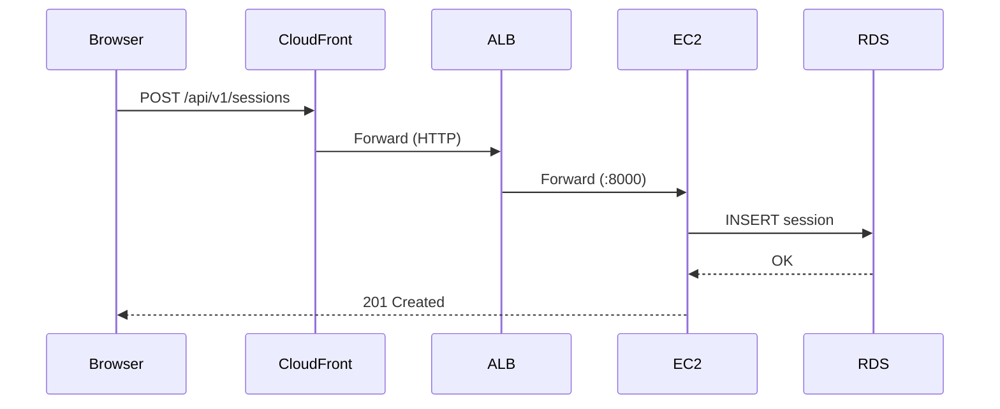
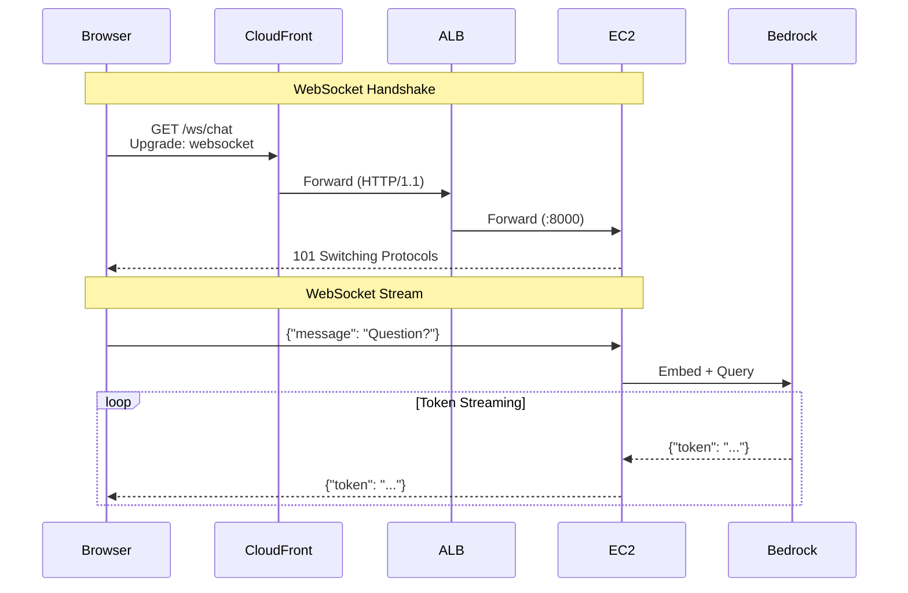

# 🏗 Student Helper Infrastructure as Code (IAC)

> **Educational Documentation** for deploying and understanding the Student Helper cloud architecture.

This document provides both a quick reference and links to detailed educational resources for the Student Helper infrastructure. Built with **Pulumi** + **Python** targeting **AWS ap-southeast-2 (Sydney)**.

---

## 📚 Documentation Index

| Document                                                                                       | Purpose                                                              |
| ---------------------------------------------------------------------------------------------- | -------------------------------------------------------------------- |
| **This README**                                                                                | Quick reference and architecture overview                            |
| **[diagrams/ARCHITECTS_DEPLOYMENT_CHECKLIST.md](diagrams/ARCHITECTS_DEPLOYMENT_CHECKLIST.md)** | 🎓 **New to Architecture?** Step-by-step learning & validation guide |
| **[diagrams/NETWORKING_DEEP_DIVE.md](diagrams/NETWORKING_DEEP_DIVE.md)**                       | 🔌 Protocol flows, security zones, troubleshooting                   |
| **[diagrams/IAC_COMPREHENSIVE_GUIDE.md](diagrams/IAC_COMPREHENSIVE_GUIDE.md)**                 | 📝 Complete IAC code walkthrough with patterns explained             |

---

## 🎯 Architecture at a Glance



---

## 🕐 "The Clock" Connection: Why It Matters

### The Problem We Solved

Previously, WebSocket connections failed with **1006 Abnormal Closure** errors because:

```
❌ Old Path: User → API Gateway (WebSocket API) → VPC Link → ALB → EC2
   Problem: API Gateway WebSocket uses webhook-style callbacks ($connect/$disconnect)
            Your FastAPI expects raw RFC 6455 WebSocket protocol
            Result: Protocol mismatch, immediate disconnection
```

### The Solution

```
✅ New Path: User → CloudFront → ALB → EC2
   Solution: CloudFront passes through Upgrade headers untouched
             ALB maintains HTTP/1.1 for WebSocket upgrade
             EC2 receives actual WebSocket handshake
             Result: Real-time streaming works!
```

> 📖 **For detailed protocol flows and troubleshooting, see [NETWORKING_DEEP_DIVE.md](diagrams/NETWORKING_DEEP_DIVE.md)**

---

## 🔌 Network Component Map

### Layer 1: Edge (Public Internet)

| Component       | Configuration               | Purpose                              |
| --------------- | --------------------------- | ------------------------------------ |
| **CloudFront**  | d1234.cloudfront.net        | Global CDN, TLS termination, routing |
| **S3 Frontend** | student-helper-dev-frontend | Static React SPA assets              |

### Layer 2: Compute (Private VPC)

| Component  | Configuration            | Purpose                       |
| ---------- | ------------------------ | ----------------------------- |
| **ALB**    | Internet-facing, port 80 | Load balancing, health checks |
| **EC2**    | t3.small, port 8000      | FastAPI + Uvicorn             |
| **Lambda** | 512MB-1GB, VPC-enabled   | Async document processing     |

### Layer 3: Data (Isolated)

| Component        | Configuration            | Purpose                  |
| ---------------- | ------------------------ | ------------------------ |
| **RDS**          | PostgreSQL 16, encrypted | Sessions, jobs, metadata |
| **S3 Documents** | Versioned, encrypted     | PDF uploads              |
| **S3 Vectors**   | 1536-dim, cosine metric  | Vector embeddings        |

---

## 🛡️ Security Group Chain



**Key Security Features:**

- 🔒 **CloudFront Prefix List**: ALB only accepts traffic from CloudFront edge IPs
- 🔒 **Security Group References**: Rules reference SG IDs, not IP addresses (auto-updates)
- 🔒 **No Public IPs**: EC2 and RDS have no direct internet access
- 🔒 **VPC Endpoints**: AWS services accessed over private network

---

## 🧠 Core Concepts Quick Reference

> These concepts are documented in detail in each module's docstring. This is a quick reference.

### Networking Fundamentals

| Concept                               | What It Does                                                                   |
| ------------------------------------- | ------------------------------------------------------------------------------ |
| **Local Route (10.0.0.0/16 → local)** | Automatic VPC route. All subnets can talk to each other without configuration. |
| **0.0.0.0/0 → IGW**                   | "Send everything else to the internet." Enables bidirectional internet access. |
| **Route Table Association**           | Links a subnet to a route table. Without it, the subnet uses the default.      |

### VPC Link vs VPC Endpoint (Common Confusion!)

| Component        | Direction            | Purpose                                                                         |
| ---------------- | -------------------- | ------------------------------------------------------------------------------- |
| **VPC Endpoint** | OUTBOUND (VPC → AWS) | Lets your private EC2/Lambda reach AWS services (S3, Bedrock) without internet. |
| **VPC Link**     | INBOUND (AWS → VPC)  | Lets API Gateway (a public AWS service) tunnel INTO your private VPC.           |

### Security Groups

| Concept                  | Meaning                                                                      |
| ------------------------ | ---------------------------------------------------------------------------- |
| **Stateful**             | Allow inbound → reply automatically allowed outbound (no extra rule needed). |
| **Identity-based rules** | `referenced_security_group_id` = allow by "badge", not by IP.                |
| **Default stance**       | Inbound: DENY ALL. Outbound: ALLOW ALL.                                      |

### ALB Chain

| Resource          | Analogy                | Purpose                                          |
| ----------------- | ---------------------- | ------------------------------------------------ |
| **Load Balancer** | The building           | Has a DNS name, receives all traffic             |
| **Listener**      | The door (port 80/443) | Binds to a port, defines what to do with traffic |
| **Target Group**  | The employee pool      | Healthy EC2 instances to forward to              |

### CloudFront Strategy

| Path          | Destination | Caching                                  |
| ------------- | ----------- | ---------------------------------------- |
| `/` (default) | S3 Frontend | ✅ Cached globally                       |
| `/api/*`      | ALB Backend | ❌ No cache                              |
| `/ws/*`       | ALB Backend | ❌ No cache, WebSocket headers forwarded |

> 📖 **For detailed explanations, read the docstrings in each component file.**

## 📊 Complete Request Flow Diagrams

### Static Asset Request



### REST API Request



### WebSocket Streaming (RAG Chat)



---

## 📁 Project Structure

```
IAC/
├── __main__.py              # 🎯 Entry point: Orchestrates all components
├── Pulumi.yaml              # Base config
├── Pulumi.dev.yaml          # Dev environment overrides
├── Pulumi.prod.yaml         # Prod environment overrides
│
├── configs/
│   ├── constants.py         # CIDRs, ports, defaults
│   ├── base.py              # EnvironmentConfig dataclass
│   └── environment.py       # Config loader
│
├── utils/
│   ├── naming.py            # Resource naming conventions
│   └── tags.py              # AWS tagging factory
│
├── components/
│   ├── networking/
│   │   ├── vpc.py           # VPC, subnets, route tables
│   │   ├── security_groups.py # 5 security groups
│   │   └── vpc_endpoints.py # S3, SQS, Bedrock, Secrets endpoints
│   │
│   ├── security/
│   │   ├── iam_roles.py     # EC2, Lambda execution roles
│   │   └── secrets_manager.py # API keys, DB credentials
│   │
│   ├── storage/
│   │   ├── s3_buckets.py    # Documents, Vectors, Frontend
│   │   ├── rds_postgres.py  # PostgreSQL database
│   │   └── ecr_repository.py # Lambda container images
│   │
│   ├── messaging/
│   │   └── sqs_queues.py    # Doc processing queue + DLQ
│   │
│   ├── compute/
│   │   ├── alb.py           # Application Load Balancer
│   │   ├── ec2_backend.py   # FastAPI backend instance
│   │   └── lambda_processor.py # Document processor
│   │
│   └── edge/
│       ├── cloudfront.py    # CDN distribution
│       └── api_gateway.py   # HTTP API with VPC Link
│
└── diagrams/
    ├── NETWORKING_DEEP_DIVE.md      # 🎓 Protocol & troubleshooting guide
    └── IAC_COMPREHENSIVE_GUIDE.md   # Complete code walkthrough
```

---

## 🚀 Deployment

### Prerequisites

```powershell
# Install Pulumi
choco install pulumi

# Install AWS CLI
choco install awscli

# Configure AWS credentials
aws configure
```

### Deploy

```powershell
# Navigate to IAC directory
cd IAC

# Select environment
pulumi stack select dev

# Preview changes
pulumi preview

# Deploy
pulumi up

# View outputs
pulumi stack output
```

### Common Issues

| Issue                 | Cause                   | Solution                                   |
| --------------------- | ----------------------- | ------------------------------------------ |
| WebSocket 1006        | ALB timeout too short   | Set `idle_timeout=600`                     |
| 502 Bad Gateway       | EC2 unhealthy           | Check /api/v1/health endpoint              |
| Can't create ALB      | Subnet misconfiguration | Use public subnets for internet-facing ALB |
| No AWS service access | Missing VPC endpoints   | Create endpoints for S3, Bedrock, SQS      |

> 📖 **For detailed troubleshooting flowcharts, see [NETWORKING_DEEP_DIVE.md](diagrams/NETWORKING_DEEP_DIVE.md#common-deployment-issues--troubleshooting)**

---

## 🔧 Key Configuration Values

### Networking

| Setting        | Value         | File                 |
| -------------- | ------------- | -------------------- |
| VPC CIDR       | 10.0.0.0/16   | configs/constants.py |
| Public Subnet  | 10.0.0.0/24   | configs/constants.py |
| Private Subnet | 10.0.1.0/24   | configs/constants.py |
| Lambda Subnet  | 10.0.2.0/24   | configs/constants.py |
| Data Subnets   | 10.0.3-4.0/24 | configs/constants.py |

### Timeouts

| Setting               | Value | Purpose                  |
| --------------------- | ----- | ------------------------ |
| ALB Idle Timeout      | 600s  | WebSocket keep-alive     |
| Target Deregistration | 300s  | Graceful shutdown        |
| Health Check Interval | 30s   | Target health monitoring |

### Protocols

| Path                 | Protocol         | Encryption        |
| -------------------- | ---------------- | ----------------- |
| Browser → CloudFront | HTTPS (TLS 1.2+) | ✅                |
| CloudFront → ALB     | HTTP/1.1         | ❌ (AWS backbone) |
| ALB → EC2            | HTTP             | ❌ (VPC internal) |
| EC2 → RDS            | PostgreSQL       | ❌ (VPC internal) |

---

## 📚 Learn More

- **[NETWORKING_DEEP_DIVE.md](diagrams/NETWORKING_DEEP_DIVE.md)** - Protocol flows, security zones, troubleshooting
- **[IAC_COMPREHENSIVE_GUIDE.md](diagrams/IAC_COMPREHENSIVE_GUIDE.md)** - Complete code walkthrough with patterns

---

_Infrastructure as Code for Student Helper RAG Application_
_Built with Pulumi + Python + AWS_
