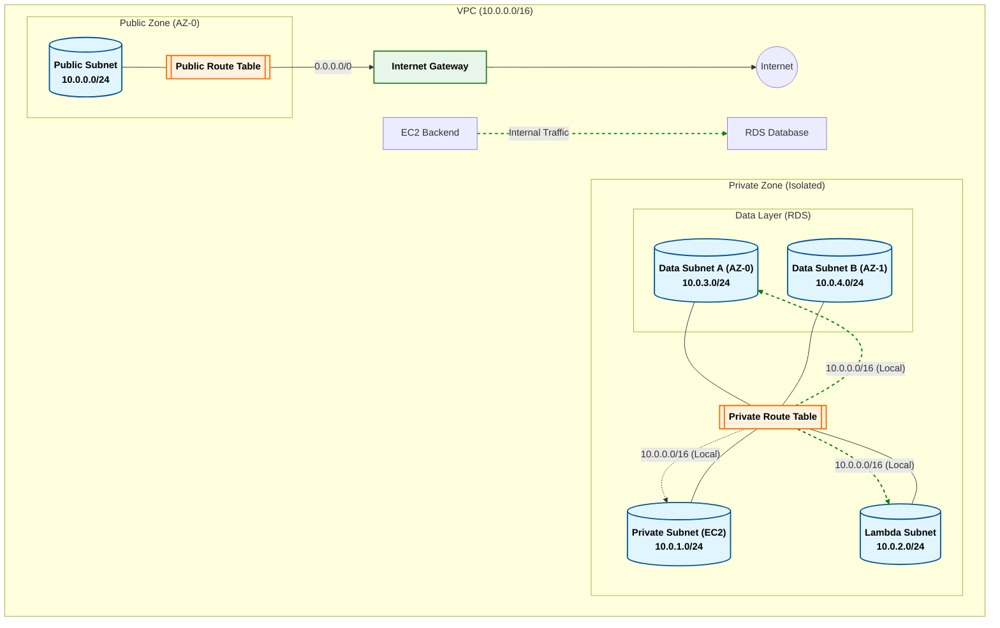

# Networking Component Documentation

This directory contains the networking infrastructure definitions for the Student Helper application.

## VPC Architecture Diagram

## Key Components

1.  **VPC**: The isolated network container.
2.  **Internet Gateway (IGW)**: The exit point for public traffic.
3.  **Route Tables**:
    - **Public**: Directs traffic to IGW (0.0.0.0/0).
    - **Private**: No internet access. Uses implicit local route (10.0.0.0/16) for internal communication.
4.  **Subnets**:
    - **Public**: For NAT Gateway (if needed) or public resources.
    - **Private/Lambda/Data**: Isolated subnets for application logic and storage.
