# Comprehensive IAC (Infrastructure as Code) Guide

## Overview

This document provides a deep technical explanation of the Student Helper RAG application's Infrastructure as Code (IAC) using Pulumi. It explains every component, how they interconnect, and their roles in the three-tier cloud architecture defined in [documentation/infra/cloud-architecture.md](documentation/infra/cloud-architecture.md).

---

## Table of Contents

1. [Architecture Overview](#architecture-overview)
2. [Project Structure](#project-structure)
3. [Configuration System](#configuration-system)
4. [Utilities](#utilities)
5. [Networking Layer](#networking-layer)
6. [Security Layer](#security-layer)
7. [Storage Layer](#storage-layer)
8. [Messaging Layer](#messaging-layer)
9. [Compute Layer](#compute-layer)
10. [Edge/CDN Layer](#edgecdn-layer)
11. [Deployment Flow](#deployment-flow)
12. [Data Flow Through Infrastructure](#data-flow-through-infrastructure)

---

## Color Scheme for Diagrams

All diagrams in this guide follow a **consistent color palette** based on AWS service categories:

| Color | Meaning | Services |
|-------|---------|----------|
| **Orange** (#FF9900) | Edge/CDN Layer | CloudFront, API Gateway |
| **Dark Blue** (#1B73E8) | Compute Resources | EC2, Lambda |
| **Light Blue** (#4285F4) | Storage & Data | S3, RDS, Databases |
| **Green** (#34A853) | Endpoints & Private Access | VPC Endpoints, PrivateLink |
| **Red** (#EA4335) | Messaging & Queues | SQS, Event streams |
| **Yellow/Gold** (#FBBC04) | Security & Secrets | IAM, Secrets Manager |
| **Light Yellow** (#FFF9E6) | Configuration | Pulumi config, utilities |
| **Light Cyan** (#B3E5FC) | Networking | VPC, Security Groups |
| **Gray** (#E8EAED) | External/Users | Users, External APIs |
| **Pink** (#FFC0CB) | Processing/Transformation | Data processing, RAG context |

Each color consistently represents the same type of resource across all diagrams, making it easier to trace data flow and understand architecture relationships.

---

## Architecture Overview


**Architecture Explanation:**

The diagram shows a three-tier AWS architecture designed for security, scalability, and clean separation of concerns:

1. **Edge Layer (Orange)** - The public-facing components. **CloudFront** caches frontend assets globally, reducing latency. **API Gateway** provides the only HTTP endpoint and routes traffic privately to EC2 via **VPC Link** (EC2 has no public IP, only accessible through the load balancer). This architecture prevents direct internet access to backend infrastructure.

2. **Compute Layer (Dark Blue)** - Private resources in isolated subnets. **EC2** runs the FastAPI REST API and is only reachable via API Gateway. **Lambda** processes documents asynchronously, triggered by SQS messages. This separation allows heavy document processing (parsing, chunking, embedding) without blocking user requests. Lambda scales independently based on queue depth.

3. **Data Layer (Light Blue/Green)** - Persistent storage with encryption and isolation:
   - **RDS PostgreSQL**: Stores sessions, job metadata, and chat history. Encrypted at rest. Multi-AZ in production for high availability.
   - **S3 Documents**: Raw PDF uploads with versioning enabled. Encryption at rest prevents unauthorized access.
   - **S3 Vectors**: AWS native vector database storing 1536-dimensional embeddings from Amazon Titan Embeddings v2. Uses cosine similarity for semantic search, with metadata filtering on document_id, session_id, and chunk_index.

4. **Messaging (Red)** - Async job processing. **SQS** decouples upload (EC2) from processing (Lambda). 360-second visibility timeout gives Lambda 5 minutes to process before message reappears. If Lambda fails 3 times, message moves to **DLQ** for manual investigation and replay. This prevents data loss and enables retry strategies.

5. **Security (Yellow)** - Centralized credential management:
   - **Secrets Manager** stores API keys (Google, Anthropic) and DB credentials securely (never in code or environment variables).
   - **IAM Roles** grant minimal permissions via least-privilege principles. EC2 and Lambda don't need AWS credentials in code—they assume their respective roles for temporary STS credentials.

---

## Project Structure

```
IAC/
├── __init__.py                    # Package marker
├── __main__.py                    # Main orchestration entry point
├── Pulumi.yaml                    # Base Pulumi project config
├── Pulumi.dev.yaml                # Development environment config
├── Pulumi.prod.yaml               # Production environment config
│
├── configs/                        # Configuration management
│   ├── __init__.py
│   ├── constants.py               # Network CIDR blocks, ports, defaults
│   ├── base.py                    # EnvironmentConfig dataclass
│   └── environment.py             # Configuration loader from Pulumi stack
│
├── utils/                          # Utility functions
│   ├── __init__.py
│   ├── naming.py                  # Resource naming conventions
│   └── tags.py                    # AWS tagging factory
│
└── components/                     # Infrastructure components (organized by layer)
    ├── __init__.py
    ├── networking/                # VPC, subnets, security groups, endpoints
    │   ├── __init__.py
    │   ├── vpc.py                 # VPC, subnets, NAT gateway, route tables
    │   ├── security_groups.py      # 4 security groups (backend, lambda, db, endpoints)
    │   └── vpc_endpoints.py        # S3, SQS, Secrets Manager endpoints
    │
    ├── security/                  # IAM and secrets
    │   ├── __init__.py
    │   ├── iam_roles.py            # EC2 and Lambda roles with policies
    │   └── secrets_manager.py      # API keys and database credentials
    │
    ├── storage/                   # Databases and object storage
    │   ├── __init__.py
    │   ├── s3_buckets.py           # Documents, vectors, frontend buckets
    │   └── rds_postgres.py         # PostgreSQL database
    │
    ├── messaging/                 # Async job processing
    │   ├── __init__.py
    │   └── sqs_queues.py           # Main queue and DLQ with redrive policy
    │
    ├── compute/                   # EC2 and Lambda
    │   ├── __init__.py
    │   ├── ec2_backend.py          # FastAPI backend instance
    │   └── lambda_processor.py     # Document processing function
    │
    └── edge/                      # CDN and API routing
        ├── __init__.py
        ├── cloudfront.py          # CloudFront CDN distribution
        └── api_gateway.py         # HTTP API with VPC Link
```

---

## Configuration System

### [Pulumi.yaml](IAC/Pulumi.yaml)

The base Pulumi project configuration file. Defines:
- **Project name**: `student-helper-infra`
- **Runtime**: Python with virtual environment at `../.venv`
- **Description**: AWS infrastructure for Student Helper RAG application

This file is shared across all stack configurations (dev, staging, prod).

### [Pulumi.dev.yaml](IAC/Pulumi.dev.yaml)

Development environment configuration. Defines cost-optimized resources:

```yaml
aws:region: ap-southeast-2
environment: dev
ec2_instance_type: t3.micro        # Smallest burstable instance
rds_instance_class: db.t3.micro    # Minimal database
rds_allocated_storage: 20GB        # Development size
lambda_memory: 512MB               # Minimal Lambda memory
enable_deletion_protection: false  # Allow deletion during testing
multi_az: false                    # Single AZ for cost savings
```

**Role in Architecture**: Uses minimal resources for testing and development, keeping costs low while maintaining feature parity.

### [Pulumi.prod.yaml](IAC/Pulumi.prod.yaml)

Production environment configuration. Defines highly-available, resilient resources:

```yaml
aws:region: ap-southeast-2
environment: prod
ec2_instance_type: t3.small        # Suitable for sustained workload
rds_instance_class: db.t3.small    # Better performance
rds_allocated_storage: 50GB        # Production data volume
lambda_memory: 1024MB              # Better document processing performance
enable_deletion_protection: true   # Prevent accidental deletion
multi_az: true                     # High availability across AZs
```

**Role in Architecture**: Ensures production reliability with multi-AZ deployments, larger instance types, and deletion protection.

### [configs/constants.py](IAC/configs/constants.py)

Centralized constants for infrastructure definitions.

**Key Constants**:
- **VPC_CIDR**: `10.0.0.0/16` - Main VPC CIDR block
- **SUBNET_CIDRS**:
  - `10.0.1.0/24` - Private subnet (EC2 Backend)
  - `10.0.2.0/24` - Lambda subnet (Document Processor)
  - `10.0.3.0/24` - Data subnet (RDS PostgreSQL)
- **AVAILABILITY_ZONES**: `ap-southeast-2a/b/c` - Sydney region AZs
- **INSTANCE_TYPES**: Dev=t3.micro, Prod=t3.small
- **LAMBDA_DEFAULTS**: memory=512MB, timeout=300s, reserved_concurrency=10
- **SQS_DEFAULTS**: visibility_timeout=360s, retention=14 days, max_retries=3
- **PORTS**: HTTP=80, HTTPS=443, FastAPI=8000, PostgreSQL=5432

**Role in Architecture**: Provides a single source of truth for infrastructure sizing, ensuring consistency across environments and easy tuning.

### [configs/base.py](IAC/configs/base.py)

Defines the `EnvironmentConfig` frozen dataclass. Represents all environment-specific configuration loaded from Pulumi stack files.

**Properties**:
- `is_production`: Boolean flag for production environment
- `api_subdomain`: Generates API subdomain (e.g., "api.studenthelper.com")
- `get_tags()`: Returns environment-specific AWS tags

**Role in Architecture**: Provides type-safe configuration with validation, preventing configuration errors at deployment time.

### [configs/environment.py](IAC/configs/environment.py)

The `get_config()` function that loads Pulumi stack configuration and creates an `EnvironmentConfig` instance.

**Behavior**:
1. Reads Pulumi stack configuration (from `Pulumi.dev.yaml` or `Pulumi.prod.yaml`)
2. Validates required fields (`environment`, `domain`)
3. Provides sensible defaults for optional fields
4. Returns a frozen `EnvironmentConfig` object

**Role in Architecture**: Acts as the configuration loader that all components depend on, injected into component constructors.

---

## Utilities

### [utils/naming.py](IAC/utils/naming.py)

The `ResourceNamer` class generates consistent AWS resource names following the convention: `{project}-{environment}-{resource}`.

**Methods**:
- `name(resource)`: Generates standard resource name (e.g., "student-helper-dev-vpc")
- `bucket_name(suffix)`: Generates globally unique S3 bucket name
- `secret_name(name)`: Generates Secrets Manager secret path

**Example Usage**:
```python
namer = ResourceNamer(project="student-helper", environment="dev")
namer.name("vpc")              # → "student-helper-dev-vpc"
namer.bucket_name("documents") # → "student-helper-dev-documents"
namer.secret_name("google-api-key")  # → "student-helper/dev/google-api-key"
```

**Role in Architecture**: Ensures all resources have predictable, consistent names across all environments, improving operational clarity.

### [utils/tags.py](IAC/utils/tags.py)

Tag factory functions for consistent AWS resource tagging.

**Functions**:
- `create_tags(environment, resource_name, **extra_tags)`: Creates standard tag set
- `merge_tags(base_tags, *additional_tags)`: Merges multiple tag dictionaries

**Standard Tags Applied**:
- `Project`: "student-helper"
- `ManagedBy`: "pulumi"
- `Environment`: Dev/staging/prod
- `Name`: Resource name

**Role in Architecture**: Enables cost allocation, resource tracking, and automation based on tags. Critical for understanding resource ownership and billing.

---

## Networking Layer


**VPC Networking Explanation:**

The VPC implements a **secure, layered network design** with separate subnets for each function:

- **Public Tier (Orange)**: Minimal public subnet reserved for future use. Internet Gateway allows inbound traffic to CloudFront/API Gateway. EC2 and Lambda are NOT in public subnets—they have no direct internet access. This prevents exposure of backend services.

- **Private Tier (Blue)**: Three isolated subnets with VPC Endpoint access:
  - **EC2 Subnet** (10.0.1.0/24): Hosts the FastAPI backend. All inbound traffic must come through API Gateway's VPC Link. All outbound AWS service access goes through VPC Endpoints.
  - **Lambda Subnet** (10.0.2.0/24): VPC-enabled Lambda functions. Access RDS via private networking and Bedrock via VPC Endpoint for embeddings.
  - **Data Subnet** (10.0.3.0/24): Only RDS database instances here. Zero public access, only reachable from EC2 and Lambda subnets via security group rules.

- **Routing Strategy**: Private subnets have NO default internet route. All AWS service access (Bedrock, S3, SQS, Secrets Manager) goes through VPC Endpoints. This eliminates data transfer costs and improves security.
  - External users CANNOT initiate connections to EC2 or Lambda (zero public access)
  - VPC Endpoints provide private connectivity to AWS services

### [components/networking/vpc.py](IAC/components/networking/vpc.py)

Creates the VPC with subnets, Internet Gateway, and route tables.

**VPC Architecture**:


**Components Created**:

1. **VPC**: Base VPC with CIDR `10.0.0.0/16`, DNS enabled
2. **Internet Gateway**: Enables internet access for public subnet
3. **Public Subnet** (`10.0.0.0/24`): Reserved for future use
4. **Private Subnets** (3 total):
   - **Private Subnet** (`10.0.1.0/24`): EC2 backend compute
   - **Lambda Subnet** (`10.0.2.0/24`): Lambda function compute
   - **Data Subnet** (`10.0.3.0/24`): RDS database storage
5. **Route Tables**:
   - Public RT: routes `0.0.0.0/0` → IGW
   - Private RT: NO default internet route (VPC Endpoints only)

**Role in Cloud Architecture**:
- Provides isolated network for compute and data layers
- Private subnets access AWS services via VPC Endpoints (zero data transfer costs)
- Subnets separated by function (compute/Lambda/database) for security isolation
- No NAT Gateway needed - Bedrock accessed via VPC Endpoint

### [components/networking/security_groups.py](IAC/components/networking/security_groups.py)

Creates 4 security groups implementing least-privilege access control.

**Security Groups**:

```mermaid
graph TB
    subgraph "Security Groups: Least-Privilege Access Control"
        direction TB

        subgraph "Backend SG (FastAPI EC2)"
            BK1["✓ INBOUND: TCP 8000<br/>from VPC 10.0.0.0/16<br/>API Gateway VPC Link only"]
            BK2["✓ OUTBOUND: All traffic<br/>to 0.0.0.0/0<br/>External APIs, RDS, VPC Endpoints"]
        end

        subgraph "Lambda SG (Document Processor)"
            LM1["✓ INBOUND: None<br/>SQS event is AWS-managed<br/>No network ingress needed"]
            LM2["✓ OUTBOUND: All traffic<br/>to 0.0.0.0/0<br/>Google API, RDS, S3, Secrets"]
        end

        subgraph "Database SG (RDS PostgreSQL)"
            DB1["✓ INBOUND: TCP 5432<br/>from Backend SG only<br/>EC2 → RDS"]
            DB2["✓ INBOUND: TCP 5432<br/>from Lambda SG only<br/>Lambda → RDS"]
            DB3["✓ OUTBOUND: None<br/>Responses via inbound rule"]
        end

        subgraph "Endpoints SG (VPC Endpoints)"
            EP1["✓ INBOUND: TCP 443 HTTPS<br/>from Backend SG<br/>EC2 accessing S3/SQS"]
            EP2["✓ INBOUND: TCP 443 HTTPS<br/>from Lambda SG<br/>Lambda accessing Secrets"]
            EP3["✓ OUTBOUND: AWS service routes<br/>To S3, SQS, Secrets Manager"]
        end
    end

    APIGW["API Gateway<br/>VPC Link"]
    EC2["EC2<br/>Backend"]
    Lambda["Lambda<br/>Processor"]
    RDS["RDS<br/>Database"]
    VPCEnd["VPC<br/>Endpoints"]
    External["External APIs<br/>Google, Anthropic"]

    APIGW -->|TCP 8000| BK1
    BK2 -->|connects| External
    BK2 -->|connects| RDS
    BK2 -->|connects| VPCEnd

    LM2 -->|connects| External
    LM2 -->|connects| RDS
    LM2 -->|connects| VPCEnd

    DB1 -->|accepts from| EC2
    DB2 -->|accepts from| Lambda

    EP1 -->|accepts from| EC2
    EP2 -->|accepts from| Lambda

    style BK1 fill:#90EE90,stroke:#2D5A2D,stroke-width:2px,color:#000
    style BK2 fill:#90EE90,stroke:#2D5A2D,stroke-width:2px,color:#000
    style LM1 fill:#90EE90,stroke:#2D5A2D,stroke-width:2px,color:#000
    style LM2 fill:#90EE90,stroke:#2D5A2D,stroke-width:2px,color:#000
    style DB1 fill:#FFB6C6,stroke:#A0325E,stroke-width:2px,color:#000
    style DB2 fill:#FFB6C6,stroke:#A0325E,stroke-width:2px,color:#000
    style DB3 fill:#FFB6C6,stroke:#A0325E,stroke-width:2px,color:#000
    style EP1 fill:#87CEEB,stroke:#005A8E,stroke-width:2px,color:#000
    style EP2 fill:#87CEEB,stroke:#005A8E,stroke-width:2px,color:#000
    style EP3 fill:#87CEEB,stroke:#005A8E,stroke-width:2px,color:#000

    style APIGW fill:#FF9900,stroke:#CC7700,stroke-width:2px,color:#000
    style EC2 fill:#1B73E8,stroke:#0D47A1,stroke-width:2px,color:#fff
    style Lambda fill:#1B73E8,stroke:#0D47A1,stroke-width:2px,color:#fff
    style RDS fill:#4285F4,stroke:#1B66C7,stroke-width:2px,color:#fff
    style VPCEnd fill:#34A853,stroke:#1E8E3E,stroke-width:2px,color:#fff
    style External fill:#E8EAED,stroke:#5F6368,stroke-width:2px,color:#000
```



**Security Groups: The Firewall Rules Between Components**

Security groups work like **stateful firewalls** at the network interface level. The diagram shows which resources can communicate:

1. **Backend SG (Green - Inbound)**:
   - **Only allows** TCP 8000 from the VPC (`10.0.0.0/16`)
   - API Gateway's VPC Link is the **only** way to reach EC2
   - Direct attempts to connect to EC2 from the internet are blocked
   - **Why**: Prevents exposure of backend services to random internet attacks

2. **Lambda SG (Green - Inbound)**:
   - **Allows nothing** on inbound
   - SQS trigger is handled by AWS infrastructure (not network-based)
   - Lambda is pull-based: it polls SQS, doesn't receive incoming connections
   - **Why**: Lambda doesn't need to be "reachable" from anywhere

3. **Database SG (Pink - Inbound)**:
   - **Only allows** TCP 5432 (PostgreSQL) from Backend SG and Lambda SG
   - RDS CANNOT be reached from the internet, public subnets, or other sources
   - **Why**: Database is only accessed by authorized compute resources

4. **Endpoints SG (Blue - Inbound)**:
   - **Only allows** TCP 443 (HTTPS) from Backend SG and Lambda SG
   - VPC Endpoints are private gateways to AWS services
   - Prevents unauthorized access to S3, SQS, Secrets Manager
   - **Why**: Keep sensitive operations on private networks, avoiding internet exposure

**Least-Privilege Principle**: Each security group grants only the **minimum permissions** needed for that resource to function. This prevents lateral movement if one resource is compromised.


### [components/networking/vpc_endpoints.py](IAC/components/networking/vpc_endpoints.py)

Creates VPC Endpoints for private AWS service access without internet gateway.

**VPC Endpoints Diagram**:


**Why VPC Endpoints Matter:**

VPC Endpoints allow private access to AWS services without internet access:
- EC2 needs S3 to store/retrieve documents
- Lambda needs SQS to receive job messages
- Both need Secrets Manager and Bedrock for AI workloads

**With VPC Endpoints (✅)**:
```
EC2 → VPC Endpoint → AWS internal network → Bedrock/S3/SQS
```
- Data never leaves AWS's private network
- Zero NAT Gateway costs (no NAT needed)
- Lower latency (direct AWS backbone)
- More secure (traffic never touches internet)

**Without VPC Endpoints (❌)**:
```
EC2 → NAT Gateway → Internet → AWS public endpoint → S3
```
- Would require NAT Gateway ($32/month + $0.045/GB)
- Data exits and re-enters AWS network
- Higher latency and security risks

**Four Types of VPC Endpoints**:

1. **S3 Gateway Endpoint**:
   - Type: Gateway (not an ENI)
   - Cost: Free
   - Routes through VPC route table
   - Used for document storage, vector storage, and frontend assets

2. **SQS Interface Endpoint**:
   - Type: Interface (PrivateLink with ENI)
   - Cost: Small hourly charge
   - Private DNS enabled
   - Used for job queue access without internet

3. **Secrets Manager Interface Endpoint**:
   - Type: Interface (PrivateLink with ENI)
   - Cost: ~$7/month
   - Private DNS enabled
   - Used to fetch secrets securely without internet

4. **Bedrock Runtime Interface Endpoint**:
   - Type: Interface (PrivateLink with ENI)
   - Cost: ~$7/month
   - Private DNS enabled
   - Used for Claude completions and Titan Embeddings

**Role in Cloud Architecture**:
- Allows EC2 and Lambda to access AWS services without internet access
- Improves security by keeping all traffic within AWS network
- Eliminates NAT Gateway costs ($32/month + data transfer)
- Enables private access to Bedrock AI models

---

## Security Layer

### [components/security/iam_roles.py](IAC/components/security/iam_roles.py)

Creates IAM roles and policies for EC2 and Lambda compute resources.

**IAM Roles Diagram**:

```mermaid
graph TB
    subgraph "IAM Roles & Policies: Temporary Credentials"
        direction TB

        subgraph "EC2 Instance Role"
            EC2Role["<b>EC2 Instance Role</b><br/>AssumePolicy: ec2.amazonaws.com<br/>Allows EC2 to assume identity"]
            EC2Profile["<b>EC2 Instance Profile</b><br/>Attaches role to EC2 instance<br/>STS provides credentials at launch"]
            EC2Policy["<b>EC2 Inline Policy</b><br/>S3 (GetObject, PutObject)<br/>SQS (SendMessage, DeleteMessage)<br/>Secrets Manager (GetSecretValue)<br/>CloudWatch (CreateLogStream)"]
        end

        subgraph "Lambda Execution Role"
            LambdaRole["<b>Lambda Execution Role</b><br/>AssumePolicy: lambda.amazonaws.com<br/>Allows Lambda to assume identity"]
            LambdaManagedVPC["<b>AWS Managed Policy</b><br/>AWSLambdaVPCAccessExecutionRole<br/>→ EC2: CreateNetworkInterface<br/>→ EC2: DeleteNetworkInterface"]
            LambdaManagedBasic["<b>AWS Managed Policy</b><br/>AWSLambdaBasicExecutionRole<br/>→ CloudWatch: CreateLogGroup<br/>→ CloudWatch: PutLogEvents"]
            LambdaPolicy["<b>Lambda Inline Policy</b><br/>S3 (GetObject, PutObject)<br/>SQS (ReceiveMessage, DeleteMessage)<br/>Secrets Manager (GetSecretValue)"]
        end
    end

    EC2Role --> EC2Profile
    EC2Role --> EC2Policy

    LambdaRole --> LambdaManagedVPC
    LambdaRole --> LambdaManagedBasic
    LambdaRole --> LambdaPolicy

    style EC2Role fill:#FBBC04,stroke:#E37400,stroke-width:2px,color:#000
    style EC2Profile fill:#FBBC04,stroke:#E37400,stroke-width:2px,color:#000
    style EC2Policy fill:#FFE0B2,stroke:#E37400,stroke-width:2px,color:#000
    style LambdaRole fill:#FBBC04,stroke:#E37400,stroke-width:2px,color:#000
    style LambdaManagedVPC fill:#FFE0B2,stroke:#E37400,stroke-width:2px,color:#000
    style LambdaManagedBasic fill:#FFE0B2,stroke:#E37400,stroke-width:2px,color:#000
    style LambdaPolicy fill:#FFE0B2,stroke:#E37400,stroke-width:2px,color:#000
```



**Why IAM Roles Instead of Long-Lived Credentials:**

- **No hardcoded AWS keys in code**: EC2 and Lambda use temporary STS credentials
- **Auto-rotation**: Credentials refresh every ~15 minutes automatically
- **Audit trail**: Every API call logs which role made it (easier to debug)
- **Least-privilege**: Each role has specific permissions, not overly broad
- **One-off compromise**: If credentials leak, they're valid for minutes, not years

**EC2 IAM Role**:

```json
Assume Policy:
  Principal: ec2.amazonaws.com
  Action: sts:AssumeRole

Inline Policy:
  - s3:GetObject, s3:PutObject, s3:ListBucket, s3:DeleteObject
    Resource: arn:aws:s3:::*
  - sqs:SendMessage, sqs:ReceiveMessage, sqs:DeleteMessage, sqs:GetQueueAttributes
    Resource: arn:aws:sqs:*:*:*
  - secretsmanager:GetSecretValue
    Resource: arn:aws:secretsmanager:*:*:secret:*
  - logs:CreateLogGroup, logs:CreateLogStream, logs:PutLogEvents
    Resource: arn:aws:logs:*:*:*
```

EC2 can:
- Upload/download documents from S3 buckets
- Send messages to SQS for document processing jobs
- Retrieve API keys from Secrets Manager
- Write application logs to CloudWatch

**Lambda IAM Role**:

```json
Assume Policy:
  Principal: lambda.amazonaws.com
  Action: sts:AssumeRole

Managed Policies Attached:
  - AWSLambdaVPCAccessExecutionRole (EC2 ENI permissions)
  - AWSLambdaBasicExecutionRole (CloudWatch Logs)

Inline Policy:
  - s3:GetObject, s3:PutObject, s3:ListBucket
    Resource: arn:aws:s3:::*
  - sqs:ReceiveMessage, sqs:DeleteMessage, sqs:GetQueueAttributes
    Resource: arn:aws:sqs:*:*:*
  - secretsmanager:GetSecretValue
    Resource: arn:aws:secretsmanager:*:*:secret:*
```

Lambda can:
- Fetch documents from S3 and store embeddings
- Receive and delete SQS messages
- Retrieve API keys for Google Embeddings API
- Write function logs to CloudWatch

**Role in Cloud Architecture**:
- Implements least-privilege access for compute resources
- Separate roles prevent EC2 from doing Lambda operations and vice versa
- Both can access shared resources (S3, SQS, Secrets Manager)
- No hardcoded credentials - uses temporary credentials from STS

### [components/security/secrets_manager.py](IAC/components/security/secrets_manager.py)

Creates AWS Secrets Manager secrets for sensitive configuration.

**Secrets Diagram**:


**Secrets Created**:

1. **Database Credentials** (`student-helper/{env}/db-credentials`):
   - Username: "postgres"
   - Password: Generated by RDS and managed by AWS
   - Engine: "postgres"
   - Port: 5432
   - RDS uses "manage_master_user_password=True" to auto-generate and store

2. **App Secrets** (`student-helper/{env}/app-config`) - Optional:
   - Placeholder for any third-party service credentials
   - Can be populated after deployment if needed

**AWS Bedrock Authentication**:
- **No API keys required** - Bedrock uses IAM role-based authentication
- EC2 instance role has `bedrock:InvokeModel` permission for Claude models
- Lambda execution role has `bedrock:InvokeModel` permission for Titan Embeddings
- Access controlled through VPC Endpoint - no internet access needed

**Workflow**:
1. Pulumi creates secrets with placeholders
2. Deployment process or manual CLI updates real values
3. EC2/Lambda fetch via `secretsmanager:GetSecretValue` permission
4. Values never stored in code, environment variables, or logs

**Role in Cloud Architecture**:
- Centralizes credential management
- Enables rotation without code redeploy
- Audit trail of secret access
- Encryption at rest and in transit

---

## Storage Layer


**Storage Layer Deep Dive:**

**S3 Documents Bucket**: Raw PDFs uploaded by users
- **Versioning enabled**: If a user re-uploads a document, old version preserved
- **Encryption**: AES-256 at rest (AWS managed keys)
- **Access**: Only via EC2 and Lambda IAM roles, never public
- **Example object key**: `documents/session-123/file-456.pdf`

**S3 Vectors Index**: AWS-native vector database
- **Automatic indexing**: Stores 1536-dim embeddings from AWS Bedrock Titan Embeddings
- **Metadata filtering**: Query by `session_id`, `doc_id`, `page_number`, `chunk_index`
- **Cosine similarity**: "Find nearest neighbor chunks to question vector"
- **Example query**: "Find 10 chunks where session_id=ABC with lowest cosine distance to [question_vector]"

**ECR Repository**: Container image registry for Lambda
- **Image size**: Up to 10GB (vs 250MB limit for zip deployment)
- **Security scanning**: Automatic vulnerability scanning on image push
- **Lifecycle**: Keeps last 5 images, deletes older versions
- **Encryption**: AES-256 at rest
- **Use case**: Lambda pulls Docker images containing docling, langchain, numpy (heavy dependencies)

**RDS PostgreSQL**: Relational data with ACID guarantees
- **Tables**: documents, chat_history, sessions, jobs
- **Replication**: Multi-AZ in production (standby in another AZ)
- **Backups**: Daily snapshots (1-7 days retention)
- **Master password**: AWS Secrets Manager manages password, auto-rotates
- **Connection**: Via RDS Endpoint (DNS), security group controls access

### [components/storage/s3_buckets.py](IAC/components/storage/s3_buckets.py)

Creates three S3 buckets for different purposes.

**1. Documents Bucket** (`student-helper-{env}-documents`):
- **Purpose**: Stores uploaded PDF documents
- **Versioning**: Enabled for data protection
- **Encryption**: AES-256 server-side encryption
- **Public Access**: Blocked via bucket policy
- **Lifecycle**: No automatic deletion (manual management)
- **Use Case**: Documents uploaded by users → Lambda fetches for processing

**2. Vectors Bucket** (AWS S3 Vectors native):
- **Purpose**: Stores vector embeddings using S3 Vectors service
- **Type**: New AWS S3 Vectors vector database
- **Encryption**: AES-256
- **Index**: Named "documents"
- **Dimension**: 1536 (matches Amazon Titan Embeddings v2)
- **Data Type**: float32
- **Distance Metric**: cosine (for semantic similarity)
- **Filterable Metadata**: document_id, session_id, page_number, chunk_index
- **Non-filterable**: text_content (too large for queries)
- **Use Case**: Store chunk embeddings for semantic search

```python
# Index configuration from code
dimension=1536,  # Amazon Titan Embeddings v2
data_type="float32",
distance_metric="cosine",
metadata_configuration=aws_native.s3vectors.IndexMetadataConfigurationArgs(
    non_filterable_metadata_keys=["text_content"],
)
```

**3. Frontend Bucket** (`student-helper-{env}-frontend`):
- **Purpose**: Serves static React SPA assets
- **Website Config**: Index document is "index.html"
- **SPA Routing**: 404 and 403 errors return "index.html" for client-side routing
- **CloudFront**: Served via CloudFront CDN with Origin Access Identity
- **Use Case**: Users access React UI via CloudFront

**S3 Vectors Index Benefits**:
- Naive vector search would require scanning all documents
- S3 Vectors provides nearest-neighbor search with metadata filtering
- Filterable metadata enables queries like: "Find embeddings for session_id=ABC where chunk_index > 5"
- Non-filterable text_content keeps size small (don't need to query full text)

**Role in Cloud Architecture**:
- **Documents**: Source of truth for user uploads
- **Vectors**: Efficient semantic search without DynamoDB or specialized vector DB
- **Frontend**: Decouples UI from API, enables CDN caching

### [components/storage/rds_postgres.py](IAC/components/storage/rds_postgres.py)

Creates RDS PostgreSQL database for relational data.

**RDS Instance Configuration**:


**Configuration Details**:

| Property | Value | Purpose |
|----------|-------|---------|
| Engine | PostgreSQL 16 | Latest stable version |
| Instance Class | t3.micro (dev) / t3.small (prod) | Burstable instances |
| Storage Type | gp3 | General purpose SSD |
| Allocated | 20GB (dev) / 50GB (prod) | Development vs production sizing |
| Encryption | AES-256 | Encryption at rest |
| Multi-AZ | false (dev) / true (prod) | High availability in production |
| Backup Window | 03:00-04:00 UTC | Off-peak time |
| Backup Retention | 1 day (dev) / 7 days (prod) | Data protection |
| Maintenance Window | Mon 04:00-05:00 UTC | Minimal disruption |
| Skip Final Snapshot | true (dev) / false (prod) | Cost savings in dev |
| Deletion Protection | false (dev) / true (prod) | Prevent accidental deletion |

**Password Management**:
```python
manage_master_user_password=True  # AWS manages password in Secrets Manager
```
- Password automatically generated
- Stored securely in Secrets Manager
- EC2 and Lambda fetch via IAM permission
- Automatic rotation possible

**Parameter Group**:
```python
"log_statement": "all",              # Log every SQL statement
"log_min_duration_statement": 1000   # Only if > 1 second (avoid spam)
```
- Enables query performance monitoring
- CloudWatch Logs Insights can analyze slow queries

**Stored Data**:
- Sessions: User Q&A session metadata
- Jobs: Document processing job tracking
- Documents: Metadata about uploaded PDFs
- Chat History: User conversations with citations

**Role in Cloud Architecture**:
- Single source of truth for application state
- Enables EC2 and Lambda to share job status
- Provides transactional guarantees for consistency
- VPC isolation ensures private network access only

### [components/storage/ecr_repository.py](IAC/components/storage/ecr_repository.py)

Creates ECR repository for Lambda container images.

**ECR Repository Configuration**:

| Property | Value | Purpose |
|----------|-------|---------|
| Repository Name | student-helper-{env}-lambda-processor | Container image storage |
| Image Size Limit | 10GB | Accommodates heavy ML/data libraries |
| Image Scanning | Scan on push | Vulnerability detection |
| Tag Mutability | MUTABLE | Allow tag updates |
| Encryption | AES-256 | Encryption at rest |
| Lifecycle Policy | Keep last 5 images | Cost optimization |

**Why ECR for Lambda**:

Lambda supports two deployment types:
1. **Zip deployment**: 250MB unzipped limit (too small for docling + langchain + numpy)
2. **Container image deployment**: 10GB limit (sufficient for heavy dependencies)

**Your Lambda dependencies**:
```python
docling==1.2.3        # ~80MB (PDF parsing, OCR)
langchain==0.1.20     # ~120MB (vector stores, embeddings)
numpy==1.26.4         # ~50MB (numerical operations)
scipy                 # ~100MB (scientific computing)
pandas                # ~150MB (data manipulation)
# ------------------------
# Total: ~500MB+ (exceeds 250MB zip limit)
```

**Container Image Benefits**:
- **No size constraints**: Can include all dependencies without splitting layers
- **System packages**: Install poppler-utils, tesseract (required by docling)
- **Reproducible builds**: Dockerfile locks exact versions
- **Local testing**: Run same Docker image locally before deployment
- **Security scanning**: Automatic vulnerability detection on push

**Lifecycle Policy**:
```json
{
  "rules": [{
    "rulePriority": 1,
    "description": "Keep last 5 images",
    "selection": {
      "tagStatus": "any",
      "countType": "imageCountMoreThan",
      "countNumber": 5
    },
    "action": {
      "type": "expire"
    }
  }]
}
```

Automatically deletes images older than the last 5, saving storage costs (~$0.10/GB/month).

**Repository Policy**:

Allows Lambda service to pull images:
```python
{
  "Version": "2012-10-17",
  "Statement": [{
    "Sid": "LambdaECRImageRetrievalPolicy",
    "Effect": "Allow",
    "Principal": {"Service": "lambda.amazonaws.com"},
    "Action": [
      "ecr:BatchGetImage",
      "ecr:GetDownloadUrlForLayer"
    ]
  }]
}
```

**Deployment Workflow**:
1. Build Docker image with all dependencies
2. Tag image with version (e.g., `latest`, `v1.2.3`)
3. Push to ECR repository
4. Lambda automatically pulls image when invoked
5. Cold start: 3-5 seconds (vs 1-2 seconds for zip)
6. Warm execution: Same speed as zip deployment

**Role in Cloud Architecture**:
- Solves Lambda deployment size limit (250MB → 10GB)
- Enables Lambda to use heavy ML libraries (docling, langchain)
- Provides security scanning for container vulnerabilities
- Integrates with IAM for access control (no separate credentials)

---

## Messaging Layer

### [components/messaging/sqs_queues.py](IAC/components/messaging/sqs_queues.py)

Creates SQS queue and Dead Letter Queue for async document processing.

**SQS Architecture Diagram**:


**SQS Lifecycle Deep Dive:**

1. **Enqueue (EC2)**: After uploading PDF to S3, EC2 sends a message to SQS containing:
   - `doc_id`: Unique document identifier
   - `session_id`: User session for filtering
   - `s3_key`: Full S3 path (e.g., `documents/session-123/file-456.pdf`)
   - `file_size`: Bytes (Lambda estimates memory needed)

2. **Long-Polling (Lambda)**: AWS Lambda continuously polls SQS:
   - Checks queue every 20 seconds (long-poll, not short-poll)
   - When message arrives, immediately triggers Lambda
   - `batch_size=1`: One message per invocation (sequential processing)

3. **Processing**: Lambda executes the handler
   - **Success**: Deletes message via `DeleteMessage` API
   - **Failure**: Exception thrown, message returns to queue after visibility timeout

4. **Visibility Timeout (360 seconds)**: If Lambda doesn't delete message within 6 minutes:
   - Message becomes visible again in queue
   - Lambda is automatically retried (AWS-managed retry)
   - Max 3 retries (configurable)

5. **Dead Letter Queue (After 3 Failures)**:
   - Message moved to DLQ after exceeding max retries
   - Ops team reviews CloudWatch logs for error cause
   - Manual replay: Send message back to main queue after fix

**Why SQS Over Direct Lambda?**
- **Durability**: Messages persist for 14 days, even if Lambda is broken
- **Decoupling**: EC2 doesn't wait for Lambda to finish
- **Retry Logic**: Automatic retries without code
- **Backpressure**: If Lambda is slow, queue builds up (visible metric)
- **Scaling**: Increase Lambda concurrency → processes queue faster

**Configuration Details**:

**Main Queue** (`student-helper-{env}-doc-processor`):
- **Visibility Timeout**: 360 seconds (6 minutes)
  - Gives Lambda 5 minutes to process + 1 minute buffer
  - If Lambda doesn't delete within this time, message reappears
- **Message Retention**: 14 days
  - Prevents message loss during Lambda outages
  - Allows replay of failed documents
- **Redrive Policy**: After 3 failed attempts, move to DLQ
  - max_receive_count=3

**Dead Letter Queue** (`student-helper-{env}-doc-processor-dlq`):
- **Purpose**: Captures messages that failed processing
- **Retention**: 14 days (same as main queue)
- **Redrive Allow Policy**: Permits main queue to send messages
- **Manual Monitoring**: Ops team reviews and fixes

**Message Flow**:

1. EC2 uploads document to S3
2. EC2 sends SQS message with metadata (doc_id, session_id, etc.)
3. Lambda is triggered by SQS event (batch_size=1, processes one at a time)
4. Lambda processes: parse → chunk → embed → index
5. If successful: Lambda deletes message
6. If fails: Message becomes visible again after 360 seconds
7. After 3 attempts: Message moves to DLQ
8. Ops team reviews DLQ, fixes issue, replays if needed

**Retry Mechanism**:
```
Attempt 1 → Fail → Wait 360s → Redrive
Attempt 2 → Fail → Wait 360s → Redrive
Attempt 3 → Fail → Move to DLQ
```

Total time to DLQ: 360s × 3 ≈ 18 minutes

**Why Async with SQS?**
- Document processing is long-running (parsing large PDFs, embedding chunks)
- API Gateway has timeout limit (~30 seconds)
- SQS decouples upload from processing
- Users see immediate upload confirmation
- Processing happens in background
- Enables autoscaling Lambda based on queue depth

**Role in Cloud Architecture**:
- Implements async job pattern for long-running operations
- Decouples EC2 (API tier) from Lambda (processing tier)
- Provides durability and retry mechanism
- DLQ enables debugging failed documents
- Enables horizontal scaling of Lambda based on queue size

---

## Compute Layer


### [components/compute/ec2_backend.py](IAC/components/compute/ec2_backend.py)

Creates EC2 instance for FastAPI backend server.

**Instance Details**:

| Property | Value | Purpose |
|----------|-------|---------|
| AMI | Ubuntu 24.04 LTS | Latest stable, long-term support |
| Instance Type | t3.micro (dev) / t3.small (prod) | Burstable with good CPU/memory ratio |
| Subnet | Private subnet 10.0.1.0/24 | No direct internet access |
| Security Group | Backend SG (inbound 8000 from VPC) | Only API Gateway can reach |
| IAM Profile | EC2 instance role | S3, SQS, Secrets Manager access |
| EBS Volume | 20GB gp3, encrypted | Root filesystem |
| IMDSv2 | Required (http_tokens="required") | Secure credential endpoint |

**User Data Bootstrap Script**:

```bash
#!/bin/bash
set -e

# 1. Update system packages
apt-get update && apt-get upgrade -y

# 2. Install Python and dependencies
apt-get install -y python3.12 python3.12-venv python3-pip git

# 3. Create application directory
mkdir -p /opt/studenthelper
cd /opt/studenthelper

# 4. Create systemd service
# ExecStart: /usr/bin/python3.12 -m uvicorn backend.main:app --host 0.0.0.0 --port 8000
# Restart: always (automatic restart on failure)

# 5. Install CloudWatch agent for centralized logging
wget https://s3.amazonaws.com/amazoncloudwatch-agent/ubuntu/amd64/latest/amazon-cloudwatch-agent.deb
dpkg -i ./amazon-cloudwatch-agent.deb
```

**Startup Process**:
1. EC2 launches with Ubuntu 24.04 LTS AMI
2. User data script runs once at boot
3. Python 3.12 and pip installed
4. systemd service registered to start FastAPI on boot
5. CloudWatch agent installed for log aggregation
6. Application code deployed via separate CI/CD process (not in Pulumi)

**Application Access**:
- EC2 is in private subnet (no public IP)
- Only accessible via API Gateway VPC Link on port 8000
- IAM instance profile provides temporary credentials for S3, SQS, Secrets Manager access

**Logging**:
- Systemd service logs (journalctl)
- Application logs → CloudWatch Log Group `/ec2/{name}`
- 30-day retention

**IMDSv2 Security**:
```python
metadata_options=aws.ec2.InstanceMetadataOptionsArgs(
    http_tokens="required",    # Require token for metadata access
    http_endpoint="enabled",   # Metadata endpoint accessible
)
```
- Prevents SSRF attacks from exploiting metadata endpoint
- Requires session token before accessing instance metadata
- Industry best practice for credential security

**Role in Cloud Architecture**:
- Hosts FastAPI REST API for user interactions
- Receives requests from API Gateway VPC Link
- Sends document processing jobs to SQS
- Queries S3 for documents and RDS for metadata
- Calls external APIs (Anthropic, Google) for LLM completions and embeddings

### [components/compute/lambda_processor.py](IAC/components/compute/lambda_processor.py)

Creates Lambda function for async document processing.

**Lambda Function Configuration**:

| Property | Value | Purpose |
|----------|-------|---------|
| Runtime | Python 3.11 | Matches backend Python version |
| Memory | 512MB (dev) / 1024MB (prod) | Document processing is memory-intensive |
| Timeout | 300 seconds | Process large PDFs (5 minutes) |
| VPC Config | Lambda subnet + Lambda SG | Access RDS in private subnet |
| Handler | `backend.core.document_processing.entrypoint.handler` | Entry point for event processing |
| Environment | ENVIRONMENT, DOCUMENTS_BUCKET, VECTORS_BUCKET, SECRETS_ARN, LOG_LEVEL | Configuration for function |

**VPC Configuration**:
```python
vpc_config=aws.lambda_.FunctionVpcConfigArgs(
    subnet_ids=[subnet_id],          # Lambda subnet
    security_group_ids=[sg_id],      # Lambda security group
)
```
- Enables Lambda to access RDS in private data subnet
- Lambda gets ENI in Lambda subnet for database connectivity
- Can reach VPC Endpoints for S3, SQS, Secrets Manager

**Event Source Mapping**:
```python
event_source_arn=sqs_queue_arn,
batch_size=1,                           # Process one document at a time
maximum_batching_window_in_seconds=0    # Don't wait for batch
```
- AWS Lambda automatically polls SQS queue
- When message arrives, invokes Lambda with batch
- batch_size=1: One message = one Lambda invocation
- No batching window: Process immediately

**Lambda Execution Role**:
- Assumes Lambda execution role
- Has permissions for:
  - S3 GetObject (fetch documents)
  - S3 PutObject (store embeddings/vectors)
  - SQS ReceiveMessage, DeleteMessage (handle queue)
  - Secrets Manager GetSecretValue (fetch API keys)
  - CloudWatch Logs (write logs)
  - VPC access (ENI creation)

**Document Processing Workflow**:

```mermaid
graph LR
    SQS["<b>SQS Message</b><br/>Event from EC2<br/>doc_id, session_id<br/>file_path, file_size"]

    SQS -->|Lambda invokes<br/>batch_size=1| Parse["<b>1️⃣ Parse PDF</b><br/>Docling parser<br/>Extract text<br/>Map page boundaries<br/>Remove headers/footers"]
    Parse -->|Semantic chunking<br/>LangChain| Chunk["<b>2️⃣ Chunk Text</b><br/>Boundaries at<br/>paragraphs/sections<br/>Overlap: 200 chars<br/>Max chunk: 1000 chars"]
    Chunk -->|Batch API request<br/>to Bedrock| Embed["<b>3️⃣ Embed Chunks</b><br/>Titan Embeddings v2<br/>1536 dimensions<br/>float32 precision<br/>Includes metadata"]
    Embed -->|Store in index<br/>S3 Vectors API| Index["<b>4️⃣ Index Vectors</b><br/>Store embeddings<br/>+ metadata<br/>doc_id, chunk_idx<br/>page_number, session_id"]
    Index -->|UPDATE query<br/>SQL transaction| RDS["<b>5️⃣ Update RDS</b><br/>Document status<br/>= PROCESSED<br/>embedding_count<br/>processed_at"]
    RDS -->|Commit success| Delete["<b>6️⃣ Delete Message</b><br/>Receipt handle<br/>SQS confirms<br/>processing complete"]
    Delete -->|Complete| Done["<b>✅ Job Done</b><br/>Doc ready for<br/>Q&A queries"]

    style SQS fill:#EA4335,stroke:#B71C1C,stroke-width:2px,color:#fff
    style Parse fill:#FFC0CB,stroke:#A0325E,stroke-width:2px,color:#000
    style Chunk fill:#FFC0CB,stroke:#A0325E,stroke-width:2px,color:#000
    style Embed fill:#4285F4,stroke:#1B66C7,stroke-width:2px,color:#fff
    style Index fill:#34A853,stroke:#1E8E3E,stroke-width:2px,color:#fff
    style RDS fill:#4285F4,stroke:#1B66C7,stroke-width:2px,color:#fff
    style Delete fill:#EA4335,stroke:#B71C1C,stroke-width:2px,color:#fff
    style Done fill:#90EE90,stroke:#2D5A2D,stroke-width:2px,color:#000
```



**Step-by-Step Breakdown:**

1. **Parse PDF**: Docling extracts text while respecting document structure (pages, sections, headings)
2. **Semantic Chunking**: LangChain's SemanticChunker groups related sentences together at logical boundaries (not just fixed sizes)
3. **Generate Embeddings**: AWS Bedrock Titan Embeddings converts each chunk to a vector (1536 numbers). Batched requests are more efficient than one-by-one
4. **Index Vectors**: S3 Vectors stores embeddings with metadata tags so queries can filter by session/document
5. **Update Status**: RDS transaction marks document as PROCESSED. Timestamp recorded for audit
6. **Cleanup**: Lambda deletes SQS message (signals AWS: "this job succeeded")

**Error Handling**:
- If any step fails, Lambda throws exception
- SQS message becomes visible again after 360s timeout
- Lambda retries automatically (up to 3 times)
- After 3 failures → message moves to DLQ
- Operator reviews DLQ, fixes issue, manually replays message

**Role in Cloud Architecture**:
- Scales horizontally based on SQS queue depth
- Offloads long-running CPU work from EC2
- Enables parallel document processing
- Can retry failed documents via SQS redrive
- CloudWatch logs enable debugging

---

## Edge/CDN Layer


### [components/edge/cloudfront.py](IAC/components/edge/cloudfront.py)

Creates CloudFront CDN distribution for frontend static assets.

**CloudFront Distribution Configuration**:

| Property | Value | Purpose |
|----------|-------|---------|
| Price Class | PriceClass_100 | US, Canada, Europe only (cheaper than global) |
| IPv6 | Enabled | Modern internet support |
| Default Root | index.html | SPA entry point |
| Origin | S3 Frontend bucket | Source of static assets |
| Origin Access Identity | Yes | Secure S3 access (not public) |

**Cache Behaviors**:

| Setting | Value | Purpose |
|---------|-------|---------|
| Protocol Policy | redirect-to-https | Force HTTPS |
| Allowed Methods | GET, HEAD, OPTIONS | Read-only |
| Cached Methods | GET, HEAD | Cache successful responses |
| Min TTL | 0 | Cache from origin time |
| Default TTL | 86400 (1 day) | Cache for 1 day |
| Max TTL | 31536000 (1 year) | Browser can cache up to 1 year |
| Compress | Yes | gzip compression |

**Error Handling for SPA**:

```python
custom_error_responses=[
    # 404 errors → return index.html (client-side routing)
    aws.cloudfront.DistributionCustomErrorResponseArgs(
        error_code=404,
        response_code=200,
        response_page_path="/index.html",
    ),
    # 403 errors → return index.html (redirect after OAI)
    aws.cloudfront.DistributionCustomErrorResponseArgs(
        error_code=403,
        response_code=200,
        response_page_path="/index.html",
    ),
]
```

This enables Single Page Application routing:
- User requests `/sessions/abc123`
- S3 doesn't have that file (404)
- CloudFront returns `/index.html` with 200 status
- React app loads and routes to `/sessions/abc123` client-side
- No server-side routing needed

**Origin Access Identity (OAI)**:

```python
oai = aws.cloudfront.OriginAccessIdentity(
    f"{name}-oai",
    comment=f"OAI for {name} frontend",
)
```

Creates a CloudFront-specific identity to access S3:
1. CloudFront has OAI identity
2. S3 bucket policy allows only that OAI
3. Direct S3 access blocked (no public access)
4. Users must go through CloudFront (cannot bypass CDN)

**S3 Bucket Policy**:

```json
{
  "Version": "2012-10-17",
  "Statement": [{
    "Effect": "Allow",
    "Principal": {"AWS": "<OAI-ARN>"},  // Only CloudFront OAI
    "Action": "s3:GetObject",
    "Resource": "arn:aws:s3:::student-helper-dev-frontend/*"
  }]
}
```

**Role in Cloud Architecture**:
- **Performance**: Caches frontend assets in 100+ global edge locations
- **Security**: CloudFront ensures S3 is never publicly accessible
- **Cost**: Regional data transfer cheaper than direct S3
- **Availability**: If S3 goes down, cached content still served
- **DDoS Protection**: CloudFront provides layer 7 protection

### [components/edge/api_gateway.py](IAC/components/edge/api_gateway.py)

Creates API Gateway HTTP API with VPC Link to EC2 backend.

**API Gateway Architecture**:


**Configuration**:

| Component | Value | Purpose |
|-----------|-------|---------|
| Protocol Type | HTTP | API Gateway v2 (newer, faster) |
| CORS | Allow all origins | Frontend can call from any domain |
| Route | `ANY /{proxy+}` | Catch-all pattern matching |
| Integration Type | HTTP_PROXY | Full HTTP proxy to backend |
| Integration Method | ANY | Pass through method unchanged |
| Connection Type | VPC_LINK | Private connection to EC2 |

**VPC Link**:

```python
vpc_link = aws.apigatewayv2.VpcLink(
    f"{name}-vpc-link",
    name=f"{name}-vpc-link",
    subnet_ids=subnet_ids,              # Private subnet
    security_group_ids=[security_group_id],  # Backend SG
)
```

VPC Link creates a Network Load Balancer internally:
1. NLB sits between API Gateway and EC2
2. Manages connection pooling
3. Distributes traffic to EC2 (though single instance in this setup)
4. Enables EC2 to stay completely private

**Integration URI**:

```python
integration_uri=ec2_private_ip.apply(
    lambda ip: f"http://{ip}:8000/{{proxy}}"
)
```

Example: User requests `/api/sessions`
- API Gateway receives: `/api/sessions`
- Proxy pattern `/{proxy+}` captures `api/sessions`
- Integration URI: `http://10.0.1.42:8000/api/sessions`
- Forwards to EC2 backend
- EC2 FastAPI routes `/api/sessions` to appropriate handler

**CORS Configuration**:

```python
cors_configuration=aws.apigatewayv2.ApiCorsConfigurationArgs(
    allow_origins=["*"],               # Accept from any domain
    allow_methods=["GET", "POST", "PUT", "DELETE", "OPTIONS"],
    allow_headers=["*"],
    max_age=86400,                     # Cache CORS response 1 day
)
```

Allows:
- Frontend from `studenthelper.com` to call API
- Frontend from `localhost:3000` (dev) to call API
- Frontend from any domain to call API
- Pre-flight OPTIONS requests cached for 1 day

**Stage Configuration**:

```python
stage = aws.apigatewayv2.Stage(
    f"{name}-stage",
    api_id=self.api.id,
    name="$default",                   # Default stage (no /prod, /dev suffix)
    auto_deploy=True,                  # Auto-deploy on API changes
)
```

- `$default` stage means API endpoint is `{api-id}.execute-api.region.amazonaws.com`
- No stage prefix in URL
- Auto-deploy eliminates manual deployment step

**Role in Cloud Architecture**:
- **Public Entry Point**: Only public endpoint users access
- **Private Backend**: EC2 stays completely private
- **Routing**: Proxies all requests to FastAPI
- **Decoupling**: API Gateway and EC2 can update independently
- **Scalability**: Could add more EC2 instances behind NLB

---

## Deployment Flow

```mermaid
graph TB
    Developer["Developer"]

    Developer -->|pulumi stack select| Stack["Select Stack<br/>dev or prod"]
    Stack -->|pulumi config set| Config["Configure<br/>environment, domain"]
    Config -->|pulumi up| Deploy["Pulumi Deploy"]

    Deploy -->|step 1| Networking["1. Networking<br/>VPC, Subnets, IGW"]
    Networking -->|step 2| SecurityGroups["2. Security Groups<br/>Backend, Lambda, DB, Endpoints"]
    SecurityGroups -->|step 3| IAM["3. IAM Roles & Policies<br/>EC2 role, Lambda role"]
    IAM -->|step 4| Secrets["4. Secrets Manager<br/>API keys, DB credentials"]
    Secrets -->|step 5| Storage["5. Storage<br/>S3 buckets, S3 Vectors index"]
    Storage -->|step 6| RDS["6. RDS PostgreSQL<br/>Database instance"]
    RDS -->|step 7| Endpoints["7. VPC Endpoints<br/>S3, SQS, Secrets"]
    Endpoints -->|step 8| SQS["8. SQS Queues<br/>Main + DLQ"]
    SQS -->|step 9| Compute["9. Compute<br/>EC2, Lambda"]
    Compute -->|step 10| Edge["10. Edge Layer<br/>CloudFront, API Gateway"]
    Edge -->|complete| Done["✓ Infrastructure Ready"]

    Done -->|manual step| Populate["Populate API Key Secrets<br/>Google, Anthropic"]
    Populate -->|CI/CD| Deploy2["Deploy Application Code<br/>EC2, Lambda code"]
    Deploy2 -->|ready| Ready["✓ Application Ready"]
```



### Deployment Sequence (from [__main__.py](IAC/__main__.py))

**Layer 1: Networking Foundation**
```python
vpc = VpcComponent(...)                    # VPC + Subnets only
security_groups = SecurityGroupsComponent(...) # Security rules
```

**Layer 2: Security & Credentials**
```python
iam_roles = IamRolesComponent(...)         # EC2 & Lambda roles
secrets = SecretsManagerComponent(...)    # API keys storage
```

**Layer 3: Storage & Messaging**
```python
s3_buckets = S3BucketsComponent(...)       # S3 Buckets + S3 Vectors
sqs_queues = SqsQueuesComponent(...)       # SQS + DLQ
```

**Layer 4: Private Service Access**
```python
vpc_endpoints = VpcEndpointsComponent(...) # S3, SQS, Secrets endpoints
rds = RdsPostgresComponent(...)            # PostgreSQL database
```

**Layer 5: Compute Resources**
```python
ec2_backend = Ec2BackendComponent(...)     # FastAPI backend
lambda_processor = LambdaProcessorComponent(...) # Document processor
```

**Layer 6: Public Edge Services**
```python
cloudfront = CloudFrontComponent(...)      # CDN for frontend
api_gateway = ApiGatewayComponent(...)     # API routing
```

### Deployment Commands

```bash
# Select development stack
pulumi stack select dev

# Configure environment
pulumi config set environment dev
pulumi config set domain dev.studenthelper.com

# Deploy infrastructure
pulumi up

# View outputs
pulumi stack output

# Manually populate secrets
aws secretsmanager put-secret-value \
  --secret-id student-helper/dev/google-api-key \
  --secret-string '{"api_key": "YOUR_KEY_HERE"}'

# Destroy infrastructure (if needed)
pulumi destroy
```

**Key Notes**:
- Pulumi determines dependency order automatically
- Resources wait for dependencies to complete before creation
- `get_outputs()` methods return child resource IDs
- Parent components pass IDs to child components
- Example: VPC ID → used by Security Groups → used by EC2

---

## Data Flow Through Infrastructure

### Document Upload & Processing Flow

```mermaid
graph TB
    User["👤 User<br/>Browser"]

    User -->|1️⃣ HTTPS<br/>POST PDF| CloudFront["<b>CloudFront</b><br/>Global edge<br/>TLS termination"]
    CloudFront -->|2️⃣ HTTPS<br/>Route /api/documents| APIGW["<b>API Gateway</b><br/>HTTP API<br/>CORS enabled"]
    APIGW -->|3️⃣ VPC Link<br/>HTTP/1.1| EC2["<b>EC2 Backend</b><br/>FastAPI<br/>Port 8000"]

    EC2 -->|4️⃣ PUT /documents<br/>multipart/form-data| S3Docs["<b>S3 Documents</b><br/>Object: UUID.pdf<br/>Versioning enabled"]
    EC2 -->|5️⃣ INSERT session<br/>job metadata| RDS["<b>RDS PostgreSQL</b><br/>documents table<br/>status = UPLOADING"]
    EC2 -->|6️⃣ SendMessage<br/>JSON body| SQS["<b>SQS Queue</b><br/>doc_id, session_id<br/>file_path, file_size"]

    SQS -->|7️⃣ Event trigger<br/>batch_size=1| Lambda["<b>Lambda</b><br/>document_processor<br/>Memory: 512MB-1GB"]

    Lambda -->|8️⃣ GET document<br/>S3 GetObject| S3Docs
    Lambda -->|9️⃣ Process:<br/>Parse PDF<br/>Semantic chunking<br/>Clean text| Process["<b>Processing</b><br/>→ text extraction<br/>→ page mapping<br/>→ semantic chunks"]

    Process -->|🔟 POST<br/>embedding request| Bedrock["<b>AWS Bedrock</b><br/>Titan Embeddings v2<br/>1536 dimensions<br/>Batched requests"]
    Bedrock -->|1️⃣1️⃣ Vector embeddings<br/>1536-dim float32| Process

    Process -->|1️⃣2️⃣ PUT index<br/>S3 Vectors API| S3Vectors["<b>S3 Vectors Index</b><br/>Index: documents<br/>Metadata: doc_id,<br/>session_id, page_no,<br/>chunk_idx"]
    Process -->|1️⃣3️⃣ UPDATE<br/>status = PROCESSED<br/>embedding_count| RDS

    Lambda -->|1️⃣4️⃣ DeleteMessage<br/>ReceiptHandle| SQS

    style User fill:#E8EAED,stroke:#5F6368,stroke-width:2px,color:#000
    style CloudFront fill:#FF9900,stroke:#CC7700,stroke-width:2px,color:#000
    style APIGW fill:#FF9900,stroke:#CC7700,stroke-width:2px,color:#000
    style EC2 fill:#1B73E8,stroke:#0D47A1,stroke-width:2px,color:#fff
    style S3Docs fill:#4285F4,stroke:#1B66C7,stroke-width:2px,color:#fff
    style RDS fill:#4285F4,stroke:#1B66C7,stroke-width:2px,color:#fff
    style S3Vectors fill:#34A853,stroke:#1E8E3E,stroke-width:2px,color:#fff
    style SQS fill:#EA4335,stroke:#B71C1C,stroke-width:2px,color:#fff
    style Lambda fill:#1B73E8,stroke:#0D47A1,stroke-width:2px,color:#fff
    style Process fill:#FFC0CB,stroke:#A0325E,stroke-width:2px,color:#000
    style Bedrock fill:#FF9900,stroke:#CC7700,stroke-width:2px,color:#000
```



**Document Ingestion Deep Dive:**

1. **Upload (Synchronous)**: User uploads PDF via CloudFront → API Gateway → EC2 (FastAPI endpoint). EC2 immediately:
   - Stores raw PDF in S3 Documents
   - Creates metadata record in RDS (status=UPLOADING)
   - Returns to user with 202 Accepted (async operation)

2. **Queue Message**: EC2 sends message to SQS with document metadata (doc_id, file_path, session_id). Message includes:
   - S3 location of PDF
   - Document size (for Lambda memory estimation)
   - Session context (for filtering vectors by user)

3. **Lambda Processing (Asynchronous)**:
   - SQS triggers Lambda with event containing the message
   - Lambda retrieves the PDF from S3
   - Docling parser extracts text and page boundaries
   - Semantic chunker creates chunks at logical boundaries (paragraphs, sections)
   - Each chunk: text content + page number + position in document

4. **Embedding & Indexing**:
   - AWS Bedrock Titan Embeddings converts chunks to 1536-dimensional vectors
   - S3 Vectors index stores each vector with metadata:
     - **Filterable**: doc_id (which document), session_id (which user), page_number, chunk_index
     - **Non-filterable**: text_content (stored but not indexed for filtering—too large)
   - This enables queries like: "Find all embeddings where session_id=ABC AND page_number > 5"

5. **Status Update**: Lambda updates RDS with final status (status=PROCESSED), embedding count, and timestamp

6. **Cleanup**: Lambda deletes message from SQS (signals successful processing). If Lambda fails:
   - Message visibility timeout expires (360 seconds)
   - Message reappears in queue for retry
   - After 3 attempts, message moves to DLQ for manual review

### Query & Retrieval Flow

```mermaid
graph TB
    User["👤 User<br/>Browser"]

    User -->|1️⃣ HTTPS<br/>POST /chat<br/>question| CF["<b>CloudFront</b><br/>TLS 1.3<br/>CORS check"]
    CF -->|2️⃣ HTTPS<br/>Route /api/chat| APIGW["<b>API Gateway</b><br/>HTTP API<br/>Auth header check"]
    APIGW -->|3️⃣ VPC Link<br/>HTTP/1.1| EC2["<b>EC2 Backend</b><br/>FastAPI<br/>Port 8000"]

    EC2 -->|4️⃣ SELECT *<br/>WHERE session_id| RDS["<b>RDS PostgreSQL</b><br/>Load session<br/>permissions check"]

    EC2 -->|5️⃣ Prepare question<br/>text cleaning<br/>trim whitespace| Clean["<b>Text Processing</b><br/>Remove duplicates<br/>Normalize spelling"]

    EC2 -->|6️⃣ POST<br/>embedding request<br/>same model| Bedrock["<b>AWS Bedrock</b><br/>Titan Embeddings v2<br/>Cached for<br/>same questions"]
    Bedrock -->|7️⃣ Question vector<br/>1536-dim float32| Clean

    EC2 -->|8️⃣ Query index<br/>similarity search<br/>cosine distance| S3Vec["<b>S3 Vectors</b><br/>Search:<br/>session_id=X<br/>ORDER BY distance<br/>LIMIT 10"]
    S3Vec -->|9️⃣ Top-10 chunks<br/>chunk_id, distance<br/>doc_id, page_no| EC2

    EC2 -->|🔟 SELECT text<br/>WHERE chunk_id IN| S3Docs["<b>S3 Documents</b><br/>Range requests<br/>Get chunk text +<br/>context window"]

    EC2 -->|1️⃣1️⃣ Build RAG<br/>context| Context["<b>RAG Context</b><br/>Preamble (system)<br/>Top chunks with<br/>citations (page #)<br/>Question"]

    EC2 -->|1️⃣2️⃣ POST<br/>completion request<br/>streaming| BedrockClaude["<b>AWS Bedrock</b><br/>Claude 3.5 Sonnet<br/>2000 token budget<br/>Streaming response"]
    BedrockClaude -->|1️⃣3️⃣ Stream tokens<br/>Real-time generation<br/>Stop at EOS| EC2

    EC2 -->|1️⃣4️⃣ INSERT<br/>chat_history<br/>Q + A + citations| RDS

    EC2 -->|1️⃣5️⃣ Server-sent events<br/>Stream to browser| CF
    CF -->|1️⃣6️⃣ HTTPS<br/>Real-time display<br/>Token by token| User

    style User fill:#E8EAED,stroke:#5F6368,stroke-width:2px,color:#000
    style CF fill:#FF9900,stroke:#CC7700,stroke-width:2px,color:#000
    style APIGW fill:#FF9900,stroke:#CC7700,stroke-width:2px,color:#000
    style EC2 fill:#1B73E8,stroke:#0D47A1,stroke-width:2px,color:#fff
    style RDS fill:#4285F4,stroke:#1B66C7,stroke-width:2px,color:#fff
    style S3Docs fill:#4285F4,stroke:#1B66C7,stroke-width:2px,color:#fff
    style S3Vec fill:#34A853,stroke:#1E8E3E,stroke-width:2px,color:#fff
    style Bedrock fill:#FF9900,stroke:#CC7700,stroke-width:2px,color:#000
    style BedrockClaude fill:#FF9900,stroke:#CC7700,stroke-width:2px,color:#000
    style Clean fill:#FFC0CB,stroke:#A0325E,stroke-width:2px,color:#000
    style Context fill:#FFC0CB,stroke:#A0325E,stroke-width:2px,color:#000
```



**RAG Query Deep Dive:**

1. **User Input**: Question arrives at FastAPI endpoint. EC2 validates:
   - Session exists and user has access
   - Question length within limits
   - Rate limit not exceeded

2. **Session Context**: EC2 loads session from RDS:
   - Which documents user uploaded
   - Previous conversation history (for context window)
   - User preferences (chunk count, answer length)

3. **Embedding Question**: EC2 embeds the question using the **same Bedrock Titan Embeddings model** used during document ingestion:
   - Both question and chunks use identical 1536-dimensional vectors
   - Embeddings are cached in memory if same question asked multiple times
   - Timestamp: typically 200-500ms for API call

4. **Vector Search**: S3 Vectors executes cosine similarity search:
   - Query: "Find 10 chunks nearest to question vector"
   - Filtered by: session_id (only this user's docs)
   - Returns: chunk_ids with similarity scores (cosine distance)
   - Timestamp: typically <100ms (local index search)

5. **Retrieve Text**: EC2 fetches full chunk text from S3:
   - Uses multi-range GET to fetch multiple chunks in one request
   - Includes page numbers and section headers for citations
   - Timestamp: <200ms (S3 VPC Endpoint latency)

6. **Build RAG Context**: EC2 constructs prompt:
   - System message: "You are a helpful study assistant..."
   - Retrieved chunks ranked by relevance
   - Include source: "According to page 5..."
   - Question at bottom

7. **LLM Completion**: EC2 streams from Claude:
   - Token-by-token response generation
   - Real-time SSE (Server-Sent Events) to browser
   - User sees answer appearing live
   - Stop sequences: answer finishes, token limit reached, or user stops

8. **Store Chat**: EC2 saves to RDS:
   - User question
   - Generated answer
   - List of cited documents
   - Timestamp (for session history replay)

---

## Component Dependency Graph


---

## Summary: IAC as Infrastructure Definition

The Student Helper IAC codebase implements a three-tier cloud architecture using Pulumi:

### **Layer 1: Edge/CDN (Public)**
- **CloudFront** serves cached static frontend assets globally
- **API Gateway** provides public HTTPS endpoint for backend APIs
- Uses VPC Link for secure private connection to EC2

### **Layer 2: Compute (Private VPC)**
- **EC2 backend**: FastAPI REST API in private subnet
- **Lambda processor**: Async document processing triggered by SQS
- Both access databases and external APIs via:
  - VPC Endpoints (for private AWS services)
  - NAT Gateway (for public internet services)

### **Layer 3: Data/Services (Private VPC)**
- **RDS PostgreSQL**: Persistent state (sessions, jobs, metadata)
- **S3 Documents**: Uploaded PDFs
- **S3 Vectors**: Vector embeddings with cosine similarity search
- **SQS**: Async job queue with Dead Letter Queue for failures
- **Secrets Manager**: Centralized credential management
- **IAM Roles**: Least-privilege permissions for EC2 and Lambda

### **Security Principles**:
1. **Zero Trust Network**: No resources have direct internet access
2. **Least Privilege**: Services only have permissions they need
3. **Encryption**: Data encrypted at rest (S3, RDS, EBS) and in transit
4. **Private Access**: VPC Endpoints prevent data leaving AWS network
5. **Credential Management**: No hardcoded secrets, IAM roles + Secrets Manager

### **Operational Benefits**:
- **Infrastructure as Code**: All resources defined in Python, version controlled
- **Environment Parity**: Dev/Prod configs differ only in sizing/protection
- **Reproducibility**: `pulumi up` creates identical infrastructure every time
- **Cost Optimization**: Configurable instance types and resource sizing
- **Observability**: CloudWatch logs for EC2 and Lambda
- **Disaster Recovery**: Backups, multi-AZ support, DLQ for failed jobs

---

## File Size Summary

| Component | Lines of Code | Purpose |
|-----------|--------------|---------|
| [__main__.py](IAC/__main__.py) | 170 | Orchestrates all components in dependency order |
| [vpc.py](IAC/components/networking/vpc.py) | 172 | VPC, subnets, route tables |
| [security_groups.py](IAC/components/networking/security_groups.py) | 191 | 4 security groups with least-privilege rules |
| [vpc_endpoints.py](IAC/components/networking/vpc_endpoints.py) | 81 | S3, SQS, Secrets Manager endpoints |
| [iam_roles.py](IAC/components/security/iam_roles.py) | 200 | EC2 and Lambda execution roles |
| [secrets_manager.py](IAC/components/security/secrets_manager.py) | 98 | API keys and database credentials |
| [s3_buckets.py](IAC/components/storage/s3_buckets.py) | 162 | Documents, vectors, frontend buckets |
| [ecr_repository.py](IAC/components/storage/ecr_repository.py) | 115 | Lambda container image repository |
| [rds_postgres.py](IAC/components/storage/rds_postgres.py) | 114 | PostgreSQL database |
| [sqs_queues.py](IAC/components/messaging/sqs_queues.py) | 102 | Main queue and DLQ |
| [ec2_backend.py](IAC/components/compute/ec2_backend.py) | 149 | FastAPI backend instance |
| [lambda_processor.py](IAC/components/compute/lambda_processor.py) | 118 | Document processor function |
| [cloudfront.py](IAC/components/edge/cloudfront.py) | 126 | CDN distribution |
| [api_gateway.py](IAC/components/edge/api_gateway.py) | 115 | HTTP API with VPC Link |
| [constants.py](IAC/configs/constants.py) | 74 | Network CIDR, ports, defaults |
| [base.py](IAC/configs/base.py) | 51 | EnvironmentConfig dataclass |
| [environment.py](IAC/configs/environment.py) | 35 | Configuration loader |
| [naming.py](IAC/utils/naming.py) | 57 | Resource naming conventions |
| [tags.py](IAC/utils/tags.py) | 53 | AWS tagging factory |

**Total: ~2,100+ lines of well-organized, single-responsibility code**

---

## Architecture Patterns Explained (Code Deep Dive)

This section explains the complex architectural patterns used in the IAC code. Each pattern is explained with **why it exists**, **how it works**, and **references to actual code**.

---

### Pattern 1: Component Resource Pattern

**What**: All infrastructure components extend `pulumi.ComponentResource`

**Why**: Encapsulation - bundles related AWS resources into logical units (e.g., VPC + subnets + route tables)

**Code Example**: [vpc.py:29-43](IAC/components/networking/vpc.py#L29-L43)

**How it works**:
```python
class VpcComponent(pulumi.ComponentResource):
    def __init__(self, name: str, environment: str, opts=None):
        # Register as custom component type
        super().__init__("custom:networking:Vpc", name, None, opts)

        # Create child resources with parent relationship
        child_opts = pulumi.ResourceOptions(parent=self)
        self.vpc = aws.ec2.Vpc(..., opts=child_opts)
```

**Key Insight**:
- `child_opts = pulumi.ResourceOptions(parent=self)` establishes parent-child relationship
- When parent is deleted, all children are automatically deleted
- Creates logical hierarchy in Pulumi state: `VpcComponent` → `vpc`, `igw`, `subnets`, etc.

**Real-world benefit**: If you run `pulumi destroy`, Pulumi knows the dependency graph and deletes resources in correct order (children before parents).

---

### Pattern 2: Output Propagation with Dataclasses

**What**: Each component returns a typed `@dataclass` containing `pulumi.Output[str]` values

**Why**: Type safety + dependency tracking - ensures resources are created in correct order

**Code Example**: [vpc.py:19-26, 189-197](IAC/components/networking/vpc.py#L19-L26)

**How it works**:
```python
@dataclass
class VpcOutputs:
    vpc_id: pulumi.Output[str]
    private_subnet_id: pulumi.Output[str]
    # ... other outputs

class VpcComponent:
    def get_outputs(self) -> VpcOutputs:
        return VpcOutputs(
            vpc_id=self.vpc.id,  # pulumi.Output[str]
            private_subnet_id=self.private_subnet.id
        )
```

**Usage in orchestration**: [__main__.py:55-62](IAC/__main__.py#L55-L62)
```python
vpc = VpcComponent(...)
vpc_outputs = vpc.get_outputs()

security_groups = SecurityGroupsComponent(
    vpc_id=vpc_outputs.vpc_id  # Type-safe dependency
)
```

**Key Insight**:
- `pulumi.Output[str]` is a **promise** - value won't exist until Pulumi creates the resource
- Pulumi automatically tracks dependencies: security groups can't be created until VPC exists
- Dataclass provides IDE autocomplete and type checking

**What happens under the hood**:
1. Pulumi creates VPC first
2. VPC creation returns `vpc.id` (an Output)
3. Pulumi waits for VPC to exist before creating security groups
4. Security groups receive the actual VPC ID value

---

### Pattern 3: Security Group Reference Pattern

**What**: Security groups reference each other by ID instead of IP ranges

**Why**: Automatic updates - if EC2's IP changes, firewall rules automatically update

**Code Example**: [security_groups.py:135-157](IAC/components/networking/security_groups.py#L135-L157)

**How it works**:
```python
# Database allows PostgreSQL traffic from backend security group
aws.vpc.SecurityGroupIngressRule(
    security_group_id=self.database_sg.id,
    from_port=5432,
    to_port=5432,
    referenced_security_group_id=self.backend_sg.id,  # Not an IP!
    description="PostgreSQL from backend"
)
```

**Compare to IP-based rules**:
```python
# BAD: Hardcoded IP - breaks if EC2 IP changes
cidr_ipv4="10.0.1.50/32"

# GOOD: Security group reference - works even if IP changes
referenced_security_group_id=self.backend_sg.id
```

**Key Insight**:
- AWS automatically tracks which instances have which security groups
- If EC2 instance IP changes, firewall rules still work
- More secure: prevents accidental gaps in security rules

**Real-world scenario**:
1. EC2 backend has `backend_sg` attached
2. RDS has rule: "allow traffic from `backend_sg`"
3. If you restart EC2 and it gets new private IP (10.0.1.51 instead of 10.0.1.50), RDS firewall automatically allows the new IP
4. No manual firewall updates needed!

---

### Pattern 4: VPC Link Integration Pattern

**What**: API Gateway connects to private EC2 instance via VPC Link

**Why**: Security - EC2 has no public IP, can't be accessed from internet

**Code Example**: [api_gateway.py:46-83](IAC/components/edge/api_gateway.py#L46-L83)

**How it works**:
```python
# Step 1: Create VPC Link (bridge from public API Gateway to private VPC)
self.vpc_link = aws.apigatewayv2.VpcLink(
    subnet_ids=subnet_ids,              # Private subnet where EC2 lives
    security_group_ids=[security_group_id]
)

# Step 2: Create integration pointing to EC2's private IP
self.integration = aws.apigatewayv2.Integration(
    integration_type="HTTP_PROXY",
    integration_uri=ec2_private_ip.apply(lambda ip: f"http://{ip}:8000/{{proxy}}"),
    connection_type="VPC_LINK",         # Use VPC Link instead of public internet
    connection_id=self.vpc_link.id
)
```

**Data flow**:
```
User Request
  ↓
CloudFront (HTTPS)
  ↓
API Gateway (public, managed by AWS)
  ↓
VPC Link (secure tunnel into your VPC)
  ↓
EC2 Backend (private IP 10.0.1.50:8000, no public access)
```

**Key Insight**:
- `integration_uri` uses `.apply()` because EC2's IP is a `pulumi.Output` (doesn't exist yet)
- `.apply(lambda ip: ...)` is Pulumi's way of saying "wait for the value, then transform it"
- VPC Link is a **managed private connection** specifically for API Gateway → VPC communication

**Security benefit**:
- EC2 instance has **no public IP** - cannot be accessed from internet
- Only API Gateway can reach it (through VPC Link)
- Even if attacker discovers your EC2 IP, they can't reach it without VPC Link credentials

---

### Pattern 5: S3 Vectors Native Architecture

**What**: AWS S3 Vectors - purpose-built vector database with native indexing

**Why**: Eliminates need for separate vector DB (Pinecone, Weaviate), reduces costs

**Code Example**: [s3_buckets.py:80-105](IAC/components/storage/s3_buckets.py#L80-L105)

**How it works**:
```python
# Step 1: Create S3 Vectors bucket (not regular S3!)
self.vectors_bucket = aws_native.s3vectors.VectorBucket(
    vector_bucket_name=namer.bucket_name("vectors"),
    encryption_configuration=...
)

# Step 2: Create vector index with specific dimensionality
self.vectors_index = aws_native.s3vectors.Index(
    vector_bucket_name=self.vectors_bucket.vector_bucket_name,
    index_name="documents",
    dimension=1536,              # Must match embedding model
    data_type="float32",
    distance_metric="cosine",    # For similarity search
    metadata_configuration=aws_native.s3vectors.IndexMetadataConfigurationArgs(
        non_filterable_metadata_keys=["text_content"]  # Large fields
    )
)
```

**Architecture decision**:
- Dimension **1536** matches Amazon Titan Embeddings v2 model
- `distance_metric="cosine"` means: smaller angle = more similar (0° = identical)
- `non_filterable_metadata_keys=["text_content"]` - full text stored but not indexed (saves memory)

**Key Insight**:
```python
# Filterable (indexed, fast queries):
- document_id
- session_id
- page_number
- chunk_index

# Non-filterable (stored, but not searchable):
- text_content (too large to index, 1000s of characters)
```

**Query example in backend**:
```python
# Fast: Filter by session_id, then search by vector similarity
results = vector_index.search(
    query_vector=[0.123, 0.456, ...],  # 1536 dimensions
    filters={"session_id": "abc-123"},  # Uses index
    top_k=5
)
```

**Real-world benefit**:
- No separate Pinecone/Weaviate subscription ($70+/month)
- Integrated with S3 permissions (IAM roles just work)
- Auto-scaling - handles 1 document or 1 million documents

---

### Pattern 6: Lambda Event Source Mapping

**What**: Lambda automatically triggered by SQS messages

**Why**: Decoupled async processing - API responds immediately, Lambda processes in background

**Code Example**: [lambda_processor.py:97-105](IAC/components/compute/lambda_processor.py#L97-L105)

**How it works**:
```python
# SQS Event Source Mapping
self.event_source = aws.lambda_.EventSourceMapping(
    event_source_arn=sqs_queue_arn,
    function_name=self.function.arn,
    batch_size=1,                              # Process 1 document at a time
    maximum_batching_window_in_seconds=0       # No delay, trigger immediately
)
```

**Data flow**:
```
User uploads document via API
  ↓
EC2 Backend saves to S3 documents bucket
  ↓
EC2 sends message to SQS: {"document_id": "doc-123", "session_id": "sess-456"}
  ↓
AWS automatically invokes Lambda (via Event Source Mapping)
  ↓
Lambda reads message, processes document
  ↓
Lambda deletes message from SQS (success) OR message goes to DLQ (failure)
```

**Key Insight**:
- `batch_size=1` means: Lambda processes one document at a time (safer, easier to debug)
- Alternative `batch_size=10` means: Lambda gets 10 messages, must process all (faster but complex error handling)
- AWS **automatically manages polling** - you don't write SQS polling code

**Error handling**:
- If Lambda throws exception → message **not deleted** from SQS
- SQS retries message after `visibility_timeout` (360 seconds)
- After 3 failed attempts → message moved to Dead Letter Queue
- Ops team can inspect DLQ to debug failed documents

**Why this pattern?**:
- User doesn't wait 30+ seconds for document processing
- API returns instantly: `{"status": "processing", "job_id": "job-123"}`
- User polls `/jobs/job-123` to check progress
- If Lambda crashes, document isn't lost (SQS retries)

---

### Pattern 7: IAM Assume Role Policy (Trust Relationships)

**What**: IAM roles have two policies: trust policy (who can use the role) + permissions policy (what the role can do)

**Why**: Separation of concerns - EC2 instance proves it's EC2, then gets permissions

**Code Example**: [iam_roles.py:43-70](IAC/components/security/iam_roles.py#L43-L70)

**How it works**:
```python
# Trust policy (WHO can assume this role)
ec2_assume_policy = json.dumps({
    "Version": "2012-10-17",
    "Statement": [{
        "Effect": "Allow",
        "Principal": {"Service": "ec2.amazonaws.com"},  # Only EC2 service
        "Action": "sts:AssumeRole"
    }]
})

self.ec2_role = aws.iam.Role(
    assume_role_policy=ec2_assume_policy  # Trust policy
)

# Permissions policy (WHAT the role can do)
aws.iam.RolePolicy(
    role=self.ec2_role.id,
    policy=json.dumps({
        "Statement": [{
            "Effect": "Allow",
            "Action": ["s3:GetObject", "s3:PutObject"],
            "Resource": ["arn:aws:s3:::*"]
        }]
    })
)
```

**Two-step authorization**:
```
Step 1: EC2 instance requests credentials
  ↓
AWS checks trust policy: "Is this EC2 service?" → Yes
  ↓
AWS issues temporary credentials (15-minute expiry)

Step 2: EC2 makes S3 API call with credentials
  ↓
AWS checks permissions policy: "Does this role have s3:GetObject?" → Yes
  ↓
S3 returns object
```

**Key Insight**:
- **Trust policy** = door lock (who can enter)
- **Permissions policy** = keys inside (what you can access once inside)
- Prevents confused deputy problem: random internet user can't just use the role

**Real-world scenario**:
```python
# BAD: Allows any AWS account to assume role
"Principal": {"AWS": "*"}  # Security hole!

# GOOD: Only EC2 service can assume role
"Principal": {"Service": "ec2.amazonaws.com"}

# GOOD: Only specific AWS account
"Principal": {"AWS": "arn:aws:iam::123456789012:root"}
```

---

### Pattern 9: Dependency Orchestration in `__main__.py`

**What**: Resources created in layers, each depending on previous layer

**Why**: Prevents errors - can't create EC2 without VPC existing first

**Code Example**: [__main__.py:50-151](IAC/__main__.py#L50-L151)

**How it works**:
```python
# Layer 1: Foundation (no dependencies)
vpc = VpcComponent(...)
vpc_outputs = vpc.get_outputs()

security_groups = SecurityGroupsComponent(
    vpc_id=vpc_outputs.vpc_id  # Dependency: needs VPC to exist
)

# Layer 2: Storage (depends on networking)
s3_buckets = S3BucketsComponent(...)

# Layer 3: Compute (depends on networking + storage)
ec2_backend = Ec2BackendComponent(
    subnet_id=vpc_outputs.private_subnet_id,  # Needs VPC
    security_group_id=sg_outputs.backend_sg_id,  # Needs SG
    instance_profile_name=iam_roles.ec2_instance_profile.name  # Needs IAM
)
```

**Dependency graph**:


**Key Insight**:
- Pulumi automatically detects dependencies from `pulumi.Output` usage
- If you pass `vpc_outputs.vpc_id` to SecurityGroupsComponent, Pulumi knows: "create VPC first"
- Manual dependency override: `depends_on=[self.log_group]`

**What Pulumi does**:
1. Build dependency graph
2. Create resources in parallel where possible (VPC, IAM, S3 don't depend on each other)
3. Wait for dependencies before creating dependent resources
4. On destroy: reverse order (delete EC2 before VPC)

**Real-world benefit**:
- No race conditions - VPC always exists before EC2
- Parallel creation where safe - faster deployments
- Correct deletion order - no "can't delete VPC, EC2 still using it" errors

---

### Pattern 10: Resource Naming and Tagging

**What**: Consistent naming scheme + tags for all resources

**Why**: Cost tracking, debugging, compliance

**Code Example**: [utils/naming.py:10-25](IAC/utils/naming.py), [utils/tags.py:10-20](IAC/utils/tags.py)

**How it works**:
```python
# Naming convention
namer = ResourceNamer(project="student-helper", environment="dev")
bucket_name = namer.bucket_name("documents")
# Result: "student-helper-dev-documents-a1b2c3d4"
# Format: {project}-{env}-{purpose}-{random}

# Tagging
tags = create_tags(environment="dev", name="vpc")
# Result: {
#   "Environment": "dev",
#   "Project": "student-helper",
#   "ManagedBy": "pulumi",
#   "Name": "vpc"
# }
```

**Why random suffix for buckets?**:
- S3 bucket names are **globally unique** across all AWS accounts
- "student-helper-dev-documents" might be taken by someone else
- Random suffix ensures uniqueness

**Tag-based cost allocation**:
```python
# AWS Cost Explorer query:
# "Show me all costs where Tag:Environment=prod"
# Result: $234.56/month for prod, $12.34/month for dev
```

**Key Insight**:
- Tags enable cost tracking by environment, team, project
- Consistent naming helps debug: "student-helper-dev-backend-sg" is obviously dev security group
- `ManagedBy: pulumi` tag distinguishes IAC resources from manually created ones

---

## Common Architectural Questions Answered

### Q1: Why VPC Endpoints for AWS services?

**Answer**: Cost savings + security + performance

**Code**: [vpc_endpoints.py:40-94](IAC/components/networking/vpc_endpoints.py)

**Cost comparison** (vs NAT Gateway alternative):
```
With NAT Gateway:
- $32/month base cost
- $0.045/GB processed
- For 100GB traffic: $32 + $4.50 = $36.50/month

With VPC Endpoints:
- S3 Gateway: $0/month (FREE)
- Bedrock Interface: ~$7/month
- SQS Interface: ~$7/month
- Secrets Interface: ~$7/month
- Total: ~$21/month (no data charges)
```

**Security**: Traffic never leaves AWS private network
```
Without VPC Endpoints: EC2 → NAT → Internet → AWS public endpoint → S3
With VPC Endpoints:    EC2 → VPC Endpoint → S3 (private AWS network only)
```

**Performance**: Lower latency via AWS backbone routing

---

### Q2: Why separate subnets for EC2, Lambda, and RDS?

**Answer**: Isolation + granular security rules

**Code**: [vpc.py:98-123](IAC/components/networking/vpc.py#L98-L123)

**Subnet layout**:
```
- Public subnet (10.0.0.0/24): Reserved for future use
- Private subnet (10.0.1.0/24): EC2 backend
- Lambda subnet (10.0.2.0/24): Lambda processor
- Data subnet (10.0.3.0/24): RDS database
```

**Benefit example**:
```python
# Database security group can say:
"Allow PostgreSQL from 10.0.1.0/24 (EC2 subnet)"
"Allow PostgreSQL from 10.0.2.0/24 (Lambda subnet)"
"Deny everything else"

# If someone compromises EC2 (in private subnet 10.0.1.0/24)
# They still can't reach Lambda subnet (10.0.2.0/24) - isolated by security groups
```

---

### Q3: Why not use Fargate instead of EC2?

**Answer**: Cost for low-traffic scenarios

**Fargate cost**:
- 0.25 vCPU, 0.5GB RAM: $10.88/month (730 hours)
- Fixed cost even if idle

**EC2 t3.small cost**:
- $15.18/month (730 hours on-demand)
- Can use Reserved Instances: $9.13/month (40% discount)

**For high-traffic production**: Fargate auto-scaling is better
**For practice/dev project**: EC2 is simpler + cheaper

---

### Q4: Why S3 Vectors instead of Pinecone/Weaviate?

**Answer**: Cost + integration

**Pinecone**:
- Free tier: 1 index, 100K vectors
- Paid: $70+/month

**S3 Vectors**:
- Pay only for storage: ~$0.023/GB/month
- 100K vectors (1536-dim) ≈ 0.6GB = $0.014/month
- 1M vectors ≈ 6GB = $0.14/month

**Integration**:
- Same IAM roles work for S3 + S3 Vectors
- No separate API keys
- VPC Endpoint routing already configured

---

## Next Steps to Understand Implementation

1. **Run Deployment**: `pulumi up --stack dev` to see infrastructure creation
2. **Inspect Outputs**: `pulumi stack output` to see resource IDs and endpoints
3. **Explore AWS Console**: Verify resources match architecture diagram
4. **Review Application Code**: See how `backend/` and `IAC/` interact
5. **Monitor Logs**: CloudWatch Logs for EC2 and Lambda execution
6. **Test Data Flow**: Upload document, observe SQS message, Lambda processing

---

Generated: Comprehensive IAC guide for Student Helper RAG infrastructure
