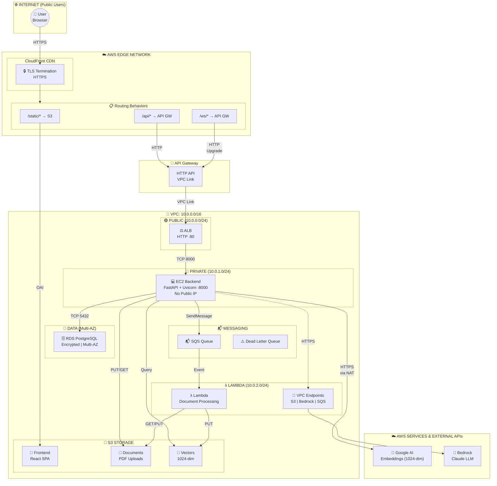
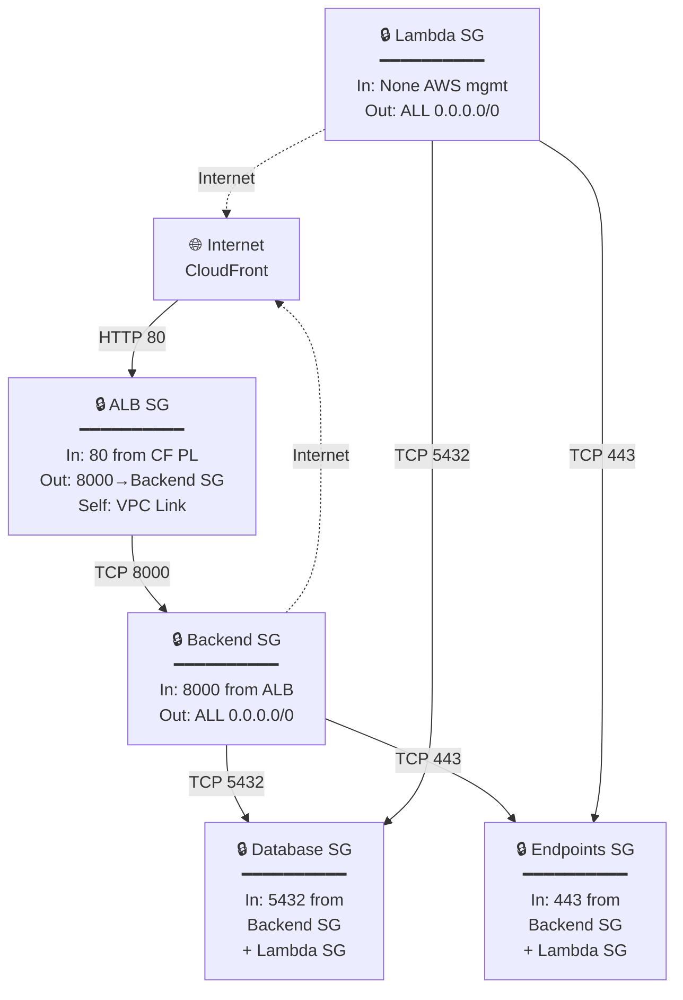

# 📚 Student Helper - RAG-Powered Q&A System

[](https://www.python.org/downloads/)
[](https://fastapi.tiangolo.com/)
[](https://www.postgresql.org/)
[](LICENSE)

A production-grade **Retrieval-Augmented Generation (RAG)** application that enables students to upload study materials and get AI-powered answers grounded in their documents. Built with FastAPI, LangChain, AWS Bedrock, and PostgreSQL.

---

## 🎯 Features

✨ **Document Management**
- Upload PDF, DOCX, and other document types
- Automatic parsing, chunking, and embedding
- Session-scoped document isolation
- Async processing with progress tracking

🤖 **AI-Powered Q&A**
- Conversational interface with chat history
- Vector-based semantic search
- Grounded answers with source citations
- Deterministic responses for reproducibility

🎨 **Visual Knowledge Generation**
- AI-generated concept diagrams from chat responses
- LangGraph 4-node pipeline for diagram creation
- S3 persistence with presigned URL delivery
- Session-scoped image management

📚 **Course Integration**
- Link sessions to academic courses
- Course-based document organization
- Flexible metadata for course management

📊 **Observability**
- Distributed tracing with Langfuse
- Structured JSON logging
- Correlation ID tracking across requests
- Prompt versioning and management

⚙️ **Production Ready**
- Type-safe Pydantic schemas
- Async/await throughout
- Connection pooling & resource management
- Comprehensive error handling
- Full test coverage (in development)

---

## 🏗️ Architecture

### Cloud Infrastructure (Production)

The Student Helper runs on **AWS in Sydney (ap-southeast-2)** with a carefully designed architecture that handles REST API calls, async document processing, and semantic search at scale.



**Key Design Decisions:**
- **Google Generative AI** for embeddings (1024-dim, via NAT gateway—eliminates Bedrock throttling)
- **AWS Bedrock Claude** for LLM inference (via VPC endpoints—private network)
- **CloudFront → API Gateway → VPC Link → ALB → EC2** routing chain (unified domain, no CORS)
- **Multi-AZ RDS** for resilience, **SQS + Lambda** for async processing
- **Least-privilege Security Groups** (see below)

#### Security Group Architecture

Five security groups implement **micro-segmentation** with identity-based rules. Traffic flows only through explicitly allowed paths:



| Security Group | Inbound | Outbound | Purpose |
|---|---|---|---|
| **ALB SG** | Port 80 from CloudFront prefix list | Port 8000 → Backend SG + self | Public entry point, routes traffic to backend |
| **Backend SG** | Port 8000 from ALB SG | ALL (0.0.0.0/0) | FastAPI application, full internet access for APIs |
| **Database SG** | Port 5432 from Backend + Lambda SGs | None (implicit allow reply) | RDS PostgreSQL, locked down to compute only |
| **Endpoints SG** | Port 443 from Backend + Lambda SGs | None (implicit allow reply) | VPC endpoints (Bedrock, S3, SQS) |
| **Lambda SG** | None (AWS manages SQS) | ALL (0.0.0.0/0) | Document processor, outbound to AWS services |

**Key principle:** Rules use **security group IDs** (identity-based) instead of IP addresses. When you add a new EC2 instance to Backend SG, it automatically inherits all rules—zero manual IP whitelisting.

#### API Gateway & VPC Link Pattern

Why route through API Gateway instead of connecting CloudFront directly to ALB? **Single domain, no CORS headaches.**

- **CloudFront** terminates HTTPS and routes based on path:
  - `/static/*` → S3 frontend (static assets)
  - `/api/*` → API Gateway → ALB (REST API)
  - `/ws/*` → API Gateway → ALB (WebSocket)

- **API Gateway's VPC Link** creates ENI tunnels into your private VPC, allowing a public AWS service to securely reach your private ALB without exposing it to the internet.

- **Result:** Frontend and API on the same domain (e.g., `app.example.com`), no CORS preflight requests, unified certificate management.

See [api_gateway.py](IAC/components/edge/api_gateway.py) and [cloudfront.py](IAC/components/edge/cloudfront.py) for implementation details.

---

Read [IAC README](IAC/README.md) for the complete architecture story and [Networking Deep Dive](IAC/diagrams/NETWORKING_DEEP_DIVE.md) for protocol flows.

---

### Backend Architecture

The backend uses **clean architecture** with strict separation of concerns: API routes → Services → Domain logic → Data boundaries. Each layer is independently testable and swappable. See [Backend README](backend/README.md) for the complete architecture and component breakdown.

---

## 🚀 Quick Start

### Prerequisites
- **Python 3.11+** - [Install Python](https://www.python.org/downloads/)
- **PostgreSQL 16+** - [Install PostgreSQL](https://www.postgresql.org/download/)
- **uv** - Fast Python package installer: `pip install uv`
- **Git** - [Install Git](https://git-scm.com/)

### Installation

1. **Clone the repository**
```bash
git clone https://github.com/your-org/student-helper.git
cd student-helper
```

2. **Install dependencies**
```bash
uv sync
```

3. **Configure environment variables**
```bash
cp .env.example .env
# Edit .env with your settings (see Configuration section)
```

4. **Start PostgreSQL** (if not already running)
```bash
# Using Docker
docker run -d \
  --name postgres \
  -p 5432:5432 \
  -e POSTGRES_PASSWORD=postgres \
  postgres:16

# Or using Homebrew (macOS)
brew services start postgresql@16
```

5. **Run the backend server**
```bash
python -m uvicorn backend.main:app --reload --host 0.0.0.0 --port 8000
```

6. **Open the API documentation**
- Swagger UI: [http://localhost:8000/docs](http://localhost:8000/docs)
- ReDoc: [http://localhost:8000/redoc](http://localhost:8000/redoc)

### Testing the API

**Create a session:**
```bash
curl -X POST http://localhost:8000/api/v1/sessions \
  -H "Content-Type: application/json" \
  -d '{"metadata": {"user": "student1"}}'
```

**Upload a document:**
```bash
curl -X POST http://localhost:8000/api/v1/sessions/{session_id}/docs \
  -H "Content-Type: application/json" \
  -d '{"files": ["s3://bucket/study_notes.pdf"]}'
```

**Chat with the documents:**
```bash
curl -X POST http://localhost:8000/api/v1/sessions/{session_id}/chat \
  -H "Content-Type: application/json" \
  -d '{"message": "What is calculus?", "include_diagram": false}'
```

---

## 📋 Configuration

Create a `.env` file in the project root:

```env
# Application
ENVIRONMENT=development
DEBUG=true
LOG_LEVEL=DEBUG

# Database
POSTGRES_HOST=localhost
POSTGRES_PORT=5432
POSTGRES_USER=postgres
POSTGRES_PASSWORD=postgres
POSTGRES_DB=student_helper
POOL_SIZE=10
MAX_OVERFLOW=20

# Vector Store
VECTOR_STORE_AWS_REGION=ap-southeast-2
VECTOR_STORE_TOP_K=5
VECTOR_STORE_SIMILARITY_THRESHOLD=0.7
VECTOR_STORE_ENABLE_SESSION_FILTERING=true

# Observability
LANGFUSE_HOST=http://localhost:3000
LANGFUSE_ENABLE_TRACING=false  # Set to true with valid keys for production
LANGFUSE_PUBLIC_KEY=
LANGFUSE_SECRET_KEY=
```

**Environment Variables:**
- All settings can be configured via environment variables
- Prefix: `POSTGRES_`, `VECTOR_STORE_`, `LANGFUSE_` for respective modules
- See [Configuration Documentation](backend/configs/README.md) for complete list

---

## 📁 Project Structure

```
Student_Helper/
├── IAC/                        # Infrastructure as Code (Pulumi)
│   ├── components/             # AWS infrastructure modules
│   │   ├── networking/         # VPC, security groups, endpoints
│   │   ├── compute/            # EC2, ALB, Lambda
│   │   ├── edge/               # CloudFront, API Gateway
│   │   ├── storage/            # S3, RDS, ECR
│   │   ├── messaging/          # SQS queues
│   │   └── security/           # IAM roles, secrets
│   └── diagrams/               # Architecture documentation
│
├── backend/                    # FastAPI Application (Python)
│   ├── api/                    # HTTP API layer (FastAPI routers)
│   │   ├── routers/            # Session, Document, Chat, Jobs, Health
│   │   └── deps/               # Dependency injection
│   │
│   ├── application/            # Service orchestration layer
│   │   ├── services/           # ChatService, DocumentService, etc.
│   │   └── adapters/           # External integrations
│   │
│   ├── core/                   # Domain/business logic
│   │   ├── agentic_system/     # RAG Agent + Visual Knowledge Agent
│   │   └── document_processing/ # Async pipeline (Lambda-ready)
│   │
│   ├── boundary/               # Infrastructure integration layer
│   │   ├── db/                 # SQLAlchemy ORM + CRUD operations
│   │   ├── vdb/                # Vector store (FAISS/S3)
│   │   └── aws/                # AWS service clients
│   │
│   ├── models/                 # Shared Pydantic data models
│   ├── configs/                # Configuration management
│   ├── observability/          # Logging & tracing
│   ├── evaluation/             # Model evaluation & testing
│   └── main.py                 # FastAPI entry point
│
├── study-buddy-ai/             # Frontend (React + TypeScript + Vite)
│   ├── src/
│   │   ├── components/         # Reusable UI components
│   │   │   ├── chat/           # Chat interface
│   │   │   ├── documents/      # Document upload
│   │   │   ├── sessions/       # Session management
│   │   │   ├── knowledge/      # Diagram & knowledge visualization
│   │   │   └── ui/             # shadcn/ui components
│   │   ├── pages/              # Route pages
│   │   ├── hooks/              # Custom React hooks
│   │   ├── services/           # API client layer
│   │   ├── types/              # TypeScript type definitions
│   │   └── App.tsx
│   └── package.json
│
├── tests/                      # Comprehensive test suite
│   ├── api/                    # API endpoint tests
│   ├── application/            # Service layer tests
│   ├── core/                   # Business logic tests
│   ├── integration/            # Database & integration tests
│   ├── unit/                   # Unit tests
│   └── infrastructure/         # IaC validation tests
│
├── documentation/              # Project documentation
│   ├── 01_architecture/        # Architecture deep dives
│   ├── 02_networking/          # Networking guides
│   ├── 03_troubleshooting/     # Troubleshooting guides
│   ├── 04_implementation_guides/ # Step-by-step implementation
│   └── 04_lessons_learned/     # Retrospectives & learnings
│
├── docker-compose.yml          # Local multi-container setup
├── Dockerfile                  # Backend container image
├── pyproject.toml              # Python project config
├── uv.lock                     # Dependency lock file
├── .env.example                # Environment template
└── README.md                   # This file
```

**Key Directories:**
- **[IAC/README.md](IAC/README.md)** - Complete infrastructure documentation
- **[backend/README.md](backend/README.md)** - Backend architecture & design
- **[backend/api/README.md](backend/api/README.md)** - HTTP routes & endpoints
- **[backend/core/README.md](backend/core/README.md)** - RAG agent & document processing
- **[backend/boundary/README.md](backend/boundary/README.md)** - Database & vector store
- **[backend/configs/README.md](backend/configs/README.md)** - Configuration management

---

## 🔧 Technology Stack

### Backend
| Layer | Technology | Purpose |
|-------|-----------|---------|
| **Framework** | FastAPI 0.100+ | Async web framework |
| **Database** | PostgreSQL 16 | Session, document, job storage |
| **ORM** | SQLAlchemy 2.0 | Type-safe database operations |
| **Vector Store** | FAISS (dev) / S3 Vectors (prod) | Semantic search & embeddings |
| **LLM** | AWS Bedrock Claude Haiku | LLM inference |
| **Embeddings** | Google Generative AI (1024-dim) | Vector generation |
| **Visual Knowledge** | LangGraph + Gemini | AI-generated diagrams |
| **Document Parsing** | Docling | PDF/DOCX extraction |
| **Text Chunking** | LangChain | Semantic text splitting |
| **Validation** | Pydantic v2 | Request/response schemas |
| **Logging** | structlog | Structured JSON logging |
| **Tracing** | Langfuse | Distributed observability |

### Frontend
| Technology | Purpose |
|-----------|---------|
| React 18+ | UI framework |
| TypeScript | Type-safe JavaScript |
| Vite | Build tool |
| Shadcn UI | Component library |
| TailwindCSS | Styling |
| Axios | HTTP client |

### Infrastructure
| Technology | Purpose |
|-----------|---------|
| Docker | Containerization |
| Docker Compose | Local orchestration |
| AWS Bedrock | LLM inference service |
| AWS S3 | Document & vector storage |
| PostgreSQL | Primary database |

---

## 📊 API Overview

**Base URL:** `http://localhost:8000/api/v1`

### Endpoints

| Method | Path | Purpose | Status |
|--------|------|---------|--------|
| POST | `/sessions` | Create session | ✅ Implemented |
| GET | `/sessions` | List sessions | ✅ Implemented |
| DELETE | `/sessions/{id}` | Delete session | ✅ Implemented |
| POST | `/sessions/{id}/chat` | Chat with RAG | ✅ Implemented |
| POST | `/sessions/{id}/chat/stream` | Stream chat (SSE) | ✅ Implemented |
| GET | `/sessions/{id}/docs` | List documents | ✅ Implemented |
| POST | `/sessions/{id}/docs` | Upload documents | ✅ Implemented |
| DELETE | `/sessions/{id}/docs/{doc_id}` | Delete document | ✅ Implemented |
| POST | `/sessions/{id}/visual-knowledge` | Generate visual diagram | ✅ Implemented |
| GET | `/sessions/{id}/images` | Get session images | ✅ Implemented |
| POST | `/courses` | Create/manage courses | ✅ Implemented |
| GET | `/jobs/{id}` | Poll job status | ✅ Implemented |
| GET | `/health` | Health check | ✅ Implemented |

**Interactive API Docs:** [Swagger UI](http://localhost:8000/docs)

---

## 🔄 Key Workflows

### Chat Workflow
```
1. User uploads documents to session
2. Documents processed: parse → chunk → embed → index
3. User asks question
4. System retrieves relevant chunks (semantic search)
5. LLM generates answer grounded in retrieved context
6. Response includes citations with source references
7. Conversation persisted to chat history
```

### Document Upload Workflow
```
1. User initiates upload via POST /sessions/{id}/docs
2. API creates job (PENDING status) and returns job_id
3. Background task processes document:
   - Parse (Docling) → Extract text + structure
   - Chunk (1000 char, 200 overlap) → Split intelligently
   - Embed (Bedrock Titan v2) → 1536-dim vectors
   - Index (FAISS/S3 Vectors) → Store with metadata
4. Job status updates: RUNNING → COMPLETED/FAILED
5. Frontend polls /jobs/{id} for progress
6. Document available for RAG queries when COMPLETED
```

---

## 🧪 Development

### Running Tests
```bash
# Run all tests
python -m pytest

# Run specific test file
python -m pytest tests/test_chat_service.py

# Run with coverage
python -m pytest --cov=backend tests/
```

### Code Quality
```bash
# Format code with Ruff
ruff format backend/

# Lint with Ruff
ruff check backend/ --fix

# Type checking with mypy
mypy backend/

# All checks
ruff format . && ruff check . --fix && mypy backend/
```

### Running with Hot Reload
```bash
python -m uvicorn backend.main:app --reload \
  --host 0.0.0.0 \
  --port 8000 \
  --log-level debug
```

---

## 🐳 Docker Deployment

### Build Docker Image
```bash
docker build -t student-helper:latest -f backend/Dockerfile .
```

### Run with Docker Compose
```bash
# Start all services
docker-compose up -d

# View logs
docker-compose logs -f app

# Stop services
docker-compose down
```

### Environment in Docker
Docker Compose reads `.env` file automatically. Update `docker-compose.yml` for production:

```yaml
services:
  app:
    environment:
      - POSTGRES_HOST=postgres  # Service name, not localhost
      - VECTOR_STORE_AWS_REGION=ap-southeast-2
```

---

## ☁️ AWS Deployment

### Prerequisites
- AWS Account with Bedrock access
- RDS PostgreSQL instance
- S3 bucket for documents
- IAM role for Lambda (document processing)

### Lambda Function (Document Processing)
Documents are processed asynchronously via AWS Lambda:

1. **SQS Event Trigger:** Document upload triggers SQS message
2. **Lambda Handler:** Processes document (parse → chunk → embed)
3. **S3 Vectors:** Stores embeddings in managed vector database
4. **RDS Update:** Updates document status in PostgreSQL

See [Document Processing Documentation](backend/core/README.md) for full details.

---

## 📈 Performance

### Latency Targets
| Operation | Target | Actual |
|-----------|--------|--------|
| Chat response | < 5s | 1-3s (semantic search + LLM) |
| Vector search | < 100ms | 10-50ms (FAISS) / 150-200ms (S3) |
| Document upload | Non-blocking | Async with progress tracking |
| Database query | < 50ms | 10-30ms (optimized indexes) |

### Scalability
- **Concurrent Users:** 100+ (connection pooling: 10 + 20 overflow)
- **Documents per Session:** Unlimited (paginated retrieval)
- **Concurrent Chat:** Isolated by session_id
- **Document Processing:** Parallelized via Lambda

---

## 🔐 Security

- **Credentials:** Environment variables (never committed)
- **Database:** Parameterized queries (SQLAlchemy) prevent SQL injection
- **API:** CORS configured for specific origins
- **Logs:** Sensitive data excluded from structured logs
- **Tracing:** Correlation IDs for audit trail

---

## 🐛 Troubleshooting

### Database Connection Error
```
Error: could not translate host name "localhost" to address
Solution: Ensure PostgreSQL is running or update POSTGRES_HOST
```

### FAISS Index Not Found
```
Error: FileNotFoundError: .faiss_index/index.faiss
Solution: Upload first document to create index
```

### Bedrock Credentials Error
```
Error: Unable to locate credentials
Solution: Configure AWS credentials (~/.aws/credentials or IAM role)
```

### Port Already in Use
```
Error: Address already in use
Solution: Change port with --port 9000 or kill existing process
```

**More Help:** See [Backend README](backend/README.md) for detailed troubleshooting

---

## 📚 Documentation Index

### 🌐 Infrastructure & Deployment
| Document | Purpose |
|----------|---------|
| [**IAC README**](IAC/README.md) | **Complete AWS architecture, networking, security, and Pulumi deployment** |
| [Deployment Checklist](IAC/diagrams/ARCHITECTS_DEPLOYMENT_CHECKLIST.md) | Step-by-step learning guide for new architects |
| [Networking Deep Dive](IAC/diagrams/NETWORKING_DEEP_DIVE.md) | Protocol flows, security zones, and troubleshooting |

### 🔧 Backend Application
| Document | Purpose |
|----------|---------|
| [Backend README](backend/README.md) | Complete backend architecture & design |
| [API Documentation](backend/api/README.md) | HTTP routes, dependency injection |
| [Application Services](backend/application/README.md) | Business logic orchestration |
| [Boundary Layer](backend/boundary/README.md) | Database & vector store |
| [Core Domain](backend/core/README.md) | RAG agent, document pipeline |
| [Configuration](backend/configs/README.md) | Settings & environment variables |
| [Models & Schemas](backend/models/README.md) | API request/response contracts |
| [Observability](backend/observability/README.md) | Logging, tracing, monitoring |

### 📡 API & Interactive Docs
| Document | Purpose |
|----------|---------|
| [API Docs (Swagger)](http://localhost:8000/docs) | Interactive API explorer |

---

## 🤝 Contributing

Contributions are welcome! Please follow these guidelines:

### Code Standards
- ✅ Type hints on all functions
- ✅ Docstrings for public APIs
- ✅ Comments explain **why**, not **what**
- ✅ Max 150 lines per file
- ✅ Single responsibility per class
- ✅ Async-first design

### Before Submitting PR
1. **Format code:** `ruff format backend/`
2. **Lint:** `ruff check backend/ --fix`
3. **Type check:** `mypy backend/`
4. **Run tests:** `pytest`
5. **Test the API:** Manual endpoint testing

### Branch Naming
- `feature/description` - New features
- `fix/description` - Bug fixes
- `docs/description` - Documentation
- `refactor/description` - Code improvements

---

## 📝 Implementation Status

| Component | Status | Notes |
|-----------|--------|-------|
| Chat Q&A | ✅ Complete | RAG with citations, streaming support |
| Document Upload | ✅ Complete | Async S3→SQS→Lambda pipeline |
| Document Deletion | ✅ Complete | Cascading vector + DB cleanup |
| Session Management | ✅ Complete | Full CRUD operations |
| Visual Knowledge | ✅ Complete | LangGraph pipeline with Gemini |
| Course Integration | ✅ Complete | Course-session linking |
| Health Checks | ✅ Complete | App health endpoint |
| Tests | 🔨 In Progress | Unit + integration tests |
| Documentation | ✅ Complete | All modules documented |

---

## 🗺️ Roadmap

### Phase 1 (Complete)
- ✅ Core RAG functionality
- ✅ Document management (upload, delete)
- ✅ Session isolation
- ✅ Visual knowledge generation
- ✅ Course integration

### Phase 2 (Current)
- 🔨 Advanced search filters
- 🔨 User authentication
- 📋 Document collections
- 📋 Multi-document insights

### Phase 3 (Future)
- 📋 Study recommendations
- 📋 Performance analytics
- 📋 Mobile app

---

## 📊 Monitoring

### Health Checks
```bash
# API health
curl http://localhost:8000/health

# Database
curl http://localhost:8000/health/db

# Vector store
curl http://localhost:8000/health/vector-store
```

### Logs
```bash
# View structured logs (JSON)
docker-compose logs app | jq '.'

# Follow logs in real-time
docker-compose logs -f app
```

### Tracing
- **Langfuse:** [http://localhost:3000](http://localhost:3000) (when enabled)
- **Correlation IDs:** Included in all API responses for tracing

---

## 📄 License

This project is licensed under the **MIT License** - see [LICENSE](LICENSE) file for details.

---

## 👥 Authors

- **Development Team** - RAG system architecture and implementation

---

## 🙏 Acknowledgments

- [LangChain](https://python.langchain.com/) - LLM framework
- [FastAPI](https://fastapi.tiangolo.com/) - Web framework
- [SQLAlchemy](https://www.sqlalchemy.org/) - ORM
- [AWS Bedrock](https://aws.amazon.com/bedrock/) - LLM service
- [Langfuse](https://langfuse.com/) - Observability platform

---

## 📞 Support

- **Issues:** [GitHub Issues](https://github.com/your-org/student-helper/issues)
- **Discussions:** [GitHub Discussions](https://github.com/your-org/student-helper/discussions)
- **Documentation:** See links in [Documentation Index](#-documentation-index)

---

## 🔗 Links

- [Project Repository](https://github.com/your-org/student-helper)
- [API Documentation](http://localhost:8000/docs)
- [Architecture Guide](backend/README.md)
- [Contributing Guide](CONTRIBUTING.md)

---

<div align="center">

**Made with ❤️ for students everywhere**

[⭐ Star us on GitHub](https://github.com/your-org/student-helper) • [🐛 Report Bug](https://github.com/your-org/student-helper/issues) • [💡 Request Feature](https://github.com/your-org/student-helper/issues)

</div>
