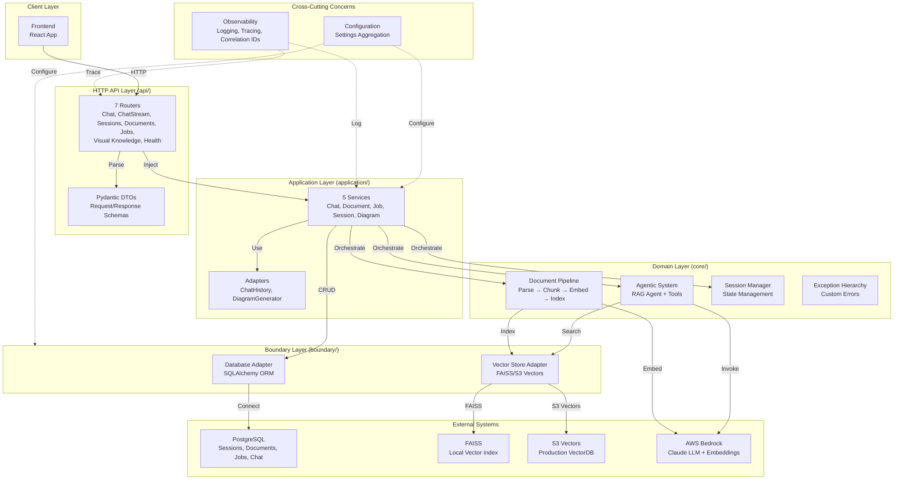

# Backend Architecture - Student Helper RAG Application

**Location:** [`backend/`](.)
**Purpose:** Production-grade RAG application with async document ingestion, session-based Q&A, and comprehensive observability.

---

## 📋 Quick Overview

The Student Helper backend is a **layered FastAPI application** implementing RAG (Retrieval-Augmented Generation) with:

- **HTTP API Layer** - RESTful endpoints with FastAPI (7 dedicated routers)
- **Business Logic** - Service orchestration for complex operations
- **Domain Layer** - Pure business logic (RAG agent, agentic systems, pipelines)
- **Boundary Layer** - Database and vector store abstractions
- **Observability** - Distributed tracing, structured logging, correlation tracking

---

## 🏗️ Architecture Diagram



---

## 📁 Module Organization

| Module | Purpose | Key Files |
|--------|---------|-----------|
| [**api/**](api/README.md) | HTTP interface | routers/, deps/, main.py |
| [**application/**](application/README.md) | Business logic | services/, adapters/ |
| [**core/**](core/README.md) | Domain logic | agentic_system/, document_processing/, session/ |
| [**boundary/**](boundary/README.md) | External adapters | db/, vdb/ |
| [**configs/**](configs/README.md) | Settings | database.py, vector_store.py, observability.py |
| [**models/**](models/README.md) | API schemas | DTOs for requests/responses |
| [**observability/**](observability/README.md) | Monitoring | middleware, logging, tracing, prompt registry |

---

## 🔄 Request Flow Example: Chat

```
User Query
  ↓
POST /api/v1/sessions/{id}/chat
  ├─ Route: chat_router.chat()
  ├─ Validate: ChatRequest schema
  ├─ Inject: ChatService via Depends()
  │   ├─ Validate session exists (session_crud.get_by_id)
  │   ├─ Fetch chat history (ChatHistoryAdapter.get_messages)
  │   ├─ Call RAG agent (rag_agent.ainvoke)
  │   │   ├─ Retrieve: faiss_store.similarity_search(question)
  │   │   ├─ Generate: bedrock.invoke_model(claude-haiku)
  │   │   └─ Return: RAGResponse with answer + citations
  │   ├─ Persist: add_user_message(message)
  │   ├─ Persist: add_ai_message(answer)
  │   └─ Return: RAGResponse
  ├─ Map: RAGCitation → Citation (extract filename)
  ├─ Optional: DiagramService.generate_diagram()
  └─ Wrap: SuccessResponse[ChatResponse]
  ↓
200 OK with answer + citations + optional diagram
```

---

## 🔄 Request Flow Example: Document Upload

```
User Upload
  ↓
POST /api/v1/sessions/{id}/docs
  ├─ Route: documents_router.upload()
  ├─ Validate: UploadDocumentsRequest schema
  ├─ JobService.create_job(DOCUMENT_INGESTION)
  ├─ Return job_id immediately (202 Accepted)
  └─ BackgroundTask:
      ├─ JobService.mark_job_running(progress=10)
      ├─ DocumentService.upload_document(file_path, session_id, name)
      │   ├─ document_crud.create(status=PENDING)
      │   ├─ DevDocumentPipeline.process()
      │   │   ├─ ParsingTask: docling parse
      │   │   ├─ ChunkingTask: split (1000 char, 200 overlap)
      │   │   ├─ EmbeddingTask: bedrock embeddings (1536-dim)
      │   │   └─ FAISSStore.add_documents()
      │   └─ document_crud.update_status(COMPLETED)
      ├─ JobService.mark_job_completed(result={chunks, time})
      └─ [On error] JobService.mark_job_failed(error)
  ↓
Frontend polls GET /jobs/{job_id} for status
  ↓
200 OK when status=COMPLETED or FAILED
```

---

## 🗄️ Data Model

### Sessions Table
```
sessions
├── id (UUID, PK)
├── session_metadata (JSON - flexible metadata)
├── created_at (DateTime)
├── updated_at (DateTime)
└── documents (FK cascade delete)
```

### Documents Table
```
documents
├── id (UUID, PK)
├── session_id (UUID, FK)
├── name (String)
├── status (Enum: PENDING, PROCESSING, COMPLETED, FAILED)
├── upload_url (String)
├── error_message (String, nullable)
├── created_at (DateTime)
└── updated_at (DateTime)
```

### Jobs Table
```
jobs
├── id (UUID, PK)
├── task_id (String, UNIQUE - SQS MessageId)
├── type (Enum: DOCUMENT_INGESTION, EVALUATION)
├── status (Enum: PENDING, RUNNING, COMPLETED, FAILED)
├── progress (Int: 0-100%)
├── result (JSON - success output or error details)
├── created_at (DateTime)
└── updated_at (DateTime)
```

### Chat Messages
```
chat_messages
├── session_id (String)
├── message_id (String)
├── type (Enum: human, ai)
├── content (Text)
├── created_at (DateTime)
└── (via LangChain PostgresChatMessageHistory)
```

### Vector Store
```
FAISS Index (.faiss_index/)
├── index.faiss (binary FAISS index)
├── index.pkl (metadata store)
└── metadata per vector:
    ├── session_id (UUID)
    ├── doc_id (UUID)
    ├── chunk_id (String)
    ├── page (Int, nullable)
    ├── section (String, nullable)
    ├── source_uri (String)
    └── similarity_score (Float: 0.0-1.0)
```

### Images Table (Visual Knowledge Diagrams)
```
images
├── id (UUID, PK)
├── session_id (UUID, FK - cascade delete)
├── s3_key (String - S3 object location)
├── mime_type (String - image/png or image/jpeg)
├── message_index (Int, nullable - links to chat message)
├── main_concepts (JSON - array of 2-3 concept strings)
├── branches (JSON - array of concept branch objects)
│   └── each branch: {id, label, description}
├── image_generation_prompt (String - full Gemini prompt)
├── created_at (DateTime)
└── updated_at (DateTime)
```

---

## 🔌 API Routers & Endpoints

### Router Organization

The API layer is organized into **7 dedicated routers**, each with a single responsibility:

| Router | Module | Responsibilities |
|--------|--------|------------------|
| **Chat** | `routers/chat.py` | Send messages, stream responses |
| **ChatStream** | `routers/chat_stream.py` | WebSocket streaming (legacy) |
| **Sessions** | `routers/sessions.py` | Session CRUD, chat history retrieval |
| **Documents** | `routers/documents.py` | Upload, list, manage documents |
| **Jobs** | `routers/jobs.py` | Poll async job status |
| **Visual Knowledge** | `routers/visual_knowledge.py` | Generate interactive concept diagrams |
| **Health** | `routers/health.py` | Health checks for app, DB, vector store |

### Endpoints

**All routes prefixed with `/api/v1`**

| Method | Endpoint | Router | Purpose | Status |
|--------|----------|--------|---------|--------|
| POST | `/sessions` | sessions | Create session | ✅ Implemented |
| GET | `/sessions` | sessions | List sessions | ✅ Implemented |
| DELETE | `/sessions/{id}` | sessions | Delete session | ✅ Implemented |
| GET | `/sessions/{id}/chat/history` | sessions | Get chat history | ✅ Implemented |
| POST | `/sessions/{id}/chat` | chat | Send chat message with RAG | ✅ Implemented |
| POST | `/sessions/{id}/chat/stream` | chat | Stream chat response (SSE) | ✅ Implemented |
| POST | `/sessions/{id}/visual-knowledge` | visual_knowledge | Generate visual diagram | ✅ Implemented |
| GET | `/sessions/{id}/docs` | documents | List documents | ✅ Implemented |
| POST | `/sessions/{id}/docs` | documents | Upload documents (async) | ✅ Implemented |
| GET | `/jobs/{id}` | jobs | Poll job status | ✅ Implemented |
| GET | `/health` | health | Application health | Scaffold |
| GET | `/health/db` | health | Database health | Scaffold |
| GET | `/health/vector-store` | health | Vector store health | Scaffold |

---

## 🚀 Running the Application

### Prerequisites
```bash
# Python 3.11+
python --version

# PostgreSQL running locally or via Docker
docker run -d -p 5432:5432 \
  -e POSTGRES_PASSWORD=postgres \
  postgres:16
```

### Installation
```bash
# Install dependencies via uv
uv sync

# Run migrations (if needed)
# [Add migration commands if using Alembic]
```

### Development
```bash
# Start FastAPI server with hot reload
python -m uvicorn backend.main:app --reload --host 0.0.0.0 --port 8000

# API docs: http://localhost:8000/docs
# ReDoc: http://localhost:8000/redoc
```

### Configuration (.env)
```env
# Database
POSTGRES_HOST=localhost
POSTGRES_PORT=5432
POSTGRES_USER=postgres
POSTGRES_PASSWORD=postgres
POSTGRES_DB=student_helper

# Vector Store
VECTOR_STORE_AWS_REGION=ap-southeast-2
VECTOR_STORE_TOP_K=5
VECTOR_STORE_SIMILARITY_THRESHOLD=0.7

# Observability
LANGFUSE_HOST=http://localhost:3000
LANGFUSE_ENABLE_TRACING=false  # Disabled for local dev

# Logging
LOG_LEVEL=INFO
DEBUG=false
```

---

## 📊 Architecture Decisions

### 1. **Layered Architecture**
- Clean separation: API → Application → Domain → Boundary
- Each layer has single responsibility
- Easy to test with dependency injection

### 2. **Async-First**
- All operations support `async/await`
- FastAPI native support for async handlers
- Non-blocking document processing

### 3. **Repository Pattern**
- `BaseCRUD` provides generic operations
- Entity-specific CRUD (SessionCRUD, DocumentCRUD, JobCRUD)
- Singletons injected into services

### 4. **Session-Scoped Isolation**
- Sessions provide boundary for RAG queries
- Documents belong to sessions
- Chat history is session-scoped
- Vector search filtered by session_id

### 5. **Status Tracking for Long Operations**
- JobModel tracks async document processing
- Frontend polls `/jobs/{id}` without WebSockets
- Non-blocking uploads with progress feedback

### 6. **Dual Vector Store Support**
- Development: FAISS (local, fast iteration)
- Production: S3 Vectors (AWS managed, scalable)
- Same interface enables easy switching

### 7. **Correlation ID Propagation**
- Request correlation ID set by middleware
- Stored in `contextvars` for async-safe access
- All logs and traces inherit same ID

### 8. **Type Safety Throughout**
- Pydantic schemas validate all inputs
- Type hints on all functions
- SQLAlchemy ORM with type checking
- Python 3.10+ union syntax (`str | None`)

---

## 🔍 Key Patterns

### Request/Response Mapping
```
HTTPRequest (JSON)
  ↓ [Pydantic validation]
Request DTO (ChatRequest)
  ↓ [Service logic]
Domain Model (RAGResponse)
  ↓ [Manual mapping]
Response DTO (ChatResponse)
  ↓ [Pydantic serialization]
HTTPResponse (JSON)
```

### Dependency Injection
```python
@router.post("/chat")
async def chat(
    session_id: UUID,
    request: ChatRequest,
    chat_service: ChatService = Depends(get_chat_service),
) → SuccessResponse[ChatResponse]:
    # FastAPI automatically:
    # 1. Parses request body → ChatRequest
    # 2. Calls get_chat_service(db=Depends(get_db))
    # 3. Injects ChatService instance
```

### Background Task Processing
```python
# Immediate response with job_id
job = await job_service.create_job(...)
background_tasks.add_task(process_document_background, ...)
return {"job_id": job.id, "status": "pending"}

# Frontend polls job status separately
# GET /jobs/{job_id} → {"status": "running", "progress": 50}
```

---

## 📈 Performance Considerations

### Database
- Connection pooling: 10 core + 20 overflow
- Async SQLAlchemy with asyncpg driver
- Query optimization via eager loading (selectinload)
- Cascade delete for data integrity

### Vector Search
- Local FAISS for dev (10-50ms latency)
- S3 Vectors for prod (150-200ms network latency)
- Metadata filtering by session_id
- Top-k retrieval (default 5, configurable)

### LLM Inference
- Temperature=0.0 for deterministic responses
- Bedrock Claude Haiku (fast, cost-effective)
- Structured output via ToolStrategy
- No token limiting (relies on Bedrock defaults)

### Async Processing
- Document ingestion via BackgroundTasks
- Non-blocking uploads with status polling
- Concurrent chat requests (session-isolated)
- No WebSocket overhead for progress tracking

---

## 🧪 Testing Strategy

### Unit Tests
- Mock services via dependency injection
- Pydantic schema validation tests
- CRUD operation tests with fixture sessions

### Integration Tests
- Real database (test instance)
- Real vector store (test FAISS index)
- Full request/response cycles
- Job status polling simulation

### Load Testing
- Concurrent chat requests per session
- Batch document uploads
- Vector search with large indices

---

## 📝 Documentation

**Module READMEs (Detailed):**
- [API Layer](api/README.md) - HTTP routes, dependency injection
- [Application Services](application/README.md) - Business logic orchestration
- [Boundary Layer](boundary/README.md) - Database & vector store adapters
- [Core Domain](core/README.md) - RAG agent, document pipeline
- [Configuration](configs/README.md) - Settings aggregation
- [Models](models/README.md) - Pydantic schemas
- [Observability](observability/README.md) - Logging, tracing, monitoring

**Code Organization:**
- File comments explain **why**, not **what**
- Function docstrings specify inputs, returns, errors
- Type hints on all functions
- Structured logging with correlation IDs

---

## ⚠️ Known Issues & TODOs

| Issue | Severity | Module | Status |
|-------|----------|--------|--------|
| SessionService incomplete | Medium | application/services/ | Scaffold |
| DiagramService incomplete | Medium | application/services/ | Scaffold |
| Health endpoints empty | Low | api/routers/ | Scaffold |
| FAISSStore per-request | Medium | api/deps/ | Inefficient |
| Vector store config hardcoded | Medium | api/deps/ | Should use settings |
| Middleware implementations | Medium | observability/ | Pass statements |
| Logger implementation | Medium | observability/ | Pass statements |
| Chat history async | Low | boundary/db/CRUD/ | Uses psycopg (sync) |
| Lambda handler TODOs | Medium | core/document_processing/ | Incomplete |

---

## 🔐 Security Considerations

- **Database Credentials** - Use environment variables (never commit .env)
- **AWS Credentials** - Handled by IAM roles (Lambda) or ~/.aws/credentials
- **API Keys** - Langfuse keys in environment variables
- **Correlation IDs** - Included in responses for audit trail
- **SQL Injection** - Prevented by SQLAlchemy parameterized queries
- **CORS** - Configured in FastAPI (allow specific origins in production)

---

## 📚 Technologies

| Layer | Technology | Purpose |
|-------|-----------|---------|
| Framework | FastAPI 0.100+ | Async web framework |
| Database | PostgreSQL 16 | Session, document, job persistence |
| ORM | SQLAlchemy 2.0 | Async database operations |
| Vector Store | FAISS (dev) / S3 Vectors (prod) | Semantic search |
| LLM | AWS Bedrock Claude Haiku | Inference |
| Embeddings | Bedrock Titan v2 | Vector generation |
| Parsing | Docling | Document extraction |
| Chunking | LangChain RecursiveCharacterTextSplitter | Text splitting |
| Validation | Pydantic v2 | Request/response schemas |
| Tracing | Langfuse | Distributed tracing |
| Logging | structlog | Structured logging |

---

## 📞 Support & Troubleshooting

### Common Issues

**Database Connection Error**
```
Error: could not translate host name "localhost" to address
Solution: Start Postgres or update POSTGRES_HOST in .env
```

**FAISS Index Not Found**
```
Error: FileNotFoundError: .faiss_index/index.faiss
Solution: First document upload creates index automatically
```

**Bedrock Credential Error**
```
Error: Unable to locate credentials
Solution: Configure AWS credentials (IAM role for Lambda, ~/.aws/credentials for local)
```

---

## 🚢 Deployment

### Local Development
```bash
python -m uvicorn backend.main:app --reload
```

### Docker
```dockerfile
FROM python:3.11-slim
WORKDIR /app
COPY pyproject.toml uv.lock ./
RUN pip install uv && uv sync --frozen
COPY backend/ backend/
CMD ["uvicorn", "backend.main:app", "--host", "0.0.0.0"]
```

### AWS Lambda
- Documented in [core/document_processing/lambda_handler.py](core/document_processing/lambda_handler.py)
- Triggered by SQS events
- Environment variables for configuration
- IAM permissions for S3, Bedrock, RDS

---

## 📊 Monitoring & Observability

**Correlation ID Tracking:**
- Set on every request via middleware
- Propagated through context variables
- Included in all logs and traces
- Enables end-to-end request tracing

**Structured Logging:**
- JSON output format (machine-parseable)
- Automatic correlation ID injection
- Log levels: DEBUG, INFO, WARNING, ERROR, CRITICAL
- Centralized configuration

**Distributed Tracing:**
- Langfuse integration for LLM observability
- HTTP request/response tracing
- Chat, ingestion, retrieval event tracking
- Prompt versioning and registry

---

## 🤝 Contributing

**Code Standards:**
- Follow SOLID principles
- Max 150 lines per file
- Single responsibility per class
- Type hints throughout
- Async-first design

**Before Committing:**
- Run tests (implementation pending)
- Check type hints: `mypy backend/`
- Format code: `ruff format backend/`
- Lint: `ruff check backend/`

---

## 📄 License

[License information here]

---

## 🔗 Related Documentation

- [Frontend Architecture](../frontend/README.md) (if exists)
- [Infrastructure as Code](../infrastructure/README.md) (if exists)
- [API Contract / OpenAPI Spec](http://localhost:8000/docs) (Swagger UI)

---

*Generated documentation for Student Helper RAG application*
**Last Updated:** 2025-12-20
