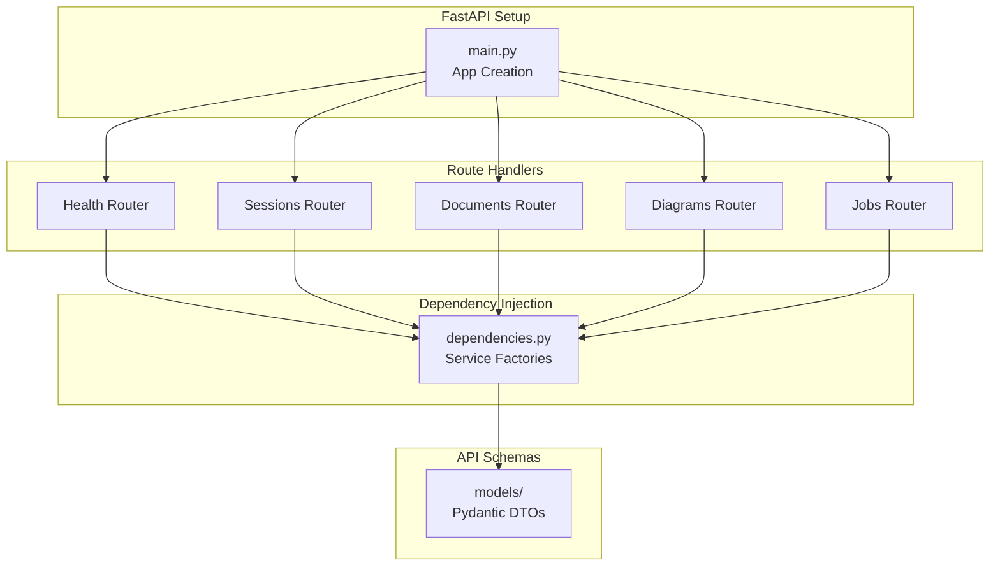

# API Module - HTTP Interface Layer

**Location:** [`backend/api/`](.)
**Purpose:** FastAPI application setup, route handlers, dependency injection, and API contracts

---

## Module Architecture



---

## Directory Structure

```
backend/api/
├── main.py                    # FastAPI app creation, router registration, middleware
├── deps/
│   ├── __init__.py
│   └── dependencies.py        # DI factories: service instantiation
├── routers/
│   ├── __init__.py
│   ├── health.py              # Health checks (scaffolded)
│   ├── sessions.py            # Session CRUD + chat endpoint
│   ├── documents.py           # Document upload/listing + background processing
│   ├── diagrams.py            # Diagram generation (scaffolded)
│   └── jobs.py                # Job status polling
└── schemas/                   # Pydantic request/response models
```

---

## Key Components

### 1. FastAPI Application ([main.py](main.py:38-72))

**Responsibilities:**
- Creates FastAPI instance with metadata
- Registers CORS, observability middleware
- Includes 5 routers with URL prefixes
- Configures app for production deployment

**Routers Registered:**
| Router | Prefix | Purpose |
|--------|--------|---------|
| health | `/health` | Health checks |
| sessions | `/sessions` | Session CRUD + chat |
| documents | `/sessions` | Document upload/list |
| diagrams | `/sessions` | Diagram generation |
| jobs | `/jobs` | Job status |

---

### 2. Dependency Injection ([deps/dependencies.py](deps/dependencies.py))

**Service Factory Functions:**

```python
# Settings singleton (LRU cached)
get_settings_dependency() → Settings

# Database session per-request
get_db() → AsyncSession

# Business services per-request
get_session_service(db) → SessionService
get_document_service(db) → DocumentService
get_job_service(db) → JobService
get_chat_service(db) → ChatService
get_diagram_service() → DiagramService
```

**Pattern:** Each factory injected into route handlers via FastAPI `Depends()`

**Configuration Issues:**
- Vector store settings hardcoded (should use `get_settings()`)
- `FAISSStore` created per-request (should be singleton)

---

### 3. Route Handlers

#### Sessions Router ([routers/sessions.py](routers/sessions.py))

**Endpoints:**
- `POST /sessions` - Create session (stub)
- `POST /sessions/{session_id}/chat` - Chat with RAG (fully implemented)

**Chat Endpoint Flow:**
1. Inject `ChatService`, `DiagramService`
2. Call `chat_service.process_chat(session_id, message)`
3. Receive `RAGResponse` with answer + citations
4. Optionally generate diagram
5. Map `RAGCitation` → API `Citation` model
6. Return `ChatResponse`

**Error Handling:**
- 404: Session not found
- 500: Processing error with details

---

#### Documents Router ([routers/documents.py](routers/documents.py))

**Endpoints:**
- `POST /sessions/{session_id}/docs` - Upload documents (async)
- `GET /sessions/{session_id}/docs` - List documents (paginated)

**Upload Flow (Non-Blocking):**
1. Create `JobModel` with `PENDING` status
2. Return job_id immediately
3. Spawn `BackgroundTask`:
   - Mark job `RUNNING` (10% progress)
   - Call `document_service.upload_document()`
   - Mark job `COMPLETED` with chunk_count, timing
   - On error: mark job `FAILED` with error_details

**List Endpoint:**
- Cursor-based pagination
- Maps internal documents to `DocumentResponse` DTOs

---

#### Jobs Router ([routers/jobs.py](routers/jobs.py))

**Endpoints:**
- `GET /jobs/{job_id}` - Poll job status

**Response:**
```json
{
  "id": "UUID",
  "task_id": "sqs-message-id",
  "type": "document_ingestion",
  "status": "running",
  "progress": 50,
  "result": {},
  "created_at": "ISO timestamp",
  "updated_at": "ISO timestamp"
}
```

**Frontend Polling:** Client polls at 1-2 second intervals until status != RUNNING

---

#### Health Router ([routers/health.py](routers/health.py))

**Endpoints (Scaffolded):**
- `GET /health` - Basic health check
- `GET /health/db` - Database connectivity
- `GET /health/vector-store` - Vector store connectivity

**Status:** Placeholder implementations

---

#### Diagrams Router ([routers/diagrams.py](routers/diagrams.py))

**Endpoints (Scaffolded):**
- `POST /sessions/{session_id}/diagram` - Generate diagram

**Status:** Delegated to sessions chat endpoint for now

---

## API Schemas ([schemas/](../models/))

**Request Models:**
- `ChatRequest` - message, include_diagram flag
- `UploadDocumentsRequest` - list of file paths
- `CreateSessionRequest` - optional metadata

**Response Models:**
- `ChatResponse` - answer, citations, optional diagram
- `DocumentResponse` - document metadata + status
- `JobStatusResponse` - job state + progress
- `Citation` - source attribution (doc_name, page, section, chunk_id, source_uri)

**Wrappers:**
- `SuccessResponse[T]` - Generic success envelope
- `PaginatedResponse[T]` - Cursor-based pagination
- `ErrorResponse` - Standardized error format

**File Paths:**
- See: [backend/models/chat.py](../models/chat.py), [documents.py](../models/document.py), [job.py](../models/job.py)

---

## Middleware Chain

**Registration Order (main.py:59-60):**
1. CORSMiddleware - Cross-origin requests
2. LangfuseMiddleware - Distributed tracing (stub)
3. CorrelationMiddleware - Request correlation IDs (stub)

**Execution:** Request → CORS → Langfuse → Correlation → Routes → Correlation → Langfuse → CORS → Response

---

## Key Design Patterns

### 1. Layered Architecture
- **HTTP Layer:** Route handlers parse requests, map to DTOs
- **Service Layer:** Business logic orchestration (DI factories)
- **Domain Layer:** Core logic (RAG agent, session management)
- **Boundary Layer:** Database, vector store abstractions

### 2. Dependency Injection
- Factory functions in `deps/dependencies.py`
- FastAPI `Depends()` injects per-request
- Enables testability via mock services

### 3. Non-Blocking Async
- Document processing via `BackgroundTasks`
- Job status polling for long-running tasks
- No WebSocket overhead

### 4. Request/Response Mapping
- Internal models (e.g., `RAGResponse`) → API DTOs (e.g., `ChatResponse`)
- Decouples API contracts from domain models

---

## Usage Examples

### Chat Request
```bash
curl -X POST http://localhost:8000/api/v1/sessions/{id}/chat \
  -H "Content-Type: application/json" \
  -d '{"message": "What is calculus?", "include_diagram": false}'
```

**Response:**
```json
{
  "answer": "Calculus is the study of change...",
  "citations": [
    {
      "doc_name": "notes.pdf",
      "page": 5,
      "section": "Introduction",
      "chunk_id": "doc123_0",
      "source_uri": "s3://bucket/notes.pdf"
    }
  ],
  "mermaid_diagram": null
}
```

### Document Upload
```bash
curl -X POST http://localhost:8000/api/v1/sessions/{id}/docs \
  -H "Content-Type: application/json" \
  -d '{"files": ["s3://bucket/doc.pdf"]}'
```

**Response (Immediate):**
```json
{
  "job_id": "UUID",
  "status": "pending"
}
```

**Then Poll:**
```bash
curl http://localhost:8000/api/v1/jobs/{job_id}
```

---

## Testing & Development

**Start Server:**
```bash
python -m uvicorn backend.main:app --reload
```

**API Documentation:**
- Swagger UI: http://localhost:8000/docs
- ReDoc: http://localhost:8000/redoc

---

## Known Issues

| Issue | Severity | Location | Details |
|-------|----------|----------|---------|
| Hardcoded VDB config | Medium | [dependencies.py:88-100](deps/dependencies.py#L88) | Vector store settings not from config |
| Per-request FAISSStore | Medium | [dependencies.py:87-92](deps/dependencies.py#L87) | Should be singleton |
| Middleware stubs | Medium | [middleware.py](../observability/middleware.py) | Empty implementations |
| Missing health checks | Low | [routers/health.py](routers/health.py) | All endpoints scaffolded |
| No session GET endpoint | Low | [routers/sessions.py](routers/sessions.py) | Can't retrieve session by ID |

---

## File Reference Map

| File | Purpose | Lines |
|------|---------|-------|
| [main.py](main.py) | FastAPI app creation | 38-72 |
| [deps/dependencies.py](deps/dependencies.py) | DI factories | 27-112 |
| [routers/sessions.py](routers/sessions.py) | Chat endpoint | 39-111 |
| [routers/documents.py](routers/documents.py) | Upload + list | 26-184 |
| [routers/jobs.py](routers/jobs.py) | Job polling | 22-72 |
| [routers/health.py](routers/health.py) | Health checks | All |
| [routers/diagrams.py](routers/diagrams.py) | Diagram generation | All |

---

## Related Documentation

- [Backend Architecture Overview](../README.md)
- [Application Services](../application/services/README.md)
- [Boundary Layer (DB/VDB)](../boundary/README.md)
- [Core Systems](../core/README.md)

---

*Generated documentation for Student Helper RAG application*
