# API Module - HTTP Interface Layer

**Location:** [`backend/api/`](.)
**Purpose:** FastAPI application setup, route handlers, dependency injection, and API contracts

---

## Recent Changes

### Latest Updates (2025-12-17)
1. **Document Deletion Endpoint** - Added DELETE endpoint for removing documents from sessions
   - Endpoint: `DELETE /sessions/{session_id}/docs/{doc_id}`
   - Removes document from both S3 Vectors and database
   - Cascading deletion of all associated vector chunks
   - File: [backend/api/routers/documents.py:179-230](routers/documents.py#L179)

2. **Session-Scoped RAG Filtering** - Fixed cross-session document contamination
   - RAG agent now filters results by session_id
   - Prevents documents from leaking between sessions
   - File: [backend/core/agentic_system/agent/rag_agent.py:195](../../core/agentic_system/agent/rag_agent.py#L195)

3. **WebSocket Streaming** - Real-time token streaming for chat responses
   - Token-by-token streaming for better UX
   - Shared RAG agent from app.state for efficiency
   - File: [backend/api/routers/chat_stream.py:27](routers/chat_stream.py#L27)

---

## Module Architecture

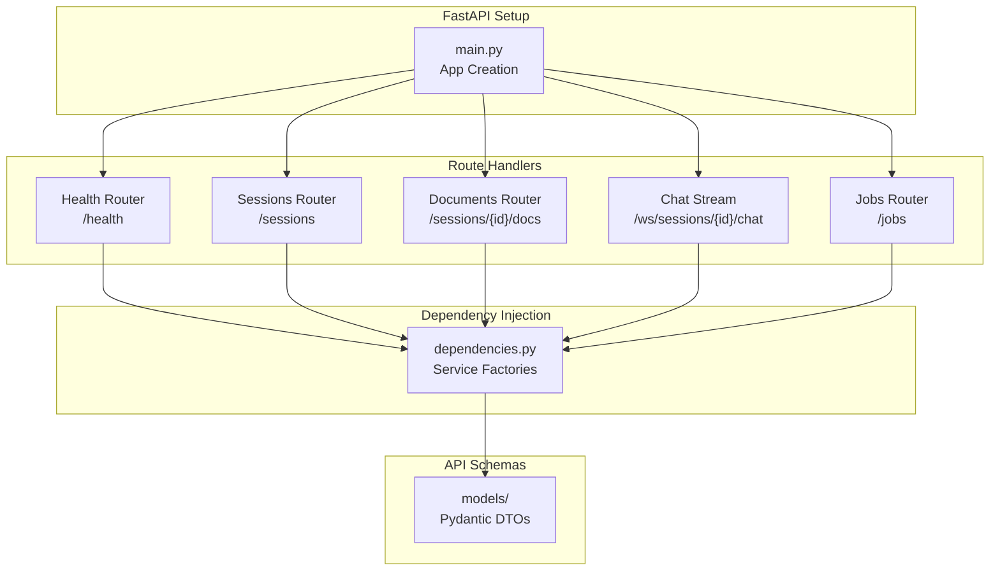

---

## Directory Structure

```
backend/api/
├── main.py                    # FastAPI app creation, router registration, middleware
├── deps/
│   ├── __init__.py
│   └── dependencies.py        # DI factories: service instantiation
├── routers/
│   ├── __init__.py
│   ├── health.py              # Health checks (3 endpoints)
│   ├── sessions.py            # Session CRUD + chat (5 endpoints)
│   ├── documents.py           # Document upload/delete (4 endpoints)
│   ├── chat_stream.py         # WebSocket streaming (1 endpoint)
│   └── jobs.py                # Job status polling (1 endpoint)
└── schemas/                   # Pydantic request/response models
```

---

## Dependency Injection Pattern

### Service Factories ([deps/dependencies.py](deps/dependencies.py))

All services are injected via FastAPI `Depends()` pattern:

```python
# Settings singleton (LRU cached)
get_settings_dependency() → Settings

# Database session per-request
get_async_db() → AsyncSession

# Business services per-request
get_session_service(db) → SessionService
get_document_service(db) → DocumentService
get_job_service(db) → JobService
get_chat_service(db) → ChatService
get_diagram_service() → DiagramService
get_s3_document_client() → S3DocumentClient
```

**Key Pattern:**
- Each factory creates service instances with injected dependencies
- Database session is created per-request and automatically closed
- Services follow constructor injection pattern for testability
- RAG agent and vector store are created per-request in HTTP endpoints
- WebSocket endpoint uses shared RAG agent from `app.state` for efficiency

---

## API Endpoints Overview

| Router | Prefix | Endpoints | Purpose |
|--------|--------|-----------|---------|
| [Health](#health-router) | `/health` | 3 | Health checks |
| [Sessions](#sessions-router) | `/sessions` | 5 | Session CRUD + chat |
| [Documents](#documents-router) | `/sessions` | 4 | Document upload/delete |
| [Chat Stream](#chat-stream-websocket) | `/ws` | 1 | Real-time streaming |
| [Jobs](#jobs-router) | `/jobs` | 1 | Job polling |

**Total:** 14 endpoints (13 HTTP + 1 WebSocket)

---

## Sessions Router

**File:** [routers/sessions.py](routers/sessions.py)
**Prefix:** `/sessions`
**Dependencies:** SessionService, ChatService, DiagramService

### Endpoints

#### 1. POST /sessions
Create new study session with optional metadata.

**Request:**
```json
{
  "metadata": {
    "name": "Calculus Study",
    "description": "Preparing for final exam"
  }
}
```

**Response:**
```json
{
  "id": "123e4567-e89b-12d3-a456-426614174000",
  "name": "Calculus Study",
  "description": "Preparing for final exam",
  "createdAt": "2025-12-17T10:00:00Z"
}
```

**Sequence Diagram:**
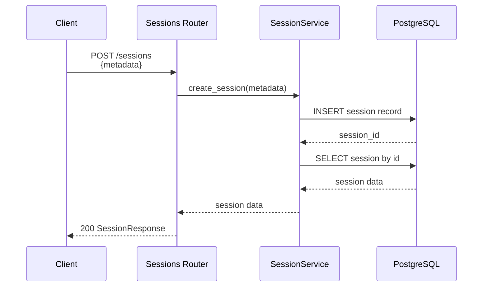

---

#### 2. GET /sessions
List all sessions with pagination.

**Query Parameters:**
- `limit` (default: 100) - Max sessions to return
- `offset` (default: 0) - Number to skip

**Response:**
```json
[
  {
    "id": "123e4567-e89b-12d3-a456-426614174000",
    "name": "Calculus Study",
    "description": "Preparing for final exam",
    "createdAt": "2025-12-17T10:00:00Z"
  }
]
```

**Sequence Diagram:**
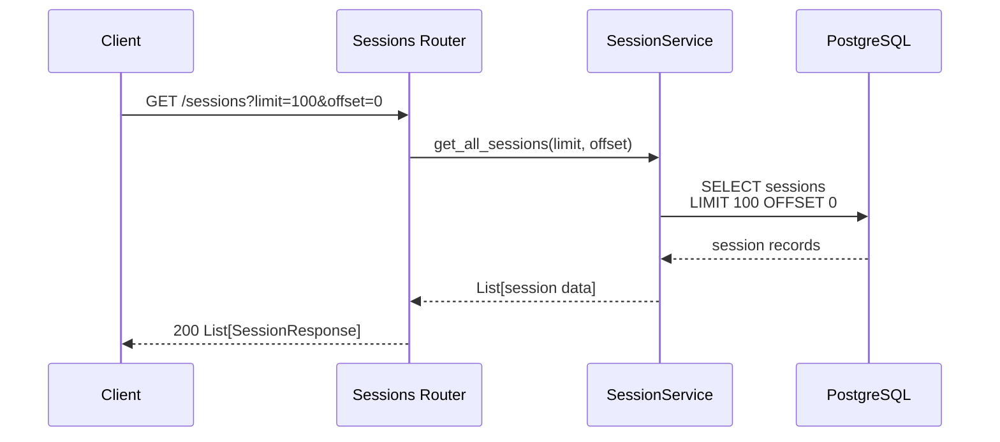

---

#### 3. DELETE /sessions/{session_id}
Delete session by ID.

**Response:** 204 No Content

**Sequence Diagram:**
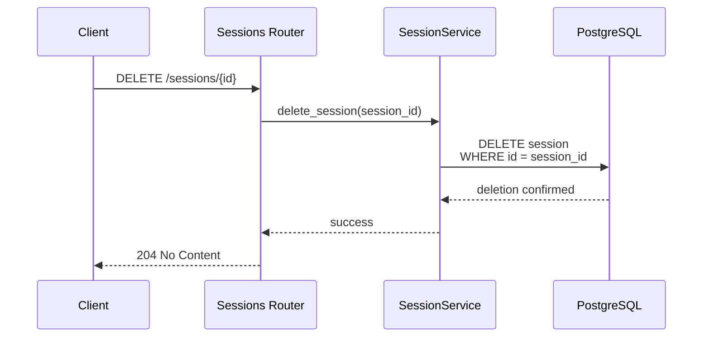

---

#### 4. GET /sessions/{session_id}/chat/history
Retrieve chat history for session.

**Query Parameters:**
- `limit` (default: 100) - Max messages to return

**Response:**
```json
{
  "messages": [
    {
      "role": "user",
      "content": "What is calculus?"
    },
    {
      "role": "assistant",
      "content": "Calculus is the study of change..."
    }
  ],
  "total": 2
}
```

**Sequence Diagram:**
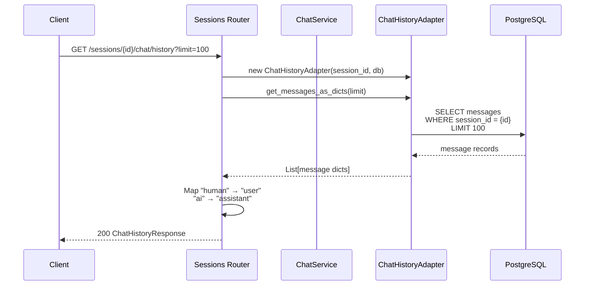

---

#### 5. POST /sessions/{session_id}/chat
Send chat message with RAG and optional diagram generation.

**Request:**
```json
{
  "message": "What is the derivative of x^2?",
  "include_diagram": false
}
```

**Response:**
```json
{
  "answer": "The derivative of x^2 is 2x...",
  "citations": [
    {
      "doc_name": "calculus_notes.pdf",
      "page": 5,
      "section": "Power Rule",
      "chunk_id": "doc123_chunk_0",
      "source_uri": "s3://bucket/doc.pdf"
    }
  ],
  "mermaid_diagram": null
}
```

**Sequence Diagram:**
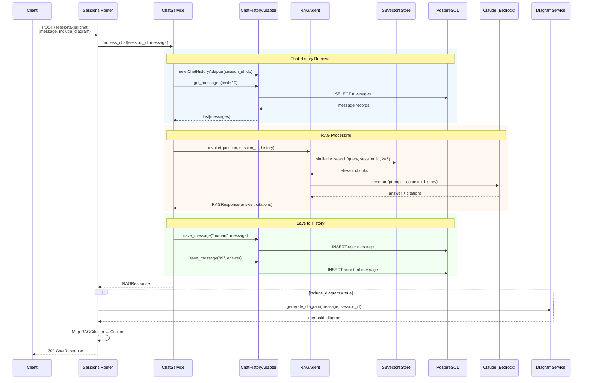

**Error Handling:**
- 404: Session not found
- 500: RAG processing error

---

## Documents Router

**File:** [routers/documents.py](routers/documents.py)
**Prefix:** `/sessions`
**Dependencies:** DocumentService, JobService, S3DocumentClient

### Upload Flow Pattern

The document upload follows a **3-step presigned URL pattern**:

1. **Get Presigned URL** - Frontend requests upload URL
2. **Direct S3 Upload** - Frontend uploads file directly to S3
3. **Notify Backend** - Frontend notifies backend to start processing

This pattern:
- Reduces backend load (no file proxying)
- Enables upload progress tracking
- Provides better error handling
- Scales horizontally

### Endpoints

#### 1. POST /sessions/{session_id}/docs/presigned-url
Generate presigned URL for direct S3 upload.

**Request:**
```json
{
  "filename": "calculus_notes.pdf",
  "content_type": "application/pdf"
}
```

**Response:**
```json
{
  "presigned_url": "https://s3.amazonaws.com/...",
  "s3_key": "sessions/123e4567/.../calculus_notes.pdf",
  "expires_at": "2025-12-17T10:15:00Z",
  "content_type": "application/pdf"
}
```

**Sequence Diagram:**
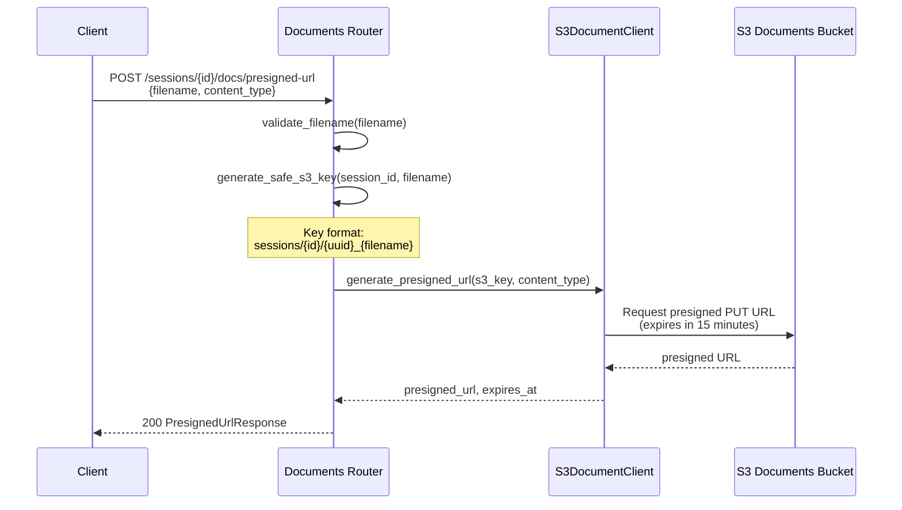

**Error Handling:**
- 400: Invalid filename or extension
- 500: S3 client error

---

#### 2. POST /sessions/{session_id}/docs/uploaded
Notify backend that S3 upload is complete.

**Request:**
```json
{
  "s3_key": "sessions/123e4567/.../calculus_notes.pdf",
  "filename": "calculus_notes.pdf"
}
```

**Response:**
```json
{
  "jobId": "job-123e4567-...",
  "status": "pending",
  "message": "Document processing started. Poll /jobs/{jobId} for status."
}
```

**Sequence Diagram:**
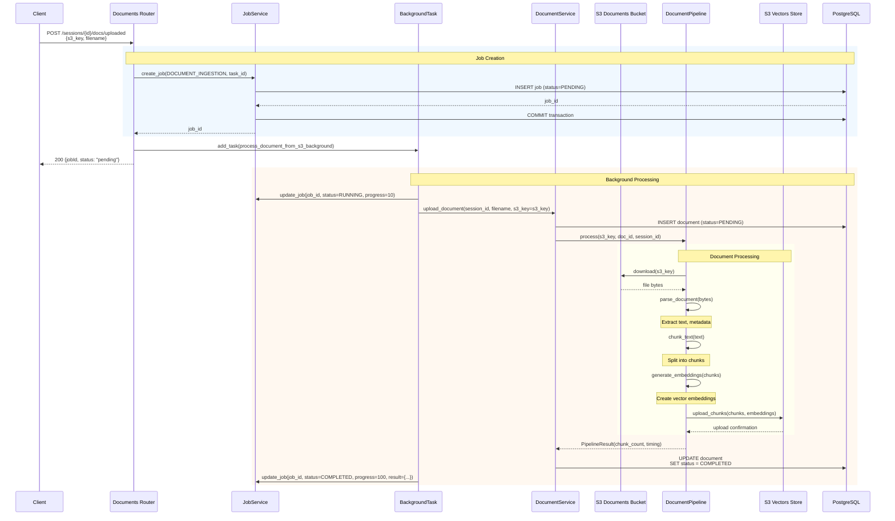

**Error Handling:**
- Document fails: Job marked as FAILED with error details
- Job polling timeout: Frontend refreshes document list to get actual status

---

#### 3. GET /sessions/{session_id}/docs
List all documents in session.

**Response:**
```json
{
  "documents": [
    {
      "id": "doc-123e4567-...",
      "session_id": "session-123e4567-...",
      "name": "calculus_notes.pdf",
      "status": "completed",
      "created_at": "2025-12-17T10:00:00Z",
      "error_message": null
    }
  ],
  "total": 1,
  "cursor": null
}
```

**Sequence Diagram:**
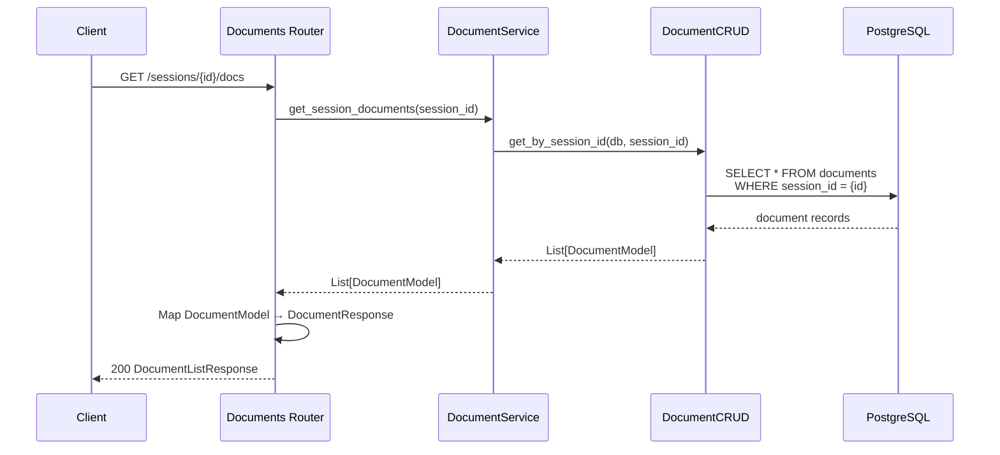

---

#### 4. DELETE /sessions/{session_id}/docs/{doc_id}
Delete document from session (NEW endpoint).

**Response:** 204 No Content

**Sequence Diagram:**
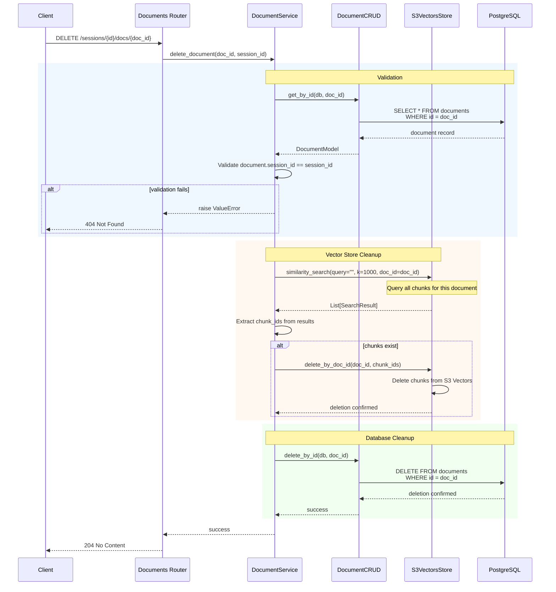

**Error Handling:**
- 404: Document not found or doesn't belong to session
- 500: Deletion failed (vector store or database error)

**Key Features:**
- Cascading deletion: removes vector chunks before database record
- Session validation: prevents cross-session deletion
- Atomic operation: both vector store and database or neither

---

## Chat Stream WebSocket

**File:** [routers/chat_stream.py](routers/chat_stream.py)
**Path:** `/ws/sessions/{session_id}/chat`
**Protocol:** WebSocket
**Dependencies:** ChatService (with shared RAG agent from app.state)

### WebSocket Flow

**Client Events:**
```json
// Chat request
{"event": "chat", "data": {"message": "...", "include_diagram": false}}

// Keep-alive
{"event": "ping"}
```

**Server Events:**
```json
// Connection established
{"event": "connected", "data": {"session_id": "..."}}

// Retrieved context chunks
{"event": "context", "data": {"chunks": [...]}}

// Token streaming (multiple events)
{"event": "token", "data": {"token": "word", "index": 0}}

// Citations when available
{"event": "citations", "data": {"citations": [...]}}

// Stream completion
{"event": "complete", "data": {"full_answer": "..."}}

// Error
{"event": "error", "data": {"code": "...", "message": "..."}}

// Pong response
{"event": "pong"}
```

### Sequence Diagram

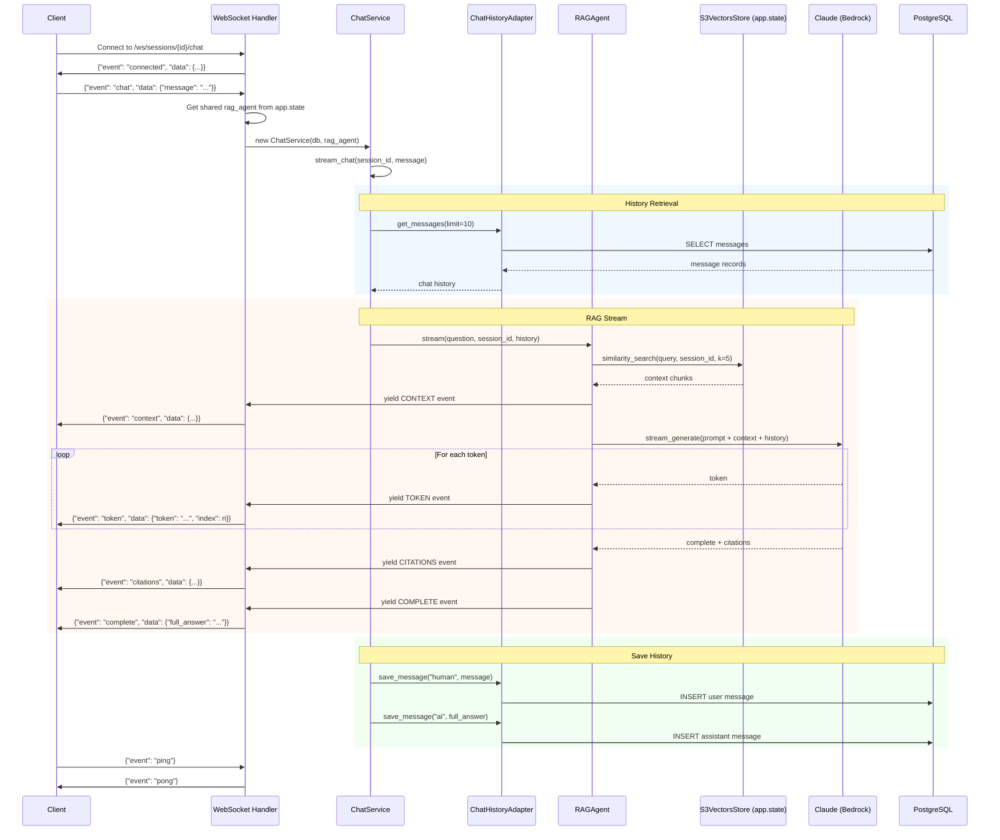

**Key Features:**
- Real-time token streaming for better UX
- Shared RAG agent from `app.state` (initialized once at startup)
- Context-aware responses with chat history
- Keep-alive via ping/pong
- Error handling with structured error codes

**Error Codes:**
- `INVALID_JSON` - Malformed JSON message
- `MISSING_MESSAGE` - Empty or missing message field
- `SESSION_NOT_FOUND` - Invalid session ID
- `PROCESSING_ERROR` - RAG processing failure
- `SERVICE_ERROR` - Service initialization failure
- `UNKNOWN_EVENT` - Unrecognized event type

---

## Jobs Router

**File:** [routers/jobs.py](routers/jobs.py)
**Prefix:** `/jobs`
**Dependencies:** JobService

### Endpoints

#### GET /jobs/{job_id}
Poll job status for long-running operations.

**Response:**
```json
{
  "id": "job-123e4567-...",
  "task_id": "task-abc123",
  "type": "document_ingestion",
  "status": "completed",
  "progress": 100,
  "result": {
    "document_id": "doc-123",
    "chunk_count": 42,
    "processing_time_ms": 1234.56
  },
  "created_at": "2025-12-17T10:00:00Z",
  "updated_at": "2025-12-17T10:00:05Z"
}
```

**Sequence Diagram:**
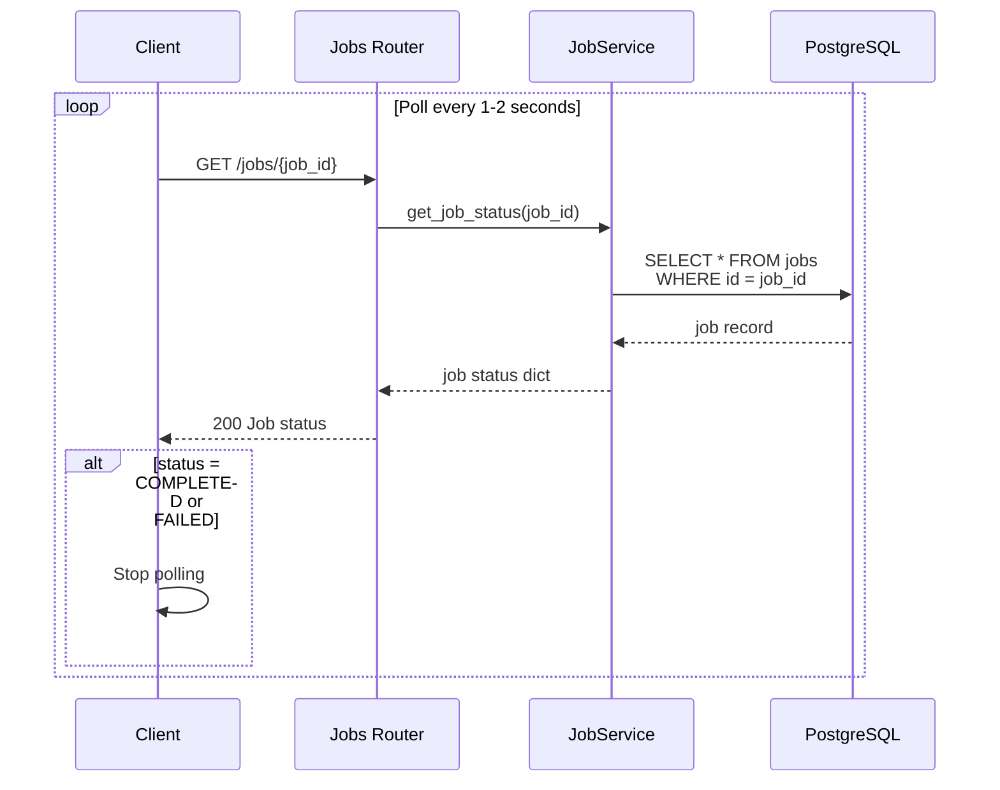

**Job Statuses:**
- `PENDING` - Job created, not started
- `RUNNING` - Job in progress
- `COMPLETED` - Job finished successfully
- `FAILED` - Job encountered error

**Error Handling:**
- 404: Job not found

---

## Health Router

**File:** [routers/health.py](routers/health.py)
**Prefix:** `/health`
**Dependencies:** None (scaffolded)

### Endpoints

#### 1. GET /health
Basic health check.

**Response:**
```json
{
  "status": "healthy",
  "message": "Server Healthy"
}
```

**Sequence Diagram:**
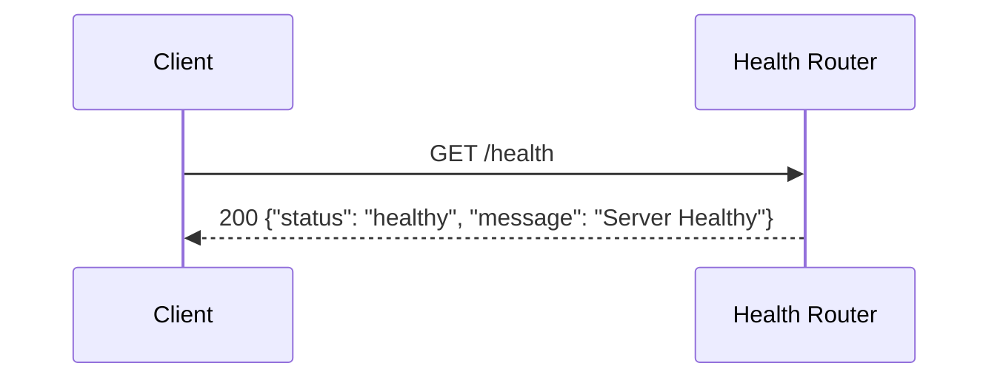

---

#### 2. GET /health/db
Database connectivity check (scaffolded).

**Response:**
```json
{
  "status": "healthy",
  "message": "Database connection OK"
}
```

**Note:** Currently returns hardcoded response. Should be implemented to test actual database connectivity.

---

#### 3. GET /health/vector-store
Vector store connectivity check (scaffolded).

**Response:**
```json
{
  "status": "healthy",
  "message": "Vector store accessible"
}
```

**Note:** Currently returns hardcoded response. Should be implemented to test actual S3 Vectors connectivity.

---

## Key Design Patterns

### 1. Layered Architecture
Clean separation of concerns across layers:

```
HTTP Layer (API Routes)
    ↓ DTOs
Service Layer (Business Logic)
    ↓ Domain Models
Domain Layer (Core Logic)
    ↓ Interfaces
Boundary Layer (External Systems)
```

**Benefits:**
- Clear responsibility boundaries
- Easy to test (mock boundaries)
- Decoupled from infrastructure

### 2. Dependency Injection
All services injected via FastAPI `Depends()`:

```python
@router.post("/{session_id}/chat")
async def chat(
    session_id: UUID,
    request: ChatRequest,
    chat_service: ChatService = Depends(get_chat_service),
) -> ChatResponse:
    ...
```

**Benefits:**
- Testability (easy to mock)
- Flexibility (swap implementations)
- Explicit dependencies

### 3. Non-Blocking Async Pattern
Long-running operations use background tasks + job polling:

```python
# Return immediately
background_tasks.add_task(process_document_from_s3_background, ...)
return {"jobId": job_id, "status": "pending"}

# Frontend polls
GET /jobs/{job_id} every 1-2 seconds
```

**Benefits:**
- No timeout issues
- Horizontal scalability
- Better user experience

### 4. Presigned URL Upload Pattern
3-step upload flow reduces backend load:

1. **Request URL** → Backend generates presigned URL
2. **Direct Upload** → Frontend uploads directly to S3
3. **Notify Complete** → Backend starts processing

**Benefits:**
- No file proxying through backend
- Upload progress tracking
- Better error handling
- Scales horizontally

### 5. Streaming WebSocket Pattern
Real-time token streaming for chat:

```python
async for event in chat_service.stream_chat(session_id, message):
    await websocket.send_json(event.to_dict())
```

**Benefits:**
- Perceived performance improvement
- Better UX (see response as it's generated)
- Efficient resource usage (shared RAG agent)

### 6. Request/Response Mapping
Internal domain models ↔ API DTOs:

```python
# Internal: RAGCitation
# External: Citation (API schema)

citations = [
    Citation(
        doc_name=cite.source_uri.split("/")[-1],
        page=cite.page,
        section=cite.section,
        chunk_id=cite.chunk_id,
        source_uri=cite.source_uri,
    )
    for cite in rag_response.citations
]
```

**Benefits:**
- API contracts independent of domain
- Versioning flexibility
- Clear boundaries

---

## Error Handling Strategy

### HTTP Status Codes

| Code | Usage | Example |
|------|-------|---------|
| 200 | Success | Document list, chat response |
| 204 | Success, no content | Delete operations |
| 400 | Client error | Invalid filename, malformed request |
| 404 | Not found | Session/document/job not found |
| 408 | Timeout | Job polling timeout (frontend handles) |
| 500 | Server error | Processing error, database error |

### Error Response Format

All errors return consistent structure:

```json
{
  "detail": "Human-readable error message"
}
```

### Exception Handling Pattern

```python
try:
    # Operation
except ValueError as e:
    # Validation errors → 400/404
    raise HTTPException(status_code=404, detail=str(e))
except Exception as e:
    # Unexpected errors → 500
    raise HTTPException(
        status_code=500,
        detail=f"Operation failed: {str(e)}"
    )
```

---

## Middleware Chain

**Registration Order ([main.py](main.py)):**

1. **CORSMiddleware** - Cross-origin requests
   - Allows all origins in development
   - Configurable per environment

2. **LangfuseMiddleware** - Distributed tracing
   - Observability for LLM calls
   - Performance monitoring

3. **CorrelationMiddleware** - Request correlation IDs
   - Tracks requests across services
   - Aids in debugging

**Execution Flow:**
```
Request → CORS → Langfuse → Correlation → Routes
         ↓
Response ← CORS ← Langfuse ← Correlation ← Routes
```

---

## Testing & Development

### Start Server

```bash
python -m uvicorn backend.main:app --reload
```

### API Documentation

- **Swagger UI:** http://localhost:8000/docs
- **ReDoc:** http://localhost:8000/redoc

### Testing Endpoints

#### Create Session
```bash
curl -X POST http://localhost:8000/api/v1/sessions \
  -H "Content-Type: application/json" \
  -d '{"metadata": {"name": "Test Session", "description": "Testing"}}'
```

#### Get Presigned URL
```bash
curl -X POST http://localhost:8000/api/v1/sessions/{id}/docs/presigned-url \
  -H "Content-Type: application/json" \
  -d '{"filename": "test.pdf", "content_type": "application/pdf"}'
```

#### Chat
```bash
curl -X POST http://localhost:8000/api/v1/sessions/{id}/chat \
  -H "Content-Type: application/json" \
  -d '{"message": "What is calculus?", "include_diagram": false}'
```

#### Poll Job
```bash
curl http://localhost:8000/api/v1/jobs/{job_id}
```

#### Delete Document
```bash
curl -X DELETE http://localhost:8000/api/v1/sessions/{session_id}/docs/{doc_id}
```

### WebSocket Testing

```javascript
const ws = new WebSocket('ws://localhost:8000/ws/sessions/{id}/chat');

ws.onopen = () => {
  ws.send(JSON.stringify({
    event: 'chat',
    data: { message: 'Hello!', include_diagram: false }
  }));
};

ws.onmessage = (event) => {
  const data = JSON.parse(event.data);
  console.log(data.event, data.data);
};
```

---

## Known Issues & Technical Debt

| Issue | Severity | Location | Details |
|-------|----------|----------|---------|
| **Hardcoded RAG config** | Medium | [dependencies.py:87-99](deps/dependencies.py#L87) | Vector store settings hardcoded, should use `get_settings()` |
| **Per-request RAG agent** | Medium | [dependencies.py:94-99](deps/dependencies.py#L94) | HTTP endpoints create RAG agent per-request (WebSocket uses shared) |
| **Scaffolded health checks** | Low | [health.py](routers/health.py) | Health endpoints return hardcoded responses |
| **No diagram router** | Low | N/A | Diagram generation delegated to chat endpoint |
| **Job polling timeout handling** | Low | [documents.py:250-267](routers/documents.py#L250) | Frontend relies on document list refresh after timeout |

---

## Related Documentation

- [Backend Architecture Overview](../README.md)
- [Application Services](../application/services/README.md)
- [Boundary Layer (DB/VDB)](../boundary/README.md)
- [Core Systems](../core/README.md)
- [Document Processing Pipeline](../core/document_processing/README.md)
- [RAG Agent](../core/agentic_system/agent/README.md)

---

*Last Updated: 2025-12-17*
*Generated documentation for Student Helper RAG application*
