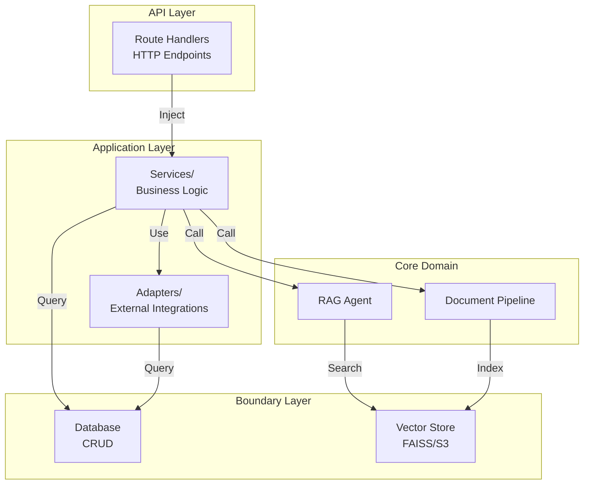
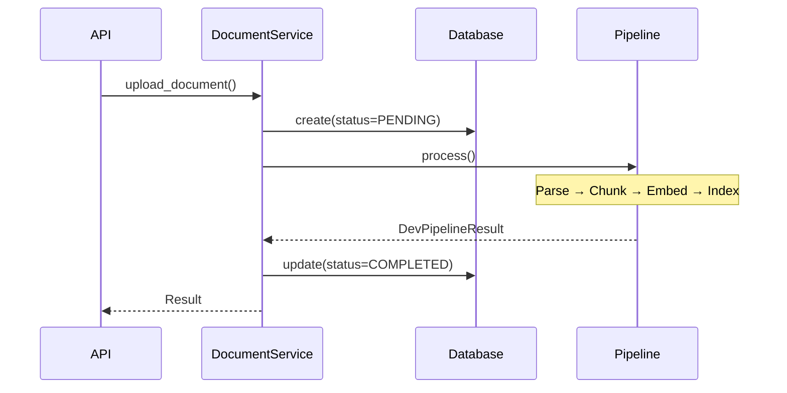

# Application Layer - Business Logic & Orchestration

**Location:** [`backend/application/`](.)
**Purpose:** Service classes that orchestrate domain logic, bridge API endpoints with boundary layer, and coordinate complex business operations

---

## Module Architecture



---

## Directory Structure

```
backend/application/
├── services/
│   ├── __init__.py
│   ├── session_service.py      # Session lifecycle (stub)
│   ├── document_service.py     # Document ingestion coordination
│   ├── chat_service.py         # RAG-based Q&A orchestration
│   ├── job_service.py          # Background job tracking (COMPLETE)
│   └── diagram_service.py      # Diagram generation (stub)
└── adapters/
    ├── __init__.py
    ├── chat_history_adapter.py # Chat persistence business logic
    └── diagram_generator.py    # Mermaid diagram generation
```

---

## Service Classes

### 1. ChatService ([services/chat_service.py](services/chat_service.py:21-95))

**Responsibility:** Orchestrate conversational Q&A with RAG grounding and history persistence

**Constructor:**
```python
__init__(db: AsyncSession, rag_agent: RAGAgent)
```
- `db` - Database session for persistence
- `rag_agent` - RAG agent instance for retrieval + generation

**Core Method: `process_chat()`**

```python
async def process_chat(
    session_id: UUID,
    message: str,
    context_window_size: int = 10
) → RAGResponse
```

**Flow:**
1. Validate session exists via `session_crud.get_by_id()`
2. Create `ChatHistoryAdapter` scoped to session
3. Fetch recent messages (last N messages for context)
4. Call `rag_agent.ainvoke(message, chat_history)`
5. Persist user message via `add_user_message()`
6. Persist AI response via `add_ai_message()`
7. Return `RAGResponse` with answer + citations

**Key Design:**
- Session-scoped isolation (different users don't interfere)
- Configurable context window (default: 10 messages)
- Async-first (uses `ainvoke()` for non-blocking)

**File Paths:**
- Implementation: [services/chat_service.py:44-95](services/chat_service.py#L44)
- Dependencies: See [core/agentic_system/](../core/agentic_system/), [application/adapters/chat_history_adapter.py](adapters/chat_history_adapter.py)

---

### 2. DocumentService ([services/document_service.py](services/document_service.py:23-293))

**Responsibility:** Manage document lifecycle - upload, processing, search, deletion

**Constructor:**
```python
__init__(db: AsyncSession, dev_pipeline: DevDocumentPipeline = None)
```
- `db` - Database session
- `dev_pipeline` - Optional custom pipeline (defaults to `DevDocumentPipeline()`)

**Core Methods:**

| Method | Purpose | Returns |
|--------|---------|---------|
| `upload_document(file_path, session_id, document_name)` | Parse → chunk → embed → index | `DevPipelineResult` |
| `search_documents(query, session_id, k=5, doc_id=None)` | Vector similarity search | `list[VectorSearchResult]` |
| `get_session_documents(session_id)` | List document names | `list[str]` |
| `delete_document(doc_id, session_id)` | Remove from store | `None` |
| `clear_session_index(session_id)` | Clear all session vectors | `None` |

**Upload Pipeline:**



**File Paths:**
- Upload: [services/document_service.py:46-117](services/document_service.py#L46)
- Search: [services/document_service.py:119-145](services/document_service.py#L119)
- Pipeline: [boundary/vdb/dev_task.py](../../boundary/vdb/dev_task.py)

---

### 3. JobService ([services/job_service.py](services/job_service.py:19-150))

**Responsibility:** Background job tracking for async document processing

**Status:** Fully implemented ✓

**Constructor:**
```python
__init__(db: AsyncSession)
```

**Core Methods:**

| Method | Purpose | Effect |
|--------|---------|--------|
| `create_job(job_type, task_id)` | Create PENDING job | Returns job UUID |
| `mark_job_running(job_id, progress=0)` | Set RUNNING status | Updates DB |
| `mark_job_completed(job_id, result_data)` | Set COMPLETED, progress=100% | Stores result dict |
| `mark_job_failed(job_id, error_details)` | Set FAILED status | Stores error dict |
| `update_job_status(job_id, status, progress, result_data)` | Generic update | Flexible fields |
| `get_job_status(job_id)` | Poll current state | Returns `JobStatusResponse` |

**Lifecycle:**
```
PENDING → RUNNING → COMPLETED/FAILED
```

**File Paths:**
- Implementation: [services/job_service.py:36-150](services/job_service.py#L36)
- Models: [boundary/db/models/job_model.py](../../boundary/db/models/job_model.py)

---

### 4. SessionService ([services/session_service.py](services/session_service.py:14-32))

**Responsibility:** Session lifecycle management

**Status:** Stub (placeholder signatures only)

**Planned Methods:**
- `create_session(metadata: dict)` - Create new session
- `get_session(session_id: UUID)` - Retrieve session
- `add_chat_message()` - Legacy interface

**Note:** Real session operations use `session_crud` directly

**File Paths:**
- Stub: [services/session_service.py](services/session_service.py)
- CRUD: [boundary/db/CRUD/session_crud.py](../../boundary/db/CRUD/session_crud.py)

---

### 5. DiagramService ([services/diagram_service.py](services/diagram_service.py))

**Responsibility:** Mermaid diagram generation

**Status:** Stub (placeholder signatures only)

**Planned Methods:**
- `generate_diagram(prompt, session_id)` - Generate grounded diagram
- `validate_diagram(diagram_code, citations)` - Validate grounding

**Note:** Called optionally from chat endpoint

---

## Adapter Classes

### ChatHistoryAdapter ([adapters/chat_history_adapter.py](adapters/chat_history_adapter.py:21-176))

**Responsibility:** High-level business logic for chat message persistence

**Constructor:**
```python
__init__(session_id: UUID, db: AsyncSession)
```
- Session-scoped to prevent cross-session message leakage

**Methods:**

```python
async def add_user_message(content: str) → None
async def add_ai_message(content: str) → None
async def get_messages(limit: int | None = None) → list[BaseMessage]
async def get_messages_as_dicts(limit: int | None = None) → list[dict]
async def clear() → None
```

**Integration with RAG:**
1. ChatService fetches messages via `get_messages(limit=10)`
2. Formats as "User: ... | Assistant: ..." text
3. Passes to RAGAgent as conversation context
4. RAGAgent includes context in prompt for follow-up questions

**Database:**
- Uses LangChain `PostgresChatMessageHistory` (psycopg, not async)
- Stores in `chat_messages` table
- Session-scoped via session_id parameter

**File Paths:**
- Implementation: [adapters/chat_history_adapter.py:23-176](adapters/chat_history_adapter.py#L23)
- CRUD: [boundary/db/CRUD/chat_history_crud.py](../../boundary/db/CRUD/chat_history_crud.py)

---

### DiagramGenerator ([adapters/diagram_generator.py](adapters/diagram_generator.py))

**Responsibility:** Mermaid diagram generation logic

**Status:** Stub implementation

---

## Integration Points

### Dependency Injection ([backend/api/deps/dependencies.py](../../api/deps/dependencies.py:33-112))

**Service factories provide per-request instances:**

```python
get_chat_service(db) → ChatService
  ├─ Injects: db (AsyncSession)
  ├─ Creates: RAGAgent with FAISSStore
  └─ Returns: ChatService(db, rag_agent)

get_document_service(db) → DocumentService
  ├─ Injects: db (AsyncSession)
  ├─ Creates: DevDocumentPipeline
  └─ Returns: DocumentService(db, pipeline)

get_job_service(db) → JobService
  ├─ Injects: db (AsyncSession)
  └─ Returns: JobService(db)
```

---

## Request/Response Flows

### Chat Flow

```
POST /api/v1/sessions/{session_id}/chat
  ↓
ChatService.process_chat(session_id, message)
  ├─ session_crud.get_by_id() [validate]
  ├─ ChatHistoryAdapter.get_messages(limit=10)
  ├─ rag_agent.ainvoke(message, chat_history)
  │  ├─ Vector search via FAISSStore
  │  ├─ LLM generation via Bedrock Claude
  │  └─ Return RAGResponse
  ├─ ChatHistoryAdapter.add_user_message(message)
  ├─ ChatHistoryAdapter.add_ai_message(answer)
  └─ Return RAGResponse
  ↓
Route handler maps RAGResponse → ChatResponse
  ├─ Extract citations from RAGResponse
  ├─ Map RAGCitation → Citation (extract filename)
  ├─ [Optional] DiagramService.generate_diagram()
  └─ Return ChatResponse with answer + citations
```

### Document Upload Flow

```
POST /api/v1/sessions/{session_id}/docs
  ↓
JobService.create_job(DOCUMENT_INGESTION, task_id)
  ↓
Return job_id immediately
  ↓
BackgroundTask: process_document_background()
  ├─ JobService.mark_job_running(job_id, progress=10)
  ├─ DocumentService.upload_document(file_path, session_id, name)
  │  ├─ document_crud.create(status=PENDING)
  │  ├─ DevDocumentPipeline.process()
  │  │  ├─ ParsingTask: Docling
  │  │  ├─ ChunkingTask: RecursiveCharacterTextSplitter
  │  │  └─ FAISSStore.add_documents()
  │  └─ document_crud.update_status(COMPLETED)
  ├─ JobService.mark_job_completed(job_id, {chunks, time})
  └─ [On error] JobService.mark_job_failed(job_id, error)
```

---

## Key Design Patterns

### 1. Adapter Pattern
Services wrap lower-level components (ChatHistoryAdapter wraps CRUD)

### 2. Async-First
All methods are `async def` using SQLAlchemy async API

### 3. Session-Scoped Isolation
ChatHistoryAdapter scoped to session_id prevents cross-user interference

### 4. Background Processing
Document ingestion via FastAPI BackgroundTasks (non-blocking)

### 5. Status Tracking
JobService enables frontend polling without WebSockets

### 6. Error Propagation
Custom exceptions (ParsingError) bubble up for API error handling

---

## Key Dependencies

| Dependency | Location | Purpose |
|------------|----------|---------|
| RAGAgent | [core/agentic_system/agent/](../core/agentic_system/agent/) | LLM + vector search |
| DevDocumentPipeline | [boundary/vdb/dev_task.py](../../boundary/vdb/dev_task.py) | Parse → chunk → embed → index |
| session_crud | [boundary/db/CRUD/](../../boundary/db/CRUD/) | Session CRUD |
| document_crud | [boundary/db/CRUD/](../../boundary/db/CRUD/) | Document CRUD |
| job_crud | [boundary/db/CRUD/](../../boundary/db/CRUD/) | Job CRUD |
| ChatHistoryCRUD | [boundary/db/CRUD/](../../boundary/db/CRUD/) | Chat persistence |

---

## Implementation Status

| Service | Status | Key Methods |
|---------|--------|------------|
| ChatService | Complete | process_chat() ✓ |
| DocumentService | Complete | upload_document(), search_documents() ✓ |
| JobService | Complete | all ✓ |
| SessionService | Stub | create_session(), get_session() |
| DiagramService | Stub | generate_diagram() |
| ChatHistoryAdapter | Complete | add_user_message(), get_messages() ✓ |
| DiagramGenerator | Stub | Empty |

---

## Testing & Development

**Service Injection in Routes:**
```python
@router.post("/chat")
async def chat(
    session_id: UUID,
    request: ChatRequest,
    chat_service: ChatService = Depends(get_chat_service),
):
    response = await chat_service.process_chat(session_id, request.message)
    return ChatResponse(...)
```

**Mocking for Unit Tests:**
```python
mock_service = AsyncMock(spec=ChatService)
mock_service.process_chat.return_value = RAGResponse(...)
```

---

## Known Issues

| Issue | Severity | Details |
|-------|----------|---------|
| SessionService incomplete | Medium | Only placeholder methods |
| DiagramService incomplete | Medium | Only placeholder methods |
| FAISSStore recreated per-request | Medium | Should be singleton |
| Async chat history | Low | Uses psycopg (sync driver) |

---

## File Reference Map

| File | Purpose | Lines |
|------|---------|-------|
| [services/chat_service.py](services/chat_service.py) | Chat orchestration | 21-95 |
| [services/document_service.py](services/document_service.py) | Document ingestion | 23-293 |
| [services/job_service.py](services/job_service.py) | Job tracking | 19-150 |
| [services/session_service.py](services/session_service.py) | Session management | 14-32 |
| [services/diagram_service.py](services/diagram_service.py) | Diagram generation | All |
| [adapters/chat_history_adapter.py](adapters/chat_history_adapter.py) | Chat persistence | 21-176 |
| [adapters/diagram_generator.py](adapters/diagram_generator.py) | Diagram logic | All |

---

## Related Documentation

- [API Layer](../api/README.md)
- [Core Domain Systems](../core/README.md)
- [Boundary Layer](../boundary/README.md)
- [Database Layer](../boundary/db/README.md)

---

*Generated documentation for Student Helper RAG application*
