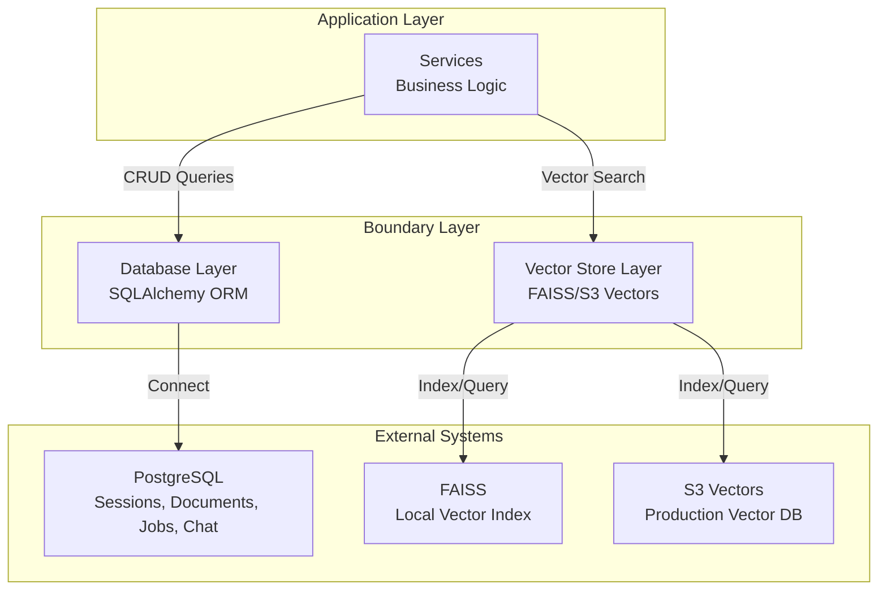
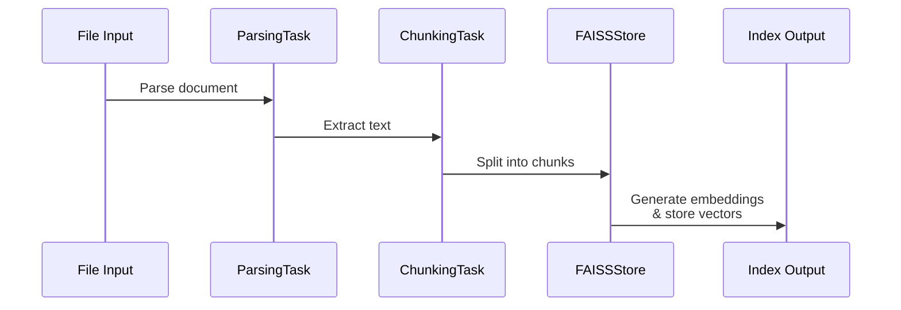

# Boundary Layer - External Integrations

**Location:** [`backend/boundary/`](.)
**Purpose:** Isolate external dependencies (databases, vector stores) behind clean interfaces. Implements repository pattern and adapter abstraction.

---

## Module Architecture



---

## Directory Structure

```
backend/boundary/
├── db/                          # Database adapter layer
│   ├── base.py                  # SQLAlchemy Base, UUIDMixin, TimestampMixin
│   ├── connection.py            # Engine, session factory, async setup
│   ├── create_tables.py         # DDL/table creation
│   ├── models/                  # ORM models
│   │   ├── session_model.py     # SessionModel
│   │   ├── document_model.py    # DocumentModel + DocumentStatus enum
│   │   └── job_model.py         # JobModel + JobStatus/JobType enums
│   ├── CRUD/                    # Data access objects
│   │   ├── base_crud.py         # Generic BaseCRUD[T] for all entities
│   │   ├── session_crud.py      # Session queries
│   │   ├── document_crud.py     # Document queries
│   │   ├── job_crud.py          # Job queries
│   │   └── chat_history_crud.py # Chat history (LangChain integration)
│   ├── example_usage.py         # Usage patterns & examples
│   └── __init__.py              # Public exports
│
└── vdb/                         # Vector database adapter layer
    ├── vector_schemas.py        # VectorMetadata, VectorQuery, VectorSearchResult
    ├── s3_vectors_store.py   # Production S3 Vectors client
    └── __init__.py              # Module exports
```

---

## Database Layer (`db/`)

### 1. Base Classes ([base.py](db/base.py))

**SQLAlchemy Setup:**

```python
Base = declarative_base()  # ORM declarative base for all models
```

**Mixins for Reusable Fields:**

| Mixin            | Purpose           | Fields                                                     |
| ---------------- | ----------------- | ---------------------------------------------------------- |
| `UUIDMixin`      | UUID primary keys | `id: UUID = Column(UUID, default=uuid4, primary_key=True)` |
| `TimestampMixin` | Audit timestamps  | `created_at: datetime`, `updated_at: datetime`             |

**File:** [db/base.py](db/base.py:31-73)

---

### 2. Connection Management ([connection.py](db/connection.py))

**Async Engine Setup:**

```python
engine = create_async_engine(
    db_config.async_database_url,
    poolclass=QueuePool,
    pool_size=10,
    max_overflow=20,
    pool_timeout=30,
    pool_pre_ping=True
)
```

**Session Factory:**

```python
async_session_factory = sessionmaker(
    bind=engine,
    class_=AsyncSession,
    autocommit=False,
    autoflush=False
)
```

**FastAPI Dependency:**

```python
async def get_db() → AsyncSession:
    async with async_session_factory() as session:
        yield session
        # Auto-closes after route completes
```

**Pool Configuration:**

- `pool_size=10` - Core pool connections
- `max_overflow=20` - Additional temp connections
- `pool_timeout=30` - Wait time before timeout
- `pool_pre_ping=True` - Health check before use

**File:** [db/connection.py:20-103](db/connection.py#L20)

---

### 3. ORM Models

#### SessionModel ([models/session_model.py](db/models/session_model.py:17-51))

```python
class SessionModel(Base, UUIDMixin, TimestampMixin):
    __tablename__ = "sessions"

    session_metadata: Mapped[dict] = mapped_column(JSON)  # Flexible metadata
    documents: Mapped[list[DocumentModel]] = relationship(
        cascade="all, delete-orphan"  # Cascades to documents
    )
```

**Usage:** Represents session isolation boundary for RAG queries

**File Path:** [db/models/session_model.py](db/models/session_model.py)

---

#### DocumentModel ([models/document_model.py](db/models/document_model.py:19-94))

```python
class DocumentModel(Base, UUIDMixin, TimestampMixin):
    __tablename__ = "documents"

    session_id: Mapped[UUID] = mapped_column(
        ForeignKey("sessions.id", ondelete="CASCADE")
    )
    name: Mapped[str] = mapped_column(String(255))
    status: Mapped[DocumentStatus]  # PENDING, PROCESSING, COMPLETED, FAILED
    upload_url: Mapped[str] = mapped_column(String(1024))
    error_message: Mapped[str | None]  # Null if successful
```

**Lifecycle:**

```
PENDING → PROCESSING → COMPLETED or FAILED
```

**File Path:** [db/models/document_model.py](db/models/document_model.py)

---

#### JobModel ([models/job_model.py](db/models/job_model.py:46-107))

```python
class JobModel(Base, UUIDMixin, TimestampMixin):
    __tablename__ = "jobs"

    task_id: Mapped[str] = mapped_column(String(255), unique=True)  # SQS MessageId
    type: Mapped[JobType]  # DOCUMENT_INGESTION, EVALUATION
    status: Mapped[JobStatus]  # PENDING, RUNNING, COMPLETED, FAILED
    progress: Mapped[int] = mapped_column(default=0)  # 0-100%
    result: Mapped[dict] = mapped_column(JSON)  # Success output or error details
```

**Enums:**

- `JobType`: DOCUMENT_INGESTION, EVALUATION
- `JobStatus`: PENDING, RUNNING, COMPLETED, FAILED

**File Path:** [db/models/job_model.py](db/models/job_model.py)

---

### 4. CRUD Pattern

#### BaseCRUD ([CRUD/base_crud.py](db/CRUD/base_crud.py:22-156))

**Generic CRUD for any model:**

```python
class BaseCRUD[ModelT](Generic[ModelT]):
    async def create(session: AsyncSession, **kwargs) → ModelT
    async def get_by_id(session: AsyncSession, id: UUID) → ModelT | None
    async def get_all(session: AsyncSession, limit: int, offset: int) → list[ModelT]
    async def update_by_id(session: AsyncSession, id: UUID, **kwargs) → ModelT | None
    async def delete_by_id(session: AsyncSession, id: UUID) → bool
    async def exists(session: AsyncSession, id: UUID) → bool
```

**Pattern:** All operations use SQLAlchemy 2.0 async API with explicit `flush()` + caller commits

**File Path:** [db/CRUD/base_crud.py](db/CRUD/base_crud.py#L22)

---

#### SessionCRUD ([CRUD/session_crud.py](db/CRUD/session_crud.py:22-104))

**Extends BaseCRUD with specialized queries:**

```python
async def get_with_documents(id: UUID) → SessionModel  # Eager load
async def update_metadata(id: UUID, metadata: dict) → SessionModel
```

**Singleton:** `session_crud = SessionCRUD()` (module level)

**File Path:** [db/CRUD/session_crud.py](db/CRUD/session_crud.py#L22)

---

#### DocumentCRUD ([CRUD/document_crud.py](db/CRUD/document_crud.py))

**Specialized queries:**

```python
async def get_by_session_id(session_id: UUID) → list[DocumentModel]
async def get_by_status(status: DocumentStatus) → list[DocumentModel]
async def update_status(id: UUID, status: DocumentStatus, error_message: str | None)
async def mark_completed(id: UUID)
async def mark_failed(id: UUID, error_message: str)
```

**Singleton:** `document_crud = DocumentCRUD()` (module level)

**File Path:** [db/CRUD/document_crud.py](db/CRUD/document_crud.py)

---

#### JobCRUD ([CRUD/job_crud.py](db/CRUD/job_crud.py:21-207))

**Specialized queries:**

```python
async def get_by_task_id(task_id: str) → JobModel  # SQS correlation
async def get_by_status(status: JobStatus) → list[JobModel]
async def mark_running(id: UUID, progress: int = 0)
async def mark_completed(id: UUID, result_data: dict)
async def mark_failed(id: UUID, error_details: dict)
```

**Singleton:** `job_crud = JobCRUD()` (module level)

**File Path:** [db/CRUD/job_crud.py](db/CRUD/job_crud.py#L21)

---

#### ChatHistoryCRUD ([CRUD/chat_history_crud.py](db/CRUD/chat_history_crud.py:23-176))

**LangChain Integration (NOT SQLAlchemy):**

```python
async def add_user_message(session_id: UUID, content: str)
async def add_ai_message(session_id: UUID, content: str)
async def get_messages(session_id: UUID) → list[BaseMessage]
async def clear_history(session_id: UUID)
```

**Note:** Uses `PostgresChatMessageHistory` from LangChain (psycopg driver)

**File Path:** [db/CRUD/chat_history_crud.py](db/CRUD/chat_history_crud.py#L23)

---

## Vector Store Layer (`vdb/`)

### 1. Vector Schemas ([vector_schemas.py](vdb/vector_schemas.py))

**Data Models:**

```python
class VectorMetadata(BaseModel):
    session_id: UUID
    doc_id: UUID
    chunk_id: str
    page: int | None
    section: str | None
    source_uri: str

class VectorQuery(BaseModel):
    embedding: list[float]  # Pre-computed embedding
    top_k: int = 5
    session_id: UUID | None
    doc_id: UUID | None
    similarity_threshold: float = 0.7

class VectorSearchResult(BaseModel):
    chunk_id: str
    content: str
    metadata: VectorMetadata
    similarity_score: float  # 0.0-1.0
```

**File:** [vdb/vector_schemas.py](vdb/vector_schemas.py)

---

### 2. Production Vector Store Client ([vector_store_client.py](vdb/vector_store_client.py))

**Purpose:** AWS S3 Vectors integration for production

**Interface:**

```python
class VectorStoreClient:
    async def upsert_vectors(vectors: list[VectorEntry]) → None
    async def query_vectors(query: VectorQuery) → list[VectorSearchResult]
    async def delete_vectors(chunk_ids: list[str]) → None
```

**Key Features:**

- Idempotent upsert (deterministic chunk IDs)
- Metadata filtering (session_id, doc_id)
- Error wrapping in `VectorStoreError`

**File Path:** [vdb/vector_store_client.py](vdb/vector_store_client.py)

---

### 3. Development Vector Store ([faiss_store.py](vdb/faiss_store.py))

**Purpose:** Local FAISS-based vector store for development

**Interface (same as production):**

```python
class FAISSStore:
    def add_documents(documents: list[Document], session_id: str, doc_id: str)
    def similarity_search(query: str, k: int = 5, session_id: str, doc_id: str) → list[VectorSearchResult]
    def delete_by_doc_id(doc_id: str)
    def clear()
```

**Key Features:**

- Persists to `.faiss_index/` directory
- Google Generative AI embeddings (1024-dim)
- Metadata filtering via LangChain
- Deterministic chunk IDs for idempotency

**File Path:** [vdb/faiss_store.py](vdb/faiss_store.py)

---

### 4. Development Pipeline ([dev_task.py](vdb/dev_task.py:23-188))

**Orchestrates full document ingestion:**



**Implementation:**

```python
class DevDocumentPipeline:
    async def process(
        file_path: str,
        session_id: UUID,
        doc_id: UUID
    ) → DevPipelineResult
```

**Result:** `DevPipelineResult(document_id, chunk_count, processing_time_ms, index_path)`

**File Path:** [vdb/dev_task.py](vdb/dev_task.py#L23)

---

## Integration Patterns

### Dependency Injection

**Services request DB session:**

```python
async def get_chat_service(
    db: AsyncSession = Depends(get_db)
) → ChatService:
    return ChatService(db=db, ...)
```

**CRUD singletons accessed within services:**

```python
async def process_chat(self, session_id: UUID, message: str):
    session = await session_crud.get_by_id(self.db, session_id)
    if not session:
        raise ValueError("Session not found")
```

---

## Key Design Decisions

### 1. Repository Pattern

- `BaseCRUD` provides generic operations
- Entity-specific `SessionCRUD`, `DocumentCRUD`, etc. extend with specialized queries
- Singletons (`session_crud = SessionCRUD()`) reused across application

### 2. Async-First

- All CRUD operations use SQLAlchemy async API
- Integrates seamlessly with FastAPI async endpoints
- Connection pooling handles concurrent requests

### 3. Transaction Control

- `autocommit=False, autoflush=False` → explicit transaction control
- Services call CRUD methods, then commit or rollback at HTTP boundary
- Prevents implicit side effects

### 4. Metadata as JSON

- `SessionModel.session_metadata` stores arbitrary dicts
- `JobModel.result` stores success/error details
- Flexible without schema migrations

### 5. Cascade Delete

- `DocumentModel` cascade deletes with session (FK constraint)
- Prevents orphaned records automatically
- Maintains referential integrity

---

## File Reference Map

| File                                                         | Purpose                   | Key Lines |
| ------------------------------------------------------------ | ------------------------- | --------- |
| [db/base.py](db/base.py)                                     | Mixins & declarative base | 31-73     |
| [db/connection.py](db/connection.py)                         | Engine, session factory   | 20-103    |
| [db/models/session_model.py](db/models/session_model.py)     | Session ORM               | 17-51     |
| [db/models/document_model.py](db/models/document_model.py)   | Document ORM              | 19-94     |
| [db/models/job_model.py](db/models/job_model.py)             | Job ORM                   | 46-107    |
| [db/CRUD/base_crud.py](db/CRUD/base_crud.py)                 | Generic CRUD              | 22-156    |
| [db/CRUD/session_crud.py](db/CRUD/session_crud.py)           | Session queries           | 22-104    |
| [db/CRUD/document_crud.py](db/CRUD/document_crud.py)         | Document queries          | All       |
| [db/CRUD/job_crud.py](db/CRUD/job_crud.py)                   | Job queries               | 21-207    |
| [db/CRUD/chat_history_crud.py](db/CRUD/chat_history_crud.py) | Chat persistence          | 23-176    |
| [vdb/vector_schemas.py](vdb/vector_schemas.py)               | Vector types              | All       |

---

## Related Documentation

- [Application Services](../application/README.md)
- [Core Systems](../core/README.md)
- [API Layer](../api/README.md)
- [Configuration](../configs/README.md)

---

_Generated documentation for Student Helper RAG application_
