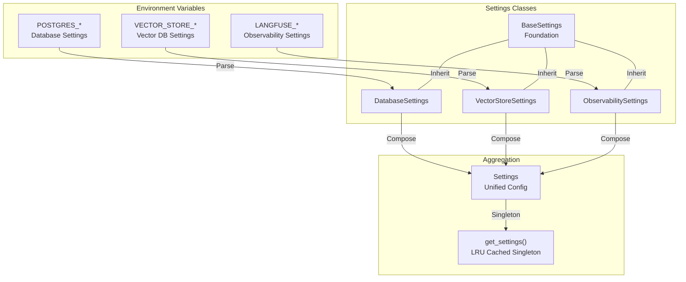
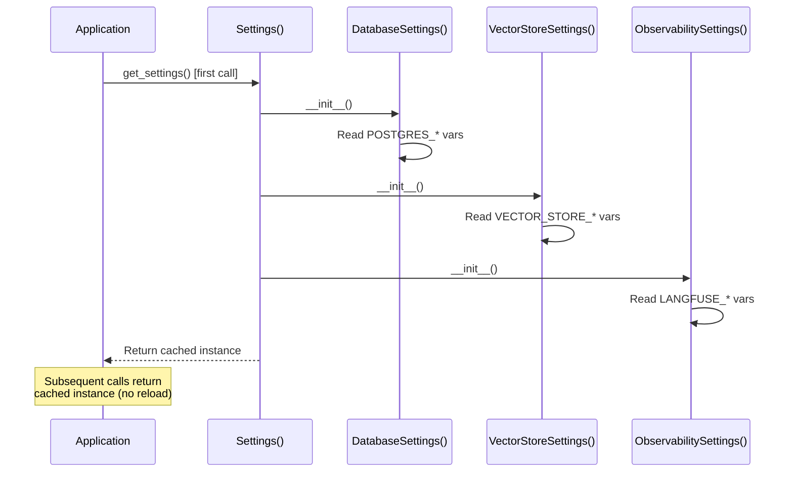

# Configuration Module - Settings Management

**Location:** [`backend/configs/`](.)
**Purpose:** Centralized configuration management with environment variable mapping, settings aggregation, and type-safe parameter validation

---

## Module Architecture



---

## Directory Structure

```
backend/configs/
├── __init__.py                  # Public exports
├── base.py                      # BaseSettings parent class
├── database.py                  # DatabaseSettings (Postgres)
├── vector_store.py              # VectorStoreSettings (S3 Vectors)
├── observability.py             # ObservabilitySettings (Langfuse)
└── settings.py                  # Settings aggregator + singleton
```

---

## Core Settings Classes

### 1. BaseSettings ([base.py](base.py:15-37))

**Foundation for all configuration classes**

**Fields:**
```python
environment: str = "development"  # dev, staging, production
debug: bool = False               # Debug mode toggle
log_level: str = "INFO"          # DEBUG, INFO, WARNING, ERROR, CRITICAL
```

**Configuration:**
- `env_file = ".env"` - Reads from .env
- `case_sensitive = False` - Case-insensitive env vars
- `extra = "ignore"` - Ignores unknown variables

**File Path:** [base.py:15-37](base.py#L15)

---

### 2. DatabaseSettings ([database.py](database.py:15-60))

**PostgreSQL connection management**

**Fields:**
```python
postgres_host: str = "localhost"
postgres_port: int = 5432
postgres_user: str = "postgres"
postgres_password: str = "postgres"
postgres_db: str = "legal_search"
pool_size: int = 10              # Core connections
max_overflow: int = 20           # Overflow connections
pool_timeout: int = 30           # Timeout (seconds)
echo_sql: bool = False           # Log SQL statements
```

**Computed Properties:**
```python
@property
def database_url() → str:
    """SQLAlchemy connection string (sync)"""
    return f"postgresql://{user}:{password}@{host}:{port}/{db}"

@property
def async_database_url() → str:
    """SQLAlchemy async connection string"""
    return f"postgresql+asyncpg://{user}:{password}@{host}:{port}/{db}"
```

**Environment Prefix:** `POSTGRES_`

**Example .env:**
```env
POSTGRES_HOST=localhost
POSTGRES_PASSWORD=secret123
POOL_SIZE=15
```

**File Path:** [database.py:15-60](database.py#L15)

---

### 3. VectorStoreSettings ([vector_store.py](vector_store.py:15-50))

**S3 Vectors configuration**

**Fields:**
```python
aws_region: str = "ap-southeast-2"
index_name: str = "legal-search-vectors"
embedding_model: str = "text-embedding-004"
embedding_dimension: int = 768
top_k: int = 5                   # Default retrieval count
similarity_threshold: float = 0.7  # Min relevance (0.0-1.0)
enable_session_filtering: bool = True
filterable_metadata_fields: list[str] = [
    "session_id", "doc_id", "page"
]
```

**Environment Prefix:** `VECTOR_STORE_`

**Example .env:**
```env
VECTOR_STORE_AWS_REGION=us-east-1
VECTOR_STORE_TOP_K=10
VECTOR_STORE_SIMILARITY_THRESHOLD=0.8
```

**File Path:** [vector_store.py:15-50](vector_store.py#L15)

---

### 4. ObservabilitySettings ([observability.py](observability.py:14-42))

**Langfuse tracing & observability**

**Fields:**
```python
langfuse_public_key: str | None = None
langfuse_secret_key: str | None = None
langfuse_host: str = "http://localhost:3000"
enable_tracing: bool = True
```

**Environment Prefix:** `LANGFUSE_`

**Example .env:**
```env
LANGFUSE_PUBLIC_KEY=pk-lf-xxx
LANGFUSE_SECRET_KEY=sk-lf-xxx
LANGFUSE_HOST=https://cloud.langfuse.com
```

**Design:** Optional keys enable graceful degradation if Langfuse not configured

**File Path:** [observability.py:14-42](observability.py#L14)

---

## Settings Aggregation ([settings.py](settings.py:19-43))

**Unified configuration pattern**

```python
class Settings(BaseSettings):
    """Unified application settings"""
    database: DatabaseSettings = DatabaseSettings()
    vector_store: VectorStoreSettings = VectorStoreSettings()
    observability: ObservabilitySettings = ObservabilitySettings()

@lru_cache
def get_settings() → Settings:
    """Get singleton settings instance"""
    return Settings()
```

**Composition Pattern:**
- Settings contains instances (NOT inheritance)
- Each sub-config loads its own env vars independently
- `@lru_cache` ensures single instance per process
- Environment variables loaded once at startup

**File Path:** [settings.py:19-43](settings.py#L19)

---

## Environment Variable Loading

### Loading Sequence



### Prefix-Based Loading

| Prefix | Settings Class | Scope |
|--------|----------------|-------|
| `POSTGRES_` | DatabaseSettings | Database connection |
| `VECTOR_STORE_` | VectorStoreSettings | Vector DB configuration |
| `LANGFUSE_` | ObservabilitySettings | Tracing configuration |
| None | BaseSettings | General application settings |

---

## Complete Parameter List

**Total: 23 Configurable Parameters**

### BaseSettings (3)
1. `environment` - App environment
2. `debug` - Debug mode
3. `log_level` - Logging level

### DatabaseSettings (9)
1. `postgres_host` - Database host
2. `postgres_port` - Database port
3. `postgres_user` - Database user
4. `postgres_password` - Database password
5. `postgres_db` - Database name
6. `pool_size` - Connection pool size
7. `max_overflow` - Overflow connections
8. `pool_timeout` - Connection timeout
9. `echo_sql` - SQL logging flag

### VectorStoreSettings (8)
1. `aws_region` - AWS region
2. `index_name` - Vector index name
3. `embedding_model` - Embedding model ID
4. `embedding_dimension` - Vector dimension
5. `top_k` - Retrieval count
6. `similarity_threshold` - Relevance threshold
7. `enable_session_filtering` - Session isolation
8. `filterable_metadata_fields` - Filterable fields

### ObservabilitySettings (4)
1. `langfuse_public_key` - Public API key
2. `langfuse_secret_key` - Secret API key
3. `langfuse_host` - Langfuse server URL
4. `enable_tracing` - Tracing enabled flag

---

## Usage Patterns

### In Application Startup

```python
# backend/main.py
settings = get_settings()
database_url = settings.database.async_database_url
```

### In Services

```python
# backend/api/deps/dependencies.py
def get_chat_service(db: AsyncSession = get_db()):
    settings = get_settings()
    vector_store = FAISSStore(
        model_id=settings.vector_store.embedding_model,
        region=settings.vector_store.aws_region
    )
    return ChatService(db=db, rag_agent=RAGAgent(vector_store))
```

### In Configuration

```python
# Any module
from backend.configs import get_settings

settings = get_settings()
log_level = settings.log_level
db_url = settings.database.database_url
```

---

## Environment Setup Examples

### Development (.env)

```env
ENVIRONMENT=development
DEBUG=True
LOG_LEVEL=DEBUG

POSTGRES_HOST=localhost
POSTGRES_PORT=5432
POSTGRES_USER=postgres
POSTGRES_PASSWORD=postgres
POSTGRES_DB=student_helper_dev

VECTOR_STORE_AWS_REGION=ap-southeast-2
VECTOR_STORE_TOP_K=5
VECTOR_STORE_SIMILARITY_THRESHOLD=0.7

LANGFUSE_PUBLIC_KEY=pk-lf-dev
LANGFUSE_SECRET_KEY=sk-lf-dev
LANGFUSE_HOST=http://localhost:3000
```

### Production (Environment Variables)

```bash
export ENVIRONMENT=production
export DEBUG=False
export LOG_LEVEL=INFO

export POSTGRES_HOST=prod-db.rds.amazonaws.com
export POSTGRES_PASSWORD=***secure-password***
export POSTGRES_DB=student_helper_prod

export VECTOR_STORE_AWS_REGION=us-east-1
export VECTOR_STORE_TOP_K=10
export VECTOR_STORE_SIMILARITY_THRESHOLD=0.8

export LANGFUSE_PUBLIC_KEY=pk-lf-prod-***
export LANGFUSE_SECRET_KEY=sk-lf-prod-***
export LANGFUSE_HOST=https://cloud.langfuse.com
```

---

## Key Design Decisions

### 1. Composition Over Inheritance
- Settings aggregates sub-configs (composition)
- NOT inheritance from BaseSettings
- Enables independent env var scoping

### 2. Singleton Pattern
- `@lru_cache` on `get_settings()`
- Single instance per process lifetime
- No runtime reloading

### 3. Prefix Isolation
- Each config has unique env prefix
- No variable name conflicts
- Clear scoping and organization

### 4. Type Safety
- All parameters type-hinted
- Pydantic validation on parsing
- Coercion for numeric types

### 5. Optional Configuration
- Langfuse keys optional (graceful degradation)
- Debug mode defaults to False
- Sensible development defaults

---

## Configuration Validation

**Pydantic validates:**
- Field types (str, int, float, bool)
- Field ranges (e.g., top_k > 0, similarity_threshold 0.0-1.0)
- Enum values (for future extension)
- Required vs. optional fields

**Error on validation failure:**
```
ValidationError: 1 validation error for DatabaseSettings
pool_size
  ensure this value is greater than 0 (type=value_error.number.not_gt; limit_value=0)
```

---

## Integration with Application

| Component | Usage | File |
|-----------|-------|------|
| Database Engine | `settings.database.async_database_url` | [boundary/db/connection.py](../boundary/db/connection.py) |
| Vector Store | `settings.vector_store.aws_region` | [boundary/vdb/vector_store_client.py](../boundary/vdb/vector_store_client.py) |
| Langfuse | `settings.observability.langfuse_host` | [observability/langfuse_tracer.py](../observability/langfuse_tracer.py) |
| FastAPI | `get_settings()` dependency | [api/deps/dependencies.py](../api/deps/dependencies.py) |

---

## File Reference Map

| File | Purpose | Lines |
|------|---------|-------|
| [base.py](base.py) | BaseSettings foundation | 15-37 |
| [database.py](database.py) | Database configuration | 15-60 |
| [vector_store.py](vector_store.py) | Vector store configuration | 15-50 |
| [observability.py](observability.py) | Observability configuration | 14-42 |
| [settings.py](settings.py) | Settings aggregation | 19-43 |

---

## Related Documentation

- [Application Services](../application/README.md)
- [Boundary Layer](../boundary/README.md)
- [Core Systems](../core/README.md)
- [Observability](../observability/README.md)

---

*Generated documentation for Student Helper RAG application*
