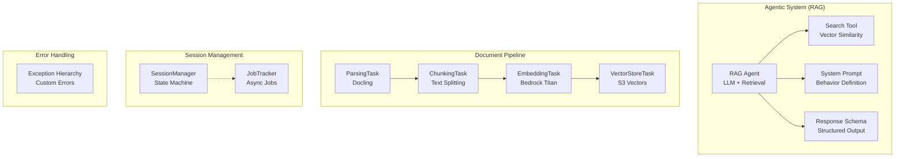

# Core Domain Layer - Business Logic & Orchestration

**Location:** [`backend/core/`](.)
**Purpose:** Pure business logic independent of frameworks. Contains RAG agent, document processing pipeline, session management, and exception hierarchy.

---

## Module Architecture



---

## Directory Structure

```
backend/core/
├── agentic_system/              # RAG agent orchestration
│   ├── __init__.py
│   ├── entrypoint.py            # Placeholder
│   ├── agent/
│   │   ├── __init__.py
│   │   ├── rag_agent.py         # Main RAG agent class
│   │   ├── rag_agent_schema.py  # Response schemas (RAGCitation, RAGResponse)
│   │   ├── rag_agent_prompt.py  # System prompt template
│   │   └── rag_agent_tool.py    # Search tool definition
│   └── graph/                   # LangGraph placeholder
│
├── document_processing/         # Document ingestion pipeline
│   ├── __init__.py
│   ├── entrypoint.py            # DocumentPipeline orchestrator
│   ├── configs.py               # Pipeline settings
│   ├── lambda_handler.py        # AWS Lambda entry point
│   ├── models/
│   │   ├── chunk.py             # Chunk domain model
│   │   ├── pipeline_result.py   # Processing result
│   │   └── sqs_event.py         # SQS message schema
│   └── tasks/
│       ├── parsing_task.py      # Docling parsing
│       ├── chunking_task.py     # Text splitting
│       ├── embedding_task.py    # Bedrock embeddings
│       └── vector_store_task.py # S3 Vectors upload (scaffold)
│
├── session/                     # Session state management
│   ├── __init__.py
│   ├── session_manager.py       # Session lifecycle (stub)
│   └── job_tracker.py           # Job state tracking (stub)
│
├── diagram/                     # Diagram generation domain
│   └── __init__.py
│
├── exceptions.py                # Custom exception hierarchy
└── observability/               # Domain-level observability
    └── __init__.py
```

---

## Agentic System (RAG)

### RAG Agent ([agentic_system/agent/rag_agent.py](agentic_system/agent/rag_agent.py:26-166))

**Purpose:** Orchestrate conversational Q&A with vector-grounded retrieval

**Constructor:**
```python
__init__(
    vector_store: FAISSStore,
    model_id: str = "claude-haiku-4-5-20251001-v1:0",
    region: str = "ap-southeast-2",
    temperature: float = 0.0,
    use_prompt_registry: bool = False,
    prompt_label: str | None = None
)
```

**Core Methods:**
```python
def invoke(question: str, session_id: UUID, chat_history: list[BaseMessage]) → RAGResponse
async def ainvoke(question: str, session_id: UUID, chat_history: list[BaseMessage]) → RAGResponse
```

**Components:**
- **`ChatBedrockConverse`** - LLM inference (Claude Haiku)
- **`search_tool`** - Vector similarity search wrapper
- **`agent`** - LangChain agent with structured output

**Response Format:**
```python
class RAGResponse(BaseModel):
    answer: str
    citations: list[RAGCitation]  # Grounded sources
    confidence: float  # 0.0-1.0
    reasoning: str
```

**File Path:** [agentic_system/agent/rag_agent.py:26-166](agentic_system/agent/rag_agent.py#L26)

---

### RAG Agent Schema ([agentic_system/agent/rag_agent_schema.py](agentic_system/agent/rag_agent_schema.py))

**Citation Model:**
```python
class RAGCitation(BaseModel):
    chunk_id: str
    content_snippet: str  # First 100 chars
    page: int | None
    section: str | None
    source_uri: str
    relevance_score: float  # 0.0-1.0
```

**Response Model:**
```python
class RAGResponse(BaseModel):
    answer: str
    citations: list[RAGCitation] = []
    confidence: float = 0.0
    reasoning: str = ""
```

**File Path:** [agentic_system/agent/rag_agent_schema.py](agentic_system/agent/rag_agent_schema.py)

---

### System Prompt ([agentic_system/agent/rag_agent_prompt.py](agentic_system/agent/rag_agent_prompt.py))

**Behavior Definition:**
- Use ONLY provided context
- Explicitly state when context insufficient
- Cite sources using chunk_id from context
- Be concise but thorough

**Template Variables:**
- `{chat_history}` - Previous conversation
- `{context}` - Retrieved document chunks
- `{question}` - Current user query

**Optional Registry:** Can register prompt versions in Langfuse

**File Path:** [agentic_system/agent/rag_agent_prompt.py:23-52](agentic_system/agent/rag_agent_prompt.py#L23)

---

### Search Tool ([agentic_system/agent/rag_agent_tool.py](agentic_system/agent/rag_agent_tool.py))

**Tool Definition:**
```python
@tool
def search_documents(query: str, k: int = 5) → str:
    """Search for relevant document chunks.

    Args:
        query: Search query to find relevant documents
        k: Number of results to return (default: 5)

    Returns:
        str: Formatted context with chunk metadata
    """
```

**Output Format:**
```
---
chunk_id: {id}
page: {page}
section: {section}
source_uri: {uri}
relevance_score: {score:.3f}

{content}
---
```

**Integration:** Bound to RAGAgent via `create_agent(tools=[self._search_tool])`

**File Path:** [agentic_system/agent/rag_agent_tool.py](agentic_system/agent/rag_agent_tool.py)

---

## Document Processing Pipeline

### Pipeline Orchestrator ([document_processing/entrypoint.py](document_processing/entrypoint.py))

**Purpose:** Coordinate 4-stage document ingestion

**Flow:**
```
Upload Event
  ↓
1. Parsing (Docling) → Extract text + structure
  ↓
2. Chunking (RecursiveCharacterTextSplitter) → Split with overlap
  ↓
3. Embedding (Google Generative AI) → 1024-dim vectors
  ↓
4. Vector Storage (S3 Vectors) → Index with metadata
  ↓
Status Update → COMPLETED or FAILED
```

**Result:**
```python
class PipelineResult(BaseModel):
    document_id: str
    chunk_count: int
    output_path: str
    processing_time_ms: float
```

**File Path:** [document_processing/entrypoint.py](document_processing/entrypoint.py)

---

### Processing Tasks

**ParsingTask** ([tasks/parsing_task.py](document_processing/tasks/parsing_task.py))
- Tool: Docling
- Input: File path (PDF, DOCX, etc.)
- Output: List[Document] with metadata

**ChunkingTask** ([tasks/chunking_task.py](document_processing/tasks/chunking_task.py))
- Tool: RecursiveCharacterTextSplitter
- Config: chunk_size=1000, overlap=200
- Output: Split documents preserving metadata

**EmbeddingTask** ([tasks/embedding_task.py](document_processing/tasks/embedding_task.py))
- Model: Google Generative AI (1024-dim)
- Input: Document chunks
- Output: Chunk objects with embeddings

**VectorStoreTask** ([tasks/vector_store_task.py](document_processing/tasks/vector_store_task.py))
- Status: Scaffolded (TODOs)
- Planned: Upload to S3 Vectors with metadata

---

### Lambda Handler ([document_processing/lambda_handler.py](document_processing/lambda_handler.py))

**Signature:**
```python
def handler(event: Dict[str, Any], context: Any) → Dict[str, Any]
```

**Flow:**
1. Parse SQS event records
2. For each record:
   - Download from S3
   - Process via pipeline
   - Upload to S3 Vectors
   - Update RDS document status
3. Return aggregated results

**Deployment:** AWS Lambda function triggered by SQS events

**File Path:** [document_processing/lambda_handler.py](document_processing/lambda_handler.py)

---

### Configuration ([document_processing/configs.py](document_processing/configs.py))

**Settings:**
```python
class DocumentPipelineSettings(BaseSettings):
    chunk_size: int = 1000
    chunk_overlap: int = 200
    embedding_model_id: str = "amazon.titan-embed-text-v2:0"
    bedrock_region: str = "us-east-1"
    vectors_bucket: str = ""
    database_url: str = ""
```

**Environment Prefix:** `DOC_PIPELINE_`

**File Path:** [document_processing/configs.py](document_processing/configs.py)

---

## Session Management (Stubs)

### SessionManager ([session/session_manager.py](session/session_manager.py:14-54))

**Planned Methods:**
- `create_session(metadata: dict)` → UUID
- `get_session(session_id: UUID)` → dict
- `delete_session(session_id: UUID)` → None

**Status:** Interface only (implementation in application layer)

**File Path:** [session/session_manager.py](session/session_manager.py)

---

### JobTracker ([session/job_tracker.py](session/job_tracker.py:14-53))

**Planned Methods:**
- `create_job(job_type: JobType)` → UUID
- `update_status(job_id: UUID, status: JobStatus)`
- `get_status(job_id: UUID)` → JobStatus

**Status:** Interface only (real implementation in JobService)

**File Path:** [session/job_tracker.py](session/job_tracker.py)

---

## Exception Hierarchy ([exceptions.py](exceptions.py))

**Base Exception:**
```python
class LegalSearchException(Exception):
    """Base exception for all domain errors"""
```

**Specific Exceptions:**
- `ParsingError` - Document parsing failure
- `ChunkingError` - Text chunking failure
- `EmbeddingError` - Vector generation failure
- `VectorStoreError` - Vector DB operation failure
- `RAGError` - LLM or retrieval failure
- `SessionError` - Session-related errors
- `JobError` - Job tracking errors

**Usage Pattern:**
```python
try:
    chunk_document(file)
except Exception as e:
    raise ParsingError(f"Failed to parse: {e}") from e
```

**File Path:** [exceptions.py](exceptions.py)

---

## Key Design Patterns

### 1. Task Chain Pattern
Document processing uses sequential tasks (parsing → chunking → embedding → storage)

### 2. Schema-Driven Output
RAGResponse enforces structured output with required citation format

### 3. Async-First
All agent methods support both sync (`invoke`) and async (`ainvoke`)

### 4. Deterministic Chunk IDs
Chunk IDs based on content hash enable idempotent re-processing

### 5. Temperature = 0.0
Deterministic LLM responses for reproducible results

### 6. Context Variable Propagation
Session context flows through async boundaries via contextvars

---

## Integration Points

### With Application Services
- ChatService calls `rag_agent.ainvoke()`
- DocumentService orchestrates DevDocumentPipeline
- JobService tracks pipeline progress

### With Boundary Layer
- RAGAgent searches via FAISSStore
- DocumentPipeline indexes via FAISSStore (dev) / S3 Vectors (prod)

### With Observability
- PromptRegistry versions RAG prompts
- LangfuseTracer records agent metrics

---

## File Reference Map

| File | Purpose | Lines |
|------|---------|-------|
| [agentic_system/agent/rag_agent.py](agentic_system/agent/rag_agent.py) | RAG orchestration | 26-166 |
| [agentic_system/agent/rag_agent_schema.py](agentic_system/agent/rag_agent_schema.py) | Response types | All |
| [agentic_system/agent/rag_agent_prompt.py](agentic_system/agent/rag_agent_prompt.py) | System prompt | 23-52 |
| [agentic_system/agent/rag_agent_tool.py](agentic_system/agent/rag_agent_tool.py) | Search tool | All |
| [document_processing/entrypoint.py](document_processing/entrypoint.py) | Pipeline orchestration | All |
| [document_processing/lambda_handler.py](document_processing/lambda_handler.py) | AWS Lambda | All |
| [document_processing/configs.py](document_processing/configs.py) | Pipeline settings | All |
| [document_processing/tasks/parsing_task.py](document_processing/tasks/parsing_task.py) | Parsing | All |
| [document_processing/tasks/chunking_task.py](document_processing/tasks/chunking_task.py) | Chunking | All |
| [document_processing/tasks/embedding_task.py](document_processing/tasks/embedding_task.py) | Embedding | All |
| [document_processing/tasks/vector_store_task.py](document_processing/tasks/vector_store_task.py) | Vector storage | All |
| [session/session_manager.py](session/session_manager.py) | Session lifecycle | 14-54 |
| [session/job_tracker.py](session/job_tracker.py) | Job tracking | 14-53 |
| [exceptions.py](exceptions.py) | Exception hierarchy | All |

---

## Related Documentation

- [Application Services](../application/README.md)
- [Boundary Layer](../boundary/README.md)
- [API Layer](../api/README.md)
- [Configuration](../configs/README.md)
- [Observability](../observability/README.md)

---

*Generated documentation for Student Helper RAG application*
