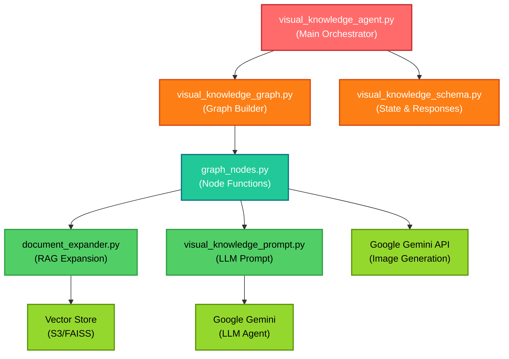
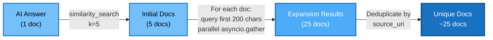
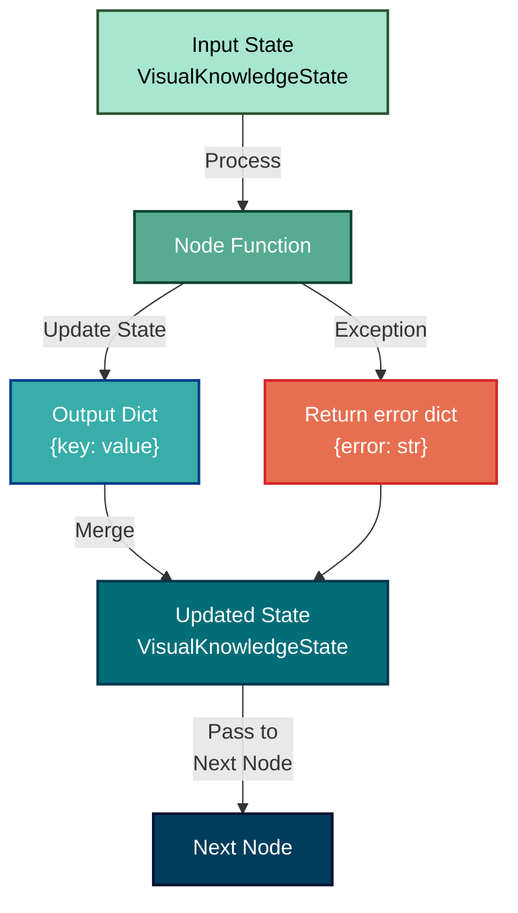
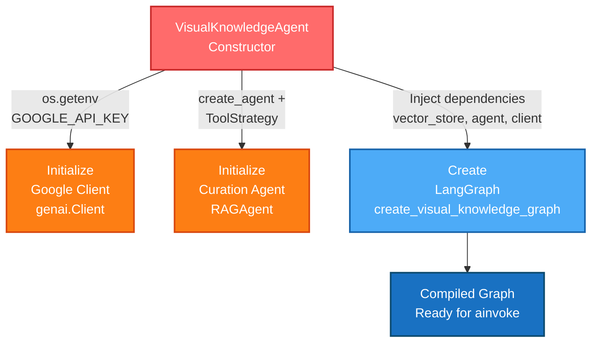
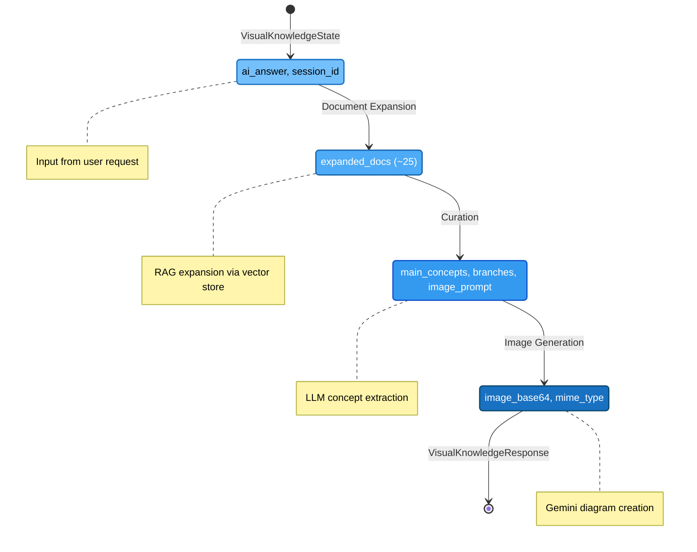
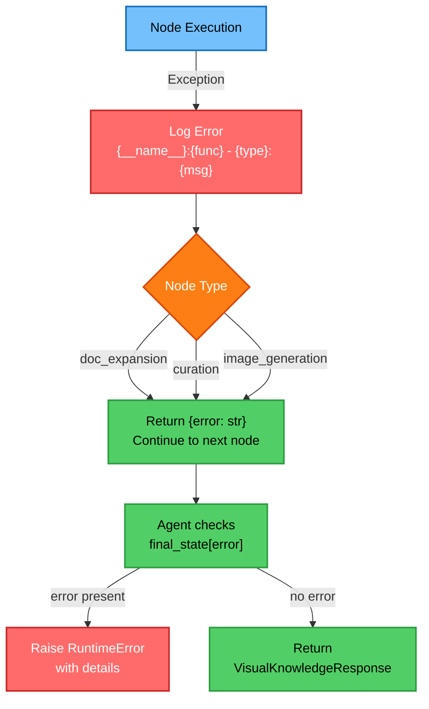

# Visual Knowledge Agent 📊

> Interactive concept diagram generation from AI responses via LangGraph orchestration

A sophisticated pipeline that transforms educational AI responses into interactive visual knowledge diagrams. Uses RAG document expansion, LLM-based concept curation, and Google Gemini for diagram generation.

---

## 🎯 Overview

The Visual Knowledge Agent generates interactive concept diagrams from AI responses through a three-stage pipeline orchestrated by LangGraph:

```
AI Answer → Document Expansion (RAG) → Concept Curation (LLM) → Image Generation (Gemini) → Interactive Diagram
```

**Key Capabilities:**
- 📈 Expands single AI answer into ~25 related documents via parallel RAG queries
- 🧠 Extracts 2-3 main concepts and 4-6 explorable branches using LLM
- 🎨 Generates high-quality diagrams via Google Gemini API
- 🔗 Returns base64-encoded images with structured metadata
- ⚡ Async/parallel operations for performance
- 📋 Full error handling and observability

---

## 🏗️ Architecture

### Module Structure

```
backend/core/agentic_system/visual_knowledge_agent/
├── __init__.py                        # Public exports
├── visual_knowledge_schema.py          # Data models & state schema
├── visual_knowledge_prompt.py          # Curation prompt template
├── document_expander.py                # RAG document expansion
├── graph_nodes.py                      # LangGraph node functions
├── visual_knowledge_graph.py           # Graph orchestration
└── visual_knowledge_agent.py           # Main agent wrapper
```

### Dependency Hierarchy



---

## 📦 Layer 1: Data Structures & Contracts

### File: [visual_knowledge_schema.py](visual_knowledge_schema.py)

Defines the complete data contract for the visual knowledge pipeline.

#### TypedDict State Schema

Used by LangGraph to track data flow through the pipeline:

```python
class VisualKnowledgeState(TypedDict, total=False):
    # Inputs
    ai_answer: str                              # User's AI response
    session_id: str | None                      # Multi-tenant context

    # Stage 1: Document Expansion
    expanded_docs: list[VectorSearchResult]     # ~25 documents

    # Stage 2: Curation
    main_concepts: list[str]                    # 2-3 core topics
    branches: list[ConceptBranch]               # 4-6 explorable topics
    image_generation_prompt: str                # Detailed Gemini instructions

    # Stage 3: Image Generation
    image_base64: str                           # PNG diagram (base64)
    mime_type: str                              # "image/png"

    # Error tracking
    error: str | None                           # Pipeline errors
```

#### Response Models

**ConceptBranch** - Explorable topic in the diagram:
```python
class ConceptBranch(BaseModel):
    id: str              # Unique ID (e.g., "branch_1")
    label: str           # Human-readable (e.g., "Activation Functions")
    description: str     # 10-20 words explaining the topic
```

**VisualKnowledgeResponse** - Complete pipeline output:
```python
class VisualKnowledgeResponse(BaseModel):
    image_base64: str                   # Base64 PNG for inline display
    mime_type: str = "image/png"        # Image MIME type
    main_concepts: list[str]            # ["Concept 1", "Concept 2"]
    branches: list[ConceptBranch]       # Explorable subtopics
    image_generation_prompt: str        # Gemini prompt (transparency)
```

---

## 🎤 Layer 2: Prompt Templates

### File: [visual_knowledge_prompt.py](visual_knowledge_prompt.py)

Instructs the curation agent to extract knowledge and create image prompts.

#### Curation Prompt Strategy

The system prompt guides the curation agent to:

1. **Extract Main Concepts** (2-3)
   - Broad, unifying topics
   - Each 1-3 words
   - Example: `["Machine Learning", "Neural Networks"]`

2. **Identify Branches** (4-6)
   - Specific explorable sub-topics
   - Each with id, label, and 10-20 word description
   - Example: `{"id": "branch_1", "label": "Backpropagation", "description": "How neural networks learn through gradient-based optimization"}`

3. **Generate Image Prompt**
   - Detailed instructions for Gemini
   - Specifies: structure, content, style, relationships, colors
   - Example: `"Create a mind map with 'ML' at center, branches for supervised/unsupervised learning..."`

#### Contract Output

```python
class CurationResult(BaseModel):
    main_concepts: list[str]                # Extracted core topics
    branches: list[ConceptBranch]          # Explorable concepts
    image_generation_prompt: str            # Gemini instruction
```

---

## 🔍 Layer 3: Document Expansion

### File: [document_expander.py](document_expander.py)

Non-agentic document retrieval that expands a single AI answer into ~25 related documents.

#### Expansion Pipeline



#### Function Signature

```python
async def expand_documents(
    vector_store: BaseVectorsStore,
    ai_answer: str,
    session_id: str | None = None,
) -> list[VectorSearchResult]:
    """
    Expands AI answer into ~25 related documents through recursive RAG queries.

    Returns:
        VectorSearchResult: [
            {
                chunk_id: str,
                content: str,
                metadata: {
                    session_id: str,
                    doc_id: str,
                    chunk_id: str,
                    page: int | None,
                    section: str | None,
                    source_uri: str,
                },
                similarity_score: float (0.0-1.0),
            }
        ]
    """
```

#### Key Implementation Details

- **Async-first**: Uses `run_in_threadpool` wrapper for vector store (sync API)
- **Parallel expansion**: `asyncio.gather()` for concurrent queries
- **Deduplication**: By `source_uri` to avoid duplicate content
- **Error handling**: Logs and re-raises exceptions per CLAUDE.md

---

## 🔗 Layer 4: Graph Nodes

### File: [graph_nodes.py](graph_nodes.py)

Three stateful node functions that operate on `VisualKnowledgeState`.

#### Node 1: Document Expansion

```python
async def document_expansion_node(
    state: VisualKnowledgeState,
    vector_store: BaseVectorsStore,
) -> dict:
    """
    Expands documents from AI answer via RAG.

    Input:  state["ai_answer"]
    Output: state["expanded_docs"] = list[VectorSearchResult]
    """
```

**Input Contract:**
- `state["ai_answer"]`: str (the AI response)
- `state["session_id"]`: str | None (optional context)

**Output Contract:**
- Updates state with `expanded_docs`: list[VectorSearchResult]
- On error: returns `{"error": str}`

#### Node 2: Curation

```python
def curation_node(
    state: VisualKnowledgeState,
    curation_agent: RAGAgent,  # LangChain agent with create_agent
) -> dict:
    """
    Extracts concepts and creates image generation prompt.

    Input:  state["expanded_docs"]
    Output: state["main_concepts"], state["branches"], state["image_generation_prompt"]
    """
```

**Input Contract:**
- `state["expanded_docs"]`: list[VectorSearchResult]
- Curation agent initialized with `response_format=ToolStrategy(CurationResult)`

**Output Contract:**
- `main_concepts`: list[str]
- `branches`: list[ConceptBranch]
- `image_generation_prompt`: str
- On error: returns `{"error": str}`

#### Node 3: Image Generation

```python
def image_generation_node(
    state: VisualKnowledgeState,
    google_client: genai.Client,
) -> dict:
    """
    Generates diagram via Google Gemini.

    Input:  state["image_generation_prompt"]
    Output: state["image_base64"], state["mime_type"]
    """
```

**Input Contract:**
- `state["image_generation_prompt"]`: str
- Google Gemini client (google.genai.Client)

**Output Contract:**
- `image_base64`: str (base64-encoded PNG)
- `mime_type`: str (always "image/png")
- On error: returns `{"error": str}`

#### Node Execution Model



---

## 🕸️ Layer 5: Graph Orchestration

### File: [visual_knowledge_graph.py](visual_knowledge_graph.py)

Builds and compiles the LangGraph that orchestrates the three nodes.

#### Graph Builder

```python
def create_visual_knowledge_graph(
    vector_store: BaseVectorsStore,
    curation_agent: RAGAgent,
    google_client: genai.Client,
) -> CompiledGraph:
    """
    Creates LangGraph for visual knowledge pipeline.

    Structure:
        Entry: document_expansion
              ↓
        document_expansion → curation
              ↓
        curation → image_generation
              ↓
        image_generation → END
    """
```

#### Graph Flow Diagram

```mermaid
graph LR
    A["START:<br/>Input State"]
    -->|"ai_answer<br/>session_id"| B["document_expansion<br/>(async node)"]

    B -->|"expanded_docs"| C["curation<br/>(sync node)"]

    C -->|"main_concepts<br/>branches<br/>image_prompt"| D["image_generation<br/>(sync node)"]

    D -->|"image_base64<br/>mime_type"| E["END:<br/>Complete State"]

    style A fill:#74c0fc,color:#000,stroke:#1971c2,stroke-width:2px
    style B fill:#4dabf7,color:#fff,stroke:#1864ab,stroke-width:2px
    style C fill:#4dabf7,color:#fff,stroke:#1864ab,stroke-width:2px
    style D fill:#4dabf7,color:#fff,stroke:#1864ab,stroke-width:2px
    style E fill:#1971c2,color:#fff,stroke:#0c4a6e,stroke-width:2px
```



#### Dependency Injection Pattern

Dependencies are bound to nodes via closures:

```python
graph.add_node(
    "document_expansion",
    lambda state: document_expansion_node(state, vector_store),  # Inject vector_store
)
graph.add_node(
    "curation",
    lambda state: curation_node(state, curation_agent),  # Inject agent
)
graph.add_node(
    "image_generation",
    lambda state: image_generation_node(state, google_client),  # Inject client
)
```

---

## 🤖 Layer 6: Agent Wrapper

### File: [visual_knowledge_agent.py](visual_knowledge_agent.py)

Main orchestrator class that wraps the LangGraph and provides a clean async interface.

#### Class Definition

```python
class VisualKnowledgeAgent:
    """Orchestrates document expansion → curation → image generation via LangGraph."""

    def __init__(
        self,
        google_api_key: str,
        vector_store: BaseVectorsStore,
        model_id: str = "gemini-3-flash-preview",
        temperature: float = 0.0,
    ) -> None:
        """Initialize with Google Gemini and vector store."""
        # Initializes:
        # - Google Gemini client (google.genai.Client)
        # - Curation agent (create_agent + ToolStrategy)
        # - LangGraph pipeline

    async def ainvoke(
        self,
        ai_answer: str,
        session_id: str | None = None,
    ) -> VisualKnowledgeResponse:
        """
        Generate visual knowledge diagram.

        Returns: VisualKnowledgeResponse with image + metadata
        Raises: RuntimeError on pipeline failure
        """
```

#### Initialization Flow



#### Invocation Contract

```python
# Input
await agent.ainvoke(
    ai_answer="Machine learning is...",
    session_id="sess-123"
)

# Output
VisualKnowledgeResponse(
    image_base64="iVBORw0KGgoAAAANSUhEUgA...",
    mime_type="image/png",
    main_concepts=["Machine Learning", "Neural Networks"],
    branches=[
        ConceptBranch(
            id="branch_1",
            label="Supervised Learning",
            description="Learning from labeled examples..."
        ),
        ...
    ],
    image_generation_prompt="Create a modern mind map with..."
)

# Error Handling
RuntimeError: "Visual knowledge generation failed: {error_msg}"
ValueError: "ai_answer cannot be empty"
```

---

## 🔧 Layer 7: Service Integration

### File: [backend/application/services/visual_knowledge_service.py](../../../application/services/visual_knowledge_service.py)

Service layer that orchestrates between API and agent.

```python
class VisualKnowledgeService:
    """Orchestrates visual knowledge generation."""

    def __init__(self, visual_knowledge_agent: VisualKnowledgeAgent):
        self._agent = visual_knowledge_agent

    async def generate(
        self,
        session_id: str,
        ai_answer: str,
    ) -> VisualKnowledgeResponseModel:
        """
        Generate visual knowledge diagram.

        Returns: VisualKnowledgeResponseModel (API model)
        Raises: ValueError | RuntimeError
        """
        # 1. Log generation start
        # 2. Call agent.ainvoke(ai_answer, session_id)
        # 3. Convert to VisualKnowledgeResponseModel
        # 4. Log success
        # 5. Error handling with CLAUDE.md format logging
```

---

## 🌐 Layer 8: API Contracts

### File: [backend/models/visual_knowledge.py](../../../models/visual_knowledge.py)

Pydantic DTOs for HTTP API contracts.

#### Request Model

```python
class VisualKnowledgeRequest(BaseModel):
    ai_answer: str = Field(
        min_length=1,
        description="The assistant response to visualize as a diagram"
    )
```

#### Response Model

```python
class VisualKnowledgeResponseModel(BaseModel):
    image_base64: str                   # Base64 PNG
    mime_type: str = "image/png"        # Always image/png
    main_concepts: list[str]            # ["Concept 1", ...]
    branches: list[ConceptBranchResponse]  # Explorable topics
    image_generation_prompt: str        # Gemini prompt (transparency)
```

### API Endpoint

**POST** `/sessions/{session_id}/visual-knowledge`

```python
@router.post(
    "/{session_id}/visual-knowledge",
    response_model=VisualKnowledgeResponseModel,
    status_code=200,
)
async def generate_visual_knowledge(
    session_id: str,
    request: VisualKnowledgeRequest,
    visual_knowledge_service = Depends(get_visual_knowledge_service),
) -> VisualKnowledgeResponseModel:
    """
    Generate visual knowledge diagram for assistant message.

    Request:  {"ai_answer": "Your AI response..."}
    Response: {"image_base64": "...", "mime_type": "...", ...}
    Errors:   400 (ValueError) | 500 (Exception)
    """
```

---

## 📊 Complete Data Flow

### End-to-End Pipeline


---

## 🚀 Usage

### Dependency Injection

```python
# backend/api/deps/dependencies.py
def get_visual_knowledge_service():
    """Factory function for dependency injection."""
    import os
    from backend.core.agentic_system.visual_knowledge_agent import VisualKnowledgeAgent
    from backend.application.services.visual_knowledge_service import VisualKnowledgeService
    from backend.boundary.vdb.vector_store_factory import get_vector_store

    google_api_key = os.getenv("GOOGLE_API_KEY")
    vector_store = get_vector_store()

    agent = VisualKnowledgeAgent(
        google_api_key=google_api_key,
        vector_store=vector_store,
        model_id="gemini-3-flash-preview",
        temperature=0.0,
    )

    return VisualKnowledgeService(visual_knowledge_agent=agent)
```

### API Usage

```bash
# Request
curl -X POST http://localhost:8000/sessions/sess-123/visual-knowledge \
  -H "Content-Type: application/json" \
  -d '{
    "ai_answer": "Machine learning is a subset of artificial intelligence..."
  }'

# Response (200 OK)
{
  "image_base64": "iVBORw0KGgoAAAANSUhEUgAAAAUA...",
  "mime_type": "image/png",
  "main_concepts": [
    "Machine Learning",
    "Artificial Intelligence"
  ],
  "branches": [
    {
      "id": "branch_1",
      "label": "Supervised Learning",
      "description": "Learning from labeled examples with defined outcomes"
    },
    {
      "id": "branch_2",
      "label": "Unsupervised Learning",
      "description": "Finding patterns in unlabeled data without predefined outcomes"
    },
    ...
  ],
  "image_generation_prompt": "Create a modern mind map with 'Machine Learning' at center..."
}
```

---

## 📋 Contract Summary

### State Transitions



### Error Handling Strategy



---

## 🔒 Key Assumptions & Contracts

| Component | Assumption | Contract |
|-----------|-----------|----------|
| **Vector Store** | Synchronous API | `similarity_search(query, k) → list[VectorSearchResult]` |
| **Google Gemini** | Available API key | `genai.Client(api_key=str)` + `models.generate_content()` |
| **LLM Agent** | Structured output | `create_agent + ToolStrategy(CurationResult)` returns `{"structured_response": CurationResult}` |
| **Document Content** | Tokenizable | First 200 chars used as expansion query |
| **Image Response** | Contains PNG | `response.candidates[0].content.parts[*].inline_data.data` is bytes |

---

## 📝 Logging Format

All functions follow CLAUDE.md logging standards:

```python
logger.error(f"{__name__}:function_name - {type(e).__name__}: {e}")
```

**Examples:**
```
backend.core.agentic_system.visual_knowledge_agent.document_expander:expand_documents - ValueError: Query cannot be empty
backend.core.agentic_system.visual_knowledge_agent.graph_nodes:curation_node - RuntimeError: Curation agent returned invalid response
```

---

## 🧪 Testing Strategy

**Unit Test Coverage:**
- [ ] Schema validation (Pydantic models)
- [ ] Document expansion with mock vector store
- [ ] Curation node with mocked LLM responses
- [ ] Image generation with mocked Gemini API
- [ ] Graph state transitions
- [ ] Error handling and logging

**Integration Test Coverage:**
- [ ] Full pipeline with test data
- [ ] Service layer integration
- [ ] API endpoint (mock dependencies)

---

## 📚 File Reference Guide

| File | Purpose | Key Exports |
|------|---------|-------------|
| [visual_knowledge_schema.py](visual_knowledge_schema.py) | Data models & TypedDict state | `VisualKnowledgeState`, `CurationResult`, `VisualKnowledgeResponse` |
| [visual_knowledge_prompt.py](visual_knowledge_prompt.py) | LLM instructions | `VISUAL_KNOWLEDGE_PROMPT`, `get_visual_knowledge_prompt()` |
| [document_expander.py](document_expander.py) | RAG document expansion | `expand_documents(...)` |
| [graph_nodes.py](graph_nodes.py) | Stateful node functions | `document_expansion_node`, `curation_node`, `image_generation_node` |
| [visual_knowledge_graph.py](visual_knowledge_graph.py) | LangGraph builder | `create_visual_knowledge_graph(...)` |
| [visual_knowledge_agent.py](visual_knowledge_agent.py) | Main orchestrator | `VisualKnowledgeAgent` |
| [__init__.py](__init__.py) | Public module interface | All public exports |

---

## 🔗 Related Files

**Service Layer:**
- [backend/application/services/visual_knowledge_service.py](../../../application/services/visual_knowledge_service.py) - Orchestrates agent

**API Integration:**
- [backend/api/routers/sessions.py](../../../api/routers/sessions.py) - HTTP endpoint
- [backend/api/deps/dependencies.py](../../../api/deps/dependencies.py) - Dependency injection

**Data Models:**
- [backend/models/visual_knowledge.py](../../../models/visual_knowledge.py) - API DTOs

---

## 🎓 Design Principles

1. **Separation of Concerns**: Schemas, prompts, expansion, nodes, graph, agent are isolated
2. **Dependency Injection**: Dependencies injected via closures to nodes
3. **Async-First**: Parallel RAG queries via `asyncio.gather()`
4. **Error Propagation**: Errors tracked in state, checked at agent level
5. **Type Safety**: Full type hints throughout
6. **Observability**: Structured logging at all levels

---

## 📄 License & Attribution

Part of the Student Helper RAG application. Built with:
- **LangGraph**: Stateful graph orchestration
- **LangChain**: Agent framework with structured output
- **Google Gemini**: LLM and image generation
- **FastAPI**: HTTP API framework

---

**Last Updated:** 2025-12-20
**Module Version:** 1.0.0
