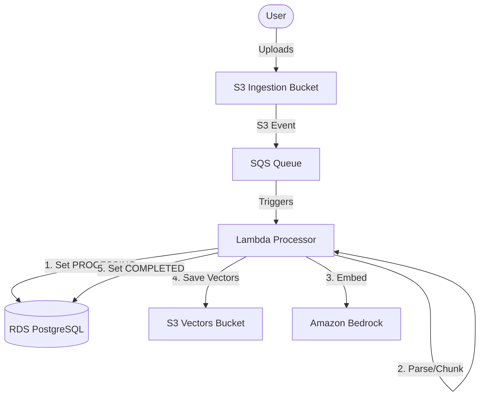
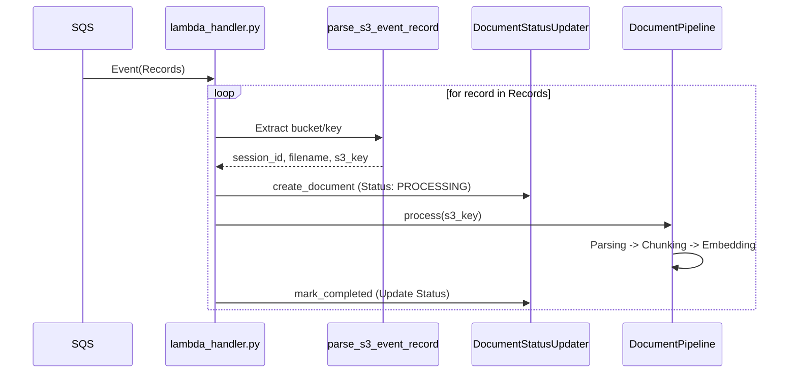

# Document Processing Lambda

Standalone Lambda-ready module for asynchronous document ingestion and vectorization.

## 🚀 Overview

This module provides a containerized Lambda function triggered by **SQS notifications** from an **S3 Ingestion Bucket**. It processes documents through a multi-stage RAG (Retrieval Augmented Generation) pipeline.

### Pipeline Stages:

1.  **Parsing** - Extracts text and structure from PDF/DOCX using **Docling**.
2.  **Chunking** - Intelligent text splitting using semantic-aware chunkers.
3.  **Embedding** - Generates vectors using **Amazon Titan Text Embeddings v2** (1536 dimensions).
4.  **Indexing** - Uploads processed chunks as JSON/Vector pairs to the **S3 Vectors Bucket**.
5.  **Status Handling** - Updates document lifecycle in the **RDS (PostgreSQL)** database.

---

## 📊 System Architecture

### 1. High-Level Event Flow



### 2. SQS Message Parsing Logic

The Lambda uses a robust parser that can handle both standard S3 event notifications wrapped in SQS and direct SQS messages.



---

## 🛠 Features

- **Multi-Event Support**: Automatically detects S3 key patterns (`sessions/{sid}/documents/{file}` or `documents/{sid}/{file}`).
- **Async DB Management**: Uses SQLAlchemy `AsyncSession` to handle database updates within the Lambda event loop.
- **Resilient Parsing**: Handles URL-encoded S3 keys and complex multipart paths.
- **Standalone Image**: Packaged as a Docker container for complete control over parsing dependencies (Docling, etc.).

---

## 📦 Environment Variables

| Variable           | Description                                 |
| ------------------ | ------------------------------------------- |
| `DOCUMENTS_BUCKET` | Input S3 bucket for documents               |
| `VECTORS_BUCKET`   | Output S3 bucket for vectors/chunks         |
| `DATABASE_URL`     | RDS connection string (PostgreSQL)          |
| `DB_SECRET_ARN`    | Secrets Manager ARN for DB password         |
| `SECRETS_ARN`      | Secrets Manager ARN for Google/Bedrock keys |
| `AWS_REGION`       | Cloud region (e.g., us-east-1)              |
| `LOG_LEVEL`        | Logging level (DEBUG, INFO, ERROR)          |

---

## 🏗 Setup & Deployment

### Build Container

```bash
docker build -t doc-processor .
```

### Local Testing

```bash
# Set up .env variables
docker run -p 9000:8080 --env-file .env doc-processor

# Invoke with mock SQS payload
curl -X POST "http://localhost:9000/2015-03-31/functions/function/invocations" \
  -d @tests/mock_sqs_event.json
```

---

## 📁 Project Structure

```text
backend/core/document_processing/
├── lambda_handler.py            # Lambda entry and SQS parsing logic
├── entrypoint.py                # Pipeline orchestration (Orchestrator)
├── implementation_orchestrator.py # Detailed pipeline logic
├── database/
│   └── document_status_updater.py # RDS status management (PostgreSQL)
├── models/
│   ├── sqs_event.py             # Pydantic schemas for events
│   └── pipeline_result.py       # Processing result schemas
├── tasks/
│   ├── parsing_task.py          # PDF/DOCX text extraction
│   ├── chunking_task.py         # Text splitting
│   ├── embedding_task.py        # Amazon Bedrock integration
│   └── vector_store_task.py     # S3 Vector storage
└── Dockerfile                   # Deployment definition
```

---

## 📝 Integration Status

- [x] **SQS Trigger Parsing** - Done
- [x] **RDS Status Updates** - Done
- [x] **Docling Parsing** - Done
- [x] **Bedrock Embeddings** - Done
- [x] **S3 Storage Management** - Done
- [ ] **Frontend Polling** - _MVP Next Step_
- [ ] **Chat API Integration** - _MVP Next Step_

---

## ⚠️ Notes for Developers

1.  **Secret Injection**: The Lambda attempts to fetch passwords from Secrets Manager if the `DATABASE_URL` contains the string "placeholder".
2.  **VPC Settings**: Ensure the Lambda is deployed in a VPC with access to the RDS instance and has S3/Bedrock VPC endpoints configured.
3.  **Scaling**: SQS visibility timeout should be greater than the Lambda timeout (e.g., 5 min) to avoid duplicate processing of large files.
