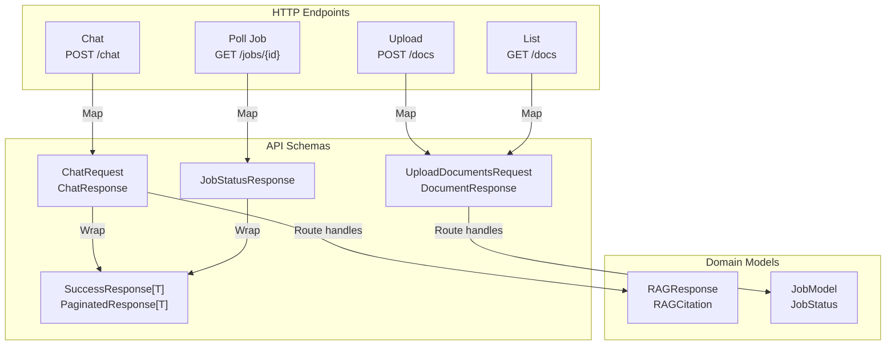

# Models Module - API Schemas & DTOs

**Location:** [`backend/models/`](.)
**Purpose:** Pydantic schema definitions for HTTP request/response contracts. Provides type-safe API contracts with validation and documentation.

---

## Module Architecture



---

## Directory Structure

```
backend/models/
├── __init__.py                  # Public exports
├── common.py                    # Generic response wrappers
├── session.py                   # Session request/response
├── document.py                  # Document upload/listing
├── chat.py                      # Chat request/response
├── job.py                       # Job status tracking
├── citation.py                  # Source attribution
├── chunk.py                     # Document chunk representation
└── diagram.py                   # Diagram generation
```

---

## Generic Wrappers ([common.py](common.py))

**Framework-level response envelopes**

```python
class SuccessResponse[T](BaseModel):
    success: bool = True          # Always True
    data: T                       # Payload (generic)

class ErrorResponse(BaseModel):
    success: bool = False         # Always False
    error: str                    # Error message
    details: dict | None = None   # Additional context

class PaginatedResponse[T](BaseModel):
    items: list[T]               # Page of results
    total: int                   # Total result count
    cursor: str | None = None    # Pagination cursor
    has_more: bool = False       # More results available
```

**Usage:** All responses wrapped in `SuccessResponse[T]` or `ErrorResponse`

**File Path:** [common.py](common.py)

---

## Session Models ([session.py](session.py))

**Request & Response for session operations**

```python
class CreateSessionRequest(BaseModel):
    metadata: dict = Field(
        default_factory=dict,
        description="Session-level metadata (flexible JSON)"
    )

class SessionResponse(BaseModel):
    id: uuid.UUID
    created_at: datetime
    updated_at: datetime
    metadata: dict
```

**Maps to:** `SessionModel` ([boundary/db/models/session_model.py](../boundary/db/models/session_model.py))

**File Path:** [session.py](session.py)

---

## Document Models ([document.py](document.py))

**Request & Response for document operations**

```python
class UploadDocumentsRequest(BaseModel):
    files: list[str] = Field(
        description="List of file paths (S3 URLs or local paths)"
    )

class DocumentResponse(BaseModel):
    id: uuid.UUID
    session_id: uuid.UUID
    name: str
    status: str  # "pending", "processing", "completed", "failed"
    created_at: datetime
    error_message: str | None = None

class DocumentListResponse(BaseModel):
    documents: list[DocumentResponse]
    total: int
    cursor: str | None = None
```

**Status Enum Values:**
- `pending` - Uploaded, awaiting processing
- `processing` - Lambda worker active
- `completed` - Indexed and ready for RAG
- `failed` - Processing error (see error_message)

**Maps to:** `DocumentModel` ([boundary/db/models/document_model.py](../boundary/db/models/document_model.py))

**File Path:** [document.py](document.py)

---

## Chat Models ([chat.py](chat.py))

**Request & Response for conversational Q&A**

```python
class ChatRequest(BaseModel):
    message: str = Field(
        description="User query message"
    )
    include_diagram: bool = Field(
        default=False,
        description="Optional: Generate Mermaid diagram"
    )

class ChatResponse(BaseModel):
    answer: str
    citations: list[Citation]  # Sources used
    mermaid_diagram: str | None = None  # Optional diagram code
```

**Flow:**
1. Parse `ChatRequest` from POST body
2. Call `ChatService.process_chat()` → `RAGResponse`
3. Map citations: `RAGCitation` → `Citation`
4. Optional diagram via `DiagramService`
5. Return `ChatResponse`

**File Path:** [chat.py](chat.py)

---

## Citation Models ([citation.py](citation.py))

**Source attribution for answer grounding**

```python
class Citation(BaseModel):
    doc_name: str               # Filename extracted from source_uri
    page: int | None = None     # Original document page
    section: str | None = None  # Section heading
    chunk_id: str               # Vector store chunk identifier
    source_uri: str             # Full document path/URI
```

**Mapping from RAGCitation:**
```python
Citation(
    doc_name=cite.source_uri.split("/")[-1],  # Extract filename
    page=cite.page,
    section=cite.section,
    chunk_id=cite.chunk_id,
    source_uri=cite.source_uri,
)
```

**File Path:** [citation.py](citation.py)

---

## Chunk Models ([chunk.py](chunk.py))

**Document chunk representation**

```python
class Chunk(BaseModel):
    id: str                     # Content-based deterministic hash
    content: str                # Chunk text
    metadata: dict              # {page, section, offset, source, ...}
    embedding: list[float] | None = None  # 1536-dim Titan vector
```

**Usage:** Internal domain model (not exposed via API)

**Lifecycle:** Parser → Chunker → Embedding → Storage

**File Path:** [chunk.py](chunk.py)

---

## Job Models ([job.py](job.py))

**Background job tracking for async operations**

```python
class JobProgress(BaseModel):
    current: int                # Current progress item
    total: int                  # Total items
    percentage: int             # 0-100

class JobStatusResponse(BaseModel):
    id: uuid.UUID
    task_id: str                # SQS MessageId correlation
    type: str                   # "document_ingestion"
    status: str                 # "pending", "running", "completed", "failed"
    progress: JobProgress       # Real-time progress
    result: dict                # Success output or error details
    created_at: datetime
    updated_at: datetime
```

**Status Lifecycle:**
```
PENDING → RUNNING → COMPLETED or FAILED
```

**Result Dictionary (Success Example):**
```json
{
  "document_id": "UUID",
  "chunk_count": 42,
  "processing_time_ms": 3500,
  "index_path": "s3://vectors/doc_id"
}
```

**Result Dictionary (Failure Example):**
```json
{
  "error": "Parsing failed: corrupted PDF",
  "type": "ParsingError",
  "traceback": "..."
}
```

**File Path:** [job.py](job.py)

---

## Diagram Models ([diagram.py](diagram.py))

**Mermaid diagram generation**

```python
class DiagramRequest(BaseModel):
    prompt: str  # User-provided diagram prompt

class DiagramCitation(Citation):  # Extends Citation
    claim: str   # Specific statement being cited

class DiagramResponse(BaseModel):
    mermaid_code: str
    citations: list[DiagramCitation]
```

**Design:**
- `DiagramCitation` extends base `Citation`
- Adds `claim` field for statement-level grounding
- Each diagram element backed by citations

**File Path:** [diagram.py](diagram.py)

---

## Request/Response Flow Patterns

### Chat Flow

```
POST /sessions/{id}/chat
Body: ChatRequest(message="What is X?", include_diagram=false)
  ↓
Route handler:
  • Parse body → ChatRequest (validated)
  • Inject ChatService via Depends()
  • Call chat_service.process_chat()
  • Map RAGResponse → ChatResponse
    - Extract citations
    - Convert RAGCitation → Citation
    - [Optional] Generate diagram
  ↓
Response (200 OK):
{
  "success": true,
  "data": {
    "answer": "Answer text",
    "citations": [
      {
        "doc_name": "notes.pdf",
        "page": 5,
        "section": "Introduction",
        "chunk_id": "doc123_0",
        "source_uri": "s3://bucket/notes.pdf"
      }
    ],
    "mermaid_diagram": null
  }
}
```

### Document Upload Flow

```
POST /sessions/{id}/docs
Body: UploadDocumentsRequest(files=["s3://bucket/doc.pdf"])
  ↓
Route handler:
  • Parse body → UploadDocumentsRequest (validated)
  • Create JobModel (status=PENDING)
  • Return immediately with job_id
  • Spawn BackgroundTask
  ↓
Response (202 Accepted):
{
  "success": true,
  "data": {
    "job_id": "UUID",
    "status": "pending"
  }
}

Frontend polls GET /jobs/{job_id}:
{
  "success": true,
  "data": {
    "id": "UUID",
    "status": "running",
    "progress": {
      "current": 2,
      "total": 4,
      "percentage": 50
    },
    "result": {}
  }
}
```

---

## Validation Rules

**ChatRequest:**
- `message` - Required, non-empty string
- `include_diagram` - Optional, defaults to False

**UploadDocumentsRequest:**
- `files` - Required list (can be empty but validated)
- Each file path validated as valid URI

**Citation:**
- `doc_name` - Extracted from source_uri (non-null)
- `page`, `section` - Optional but contextual
- `chunk_id` - Required for vector store lookup
- `source_uri` - Required for document navigation

**JobStatusResponse:**
- `progress.percentage` - 0-100 range (service enforces)
- `progress.current` ≤ `progress.total` (service enforces)
- `status` - Enum: pending, running, completed, failed
- `result` - Empty dict {} while running; populated on completion

---

## Type Mapping

| API Schema | Domain Model | Database Model |
|-----------|--------------|----------------|
| `ChatRequest` | `message: str` | N/A |
| `ChatResponse` | `RAGResponse` | chat_messages table |
| `DocumentResponse` | `DocumentModel` | documents table |
| `SessionResponse` | `SessionModel` | sessions table |
| `JobStatusResponse` | `JobModel` | jobs table |
| `Citation` | `RAGCitation` | N/A (computed) |

---

## Field Dependencies

**SessionResponse:**
- `metadata` - Arbitrary dict, no internal dependencies

**DocumentResponse:**
- `status` determines visibility:
  - PENDING/PROCESSING - Empty error_message
  - FAILED - error_message populated
  - COMPLETED - error_message null

**ChatResponse:**
- `mermaid_diagram` - Only populated if `include_diagram=True`
- `citations` - Always present (may be empty)

**JobStatusResponse:**
- `progress.percentage` - Derived from progress.current / progress.total
- `result` - Populated on status != RUNNING

---

## File Reference Map

| File | Purpose | Models |
|------|---------|--------|
| [common.py](common.py) | Generic wrappers | SuccessResponse[T], ErrorResponse, PaginatedResponse[T] |
| [session.py](session.py) | Session contracts | CreateSessionRequest, SessionResponse |
| [document.py](document.py) | Document contracts | UploadDocumentsRequest, DocumentResponse, DocumentListResponse |
| [chat.py](chat.py) | Chat contracts | ChatRequest, ChatResponse |
| [job.py](job.py) | Job contracts | JobProgress, JobStatusResponse |
| [citation.py](citation.py) | Source attribution | Citation |
| [chunk.py](chunk.py) | Chunk representation | Chunk |
| [diagram.py](diagram.py) | Diagram contracts | DiagramRequest, DiagramCitation, DiagramResponse |

---

## Testing & Development

**Request validation (automatic via Pydantic):**
```python
# Route handler
request: ChatRequest  # FastAPI automatically validates

# Invalid request → 422 Unprocessable Entity
# Missing required field
# Invalid field type
# Constraint violation (e.g., max_length)
```

**Response mapping:**
```python
# Route handler manually maps domain → API
response_dto = ChatResponse(
    answer=rag_response.answer,
    citations=[
        Citation(doc_name=c.source_uri.split("/")[-1], ...)
        for c in rag_response.citations
    ],
    mermaid_diagram=None if not request.include_diagram else diagram_code
)
```

---

## Design Principles

1. **Request/Response Separation** - DTOs distinct from domain models
2. **Type Safety** - All fields type-hinted with validation
3. **Forward References** - Use string forward refs for circular imports
4. **Field Descriptions** - All fields include description for API docs
5. **Optional Nullability** - Explicit `| None` for optional fields
6. **Enum Validation** - String enums for status/type fields
7. **Composition** - Generic wrappers (SuccessResponse[T]) for consistency
8. **Deterministic Schemas** - Pydantic v2 with strict validation

---

## Related Documentation

- [API Layer](../api/README.md)
- [Application Services](../application/README.md)
- [Boundary Layer](../boundary/README.md)
- [Configuration](../configs/README.md)

---

*Generated documentation for Student Helper RAG application*
