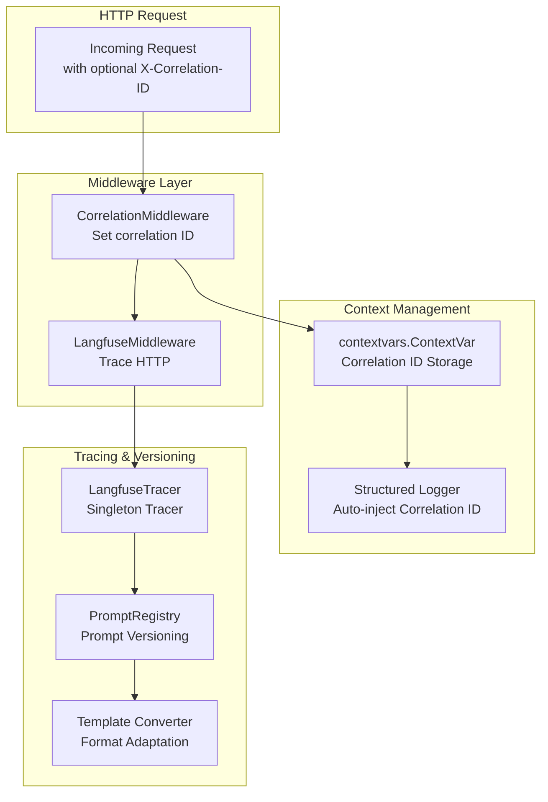
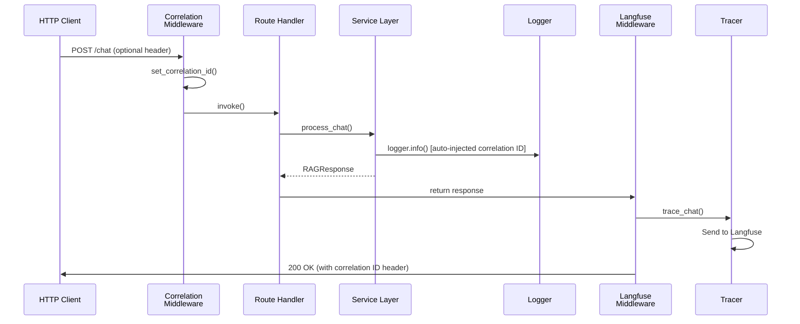

# Observability Module - Tracing, Logging, & Monitoring

**Location:** [`backend/observability/`](.)
**Purpose:** Distributed tracing, structured logging, correlation ID tracking, and prompt version management for observability across the system.

---

## Module Architecture



---

## Directory Structure

```
backend/observability/
├── __init__.py                  # Module exports
├── correlation.py               # Correlation ID context management
├── middleware.py                # HTTP middleware (Correlation, Langfuse)
├── logger.py                    # Structured logging configuration
├── langfuse_tracer.py          # Langfuse tracer singleton
├── prompt_registry/             # Prompt versioning
│   ├── __init__.py
│   ├── registry.py              # PromptRegistry singleton
│   ├── models.py                # ModelConfig schema
│   └── converter.py             # Template converters
└── (experimental)
    └── observability_dashboard/ # Observability UI (future)
```

---

## Correlation ID Tracking ([correlation.py](correlation.py:1-42))

**Purpose:** Request context propagation across async boundaries

```python
correlation_id_ctx: ContextVar[str]  # Thread-safe async context

def set_correlation_id(correlation_id: str | None = None) → str:
    """Set or generate new UUID-based correlation ID"""

def get_correlation_id() → str:
    """Retrieve current correlation ID from context"""

def clear_correlation_id() → None:
    """Clear correlation ID from context"""
```

**Design:** Uses Python's `contextvars` module for async-safe context storage

**Integration:** CorrelationMiddleware sets ID on request entry; all downstream operations inherit via context

**File Path:** [correlation.py:1-42](correlation.py#L1)

---

## Middleware Layer ([middleware.py](middleware.py))

### CorrelationMiddleware

**Purpose:** Inject correlation ID into request context

**Flow:**
1. Extract X-Correlation-ID header (or generate new UUID)
2. Set in context via `set_correlation_id()`
3. Pass to next middleware
4. Return response with correlation ID header

**Result:** All downstream operations (services, logging, tracing) inherit same correlation ID via context variables

**File Path:** [middleware.py:14-28](middleware.py#L14)

---

### LangfuseMiddleware

**Purpose:** Trace HTTP request/response lifecycle to Langfuse

**Flow:**
1. Receive HTTP request
2. Record request metadata (method, path, headers, body)
3. Call next middleware to execute endpoint
4. Record response metadata (status, body, latency)
5. Send trace to Langfuse with correlation ID
6. Return response to client

**Result:** All HTTP operations traced in Langfuse with correlation ID for distributed tracing

**File Path:** [middleware.py:31-45](middleware.py#L31)

---

### Middleware Registration

**File:** [backend/main.py:59-60](../main.py#L59)

```python
app.add_middleware(CorrelationMiddleware)
app.add_middleware(LangfuseMiddleware)
```

**Execution Order (LIFO):**
```
Request  →  CORS  →  Langfuse  →  Correlation  →  Routes
Response  ←  CORS  ←  Langfuse  ←  Correlation  ←  Routes
```

---

## Structured Logging ([logger.py](logger.py:1-29))

**Purpose:** Factory for configured `structlog` loggers with automatic correlation ID injection

```python
def get_logger(name: str) → structlog.BoundLogger:
    """Return configured logger instance with correlation ID binding"""

def configure_logging() → None:
    """Centralized logging setup with JSON output"""
```

**Features:**
- Logger name binding (for module identification)
- Automatic correlation ID injection via context
- JSON output formatting (machine-parseable)
- Timestamp, log level, event field support

**Usage:**
```python
from backend.observability.logger import get_logger

logger = get_logger(__name__)
logger.info("event", user_id=user_id)  # Auto-includes correlation ID
```

**Output Example:**
```json
{
  "correlation_id": "550e8400-e29b-41d4-a716-446655440000",
  "logger": "backend.services.chat_service",
  "level": "info",
  "event": "chat_processed",
  "user_id": "123",
  "timestamp": "2024-12-15T10:30:00Z"
}
```

**File Path:** [logger.py:1-29](logger.py#L1)

---

## Langfuse Integration - Tracing ([langfuse_tracer.py](langfuse_tracer.py:1-58))

**Purpose:** Singleton tracer for RAG-specific observability events

**Singleton Pattern:**
```python
class LangfuseTracer:
    def __new__(cls) → LangfuseTracer:
        # Single instance per process

    def _initialize(self) → None:
        # Lazy initialization of Langfuse client
```

**Configuration:**
- `langfuse_public_key` - Authentication
- `langfuse_secret_key` - Authentication
- `langfuse_host` - Server endpoint (default: `http://localhost:3000`)
- `enable_tracing` - Feature flag

**Tracing Methods:**

```python
def trace_chat(session_id: str, message: str, response: str) → None:
    """Log chat interactions (question-answer pairs)"""

def trace_ingestion(doc_id: str, chunks: int, duration: float) → None:
    """Record document processing metrics"""

def trace_retrieval(query: str, results: int, latency: float) → None:
    """Record RAG retrieval performance"""
```

**Graceful Degradation:** If `enable_tracing=False` or keys missing, methods return without error (logged as warning)

**File Path:** [langfuse_tracer.py:1-58](langfuse_tracer.py#L1)

---

## Prompt Registry - Version Management

### Registry Singleton ([prompt_registry/registry.py](prompt_registry/registry.py:1-242))

**Purpose:** Automate prompt versioning in Langfuse from LangChain templates

**Singleton Pattern:**
```python
class PromptRegistry:
    def __new__(cls) → PromptRegistry:
        # Single instance per process

    def _initialize(self) → None:
        # Lazy Langfuse client initialization
```

**Core Methods:**

```python
async def register_prompt(
    name: str,
    template: ChatPromptTemplate | PromptTemplate,
    config: ModelConfig,
    labels: list[str] | None = None
) → Prompt | None:
    """Create or version prompt in Langfuse"""

def get_prompt(
    name: str,
    label: str | None = None,
    version: int | None = None
) → Prompt | None:
    """Fetch prompt from Langfuse registry"""

def get_langchain_prompt(
    name: str,
    label: str | None = None,
    version: int | None = None
) → ChatPromptTemplate | None:
    """Fetch and convert to LangChain format"""

def get_config(name: str, label: str | None = None) → dict | None:
    """Extract model configuration stored with prompt"""
```

**Implementation Details:**

1. **Register Prompt:**
   - Converts LangChain template to Langfuse format
   - Stores model configuration alongside prompt
   - Auto-increments version on re-registration
   - Supports labels (e.g., "production", "staging")

2. **Fetch Prompt:**
   - Supports label filtering (fetch production version)
   - Supports version filtering (fetch version 3)
   - Default: Returns latest version

3. **Feature Flags:**
   - Check `enable_tracing` before initializing Langfuse
   - Graceful degradation if disabled or keys missing
   - Log warning if disabled

**File Path:** [prompt_registry/registry.py:1-242](prompt_registry/registry.py#L1)

---

### ModelConfig Schema ([prompt_registry/models.py](prompt_registry/models.py:1-72))

**Purpose:** LLM parameters stored with prompts

```python
class ModelConfig(BaseModel):
    model: str
    temperature: float | None = None      # 0.0-2.0
    top_p: float | None = None            # 0.0-1.0
    max_tokens: int | None = None         # > 0
    extra: dict[str, Any] | None = None   # Custom params

    def to_langfuse_config(self) → dict[str, Any]:
        """Convert to Langfuse format (non-None fields only)"""
```

**Validation:**
- `temperature`: 0.0 ≤ x ≤ 2.0
- `top_p`: 0.0 ≤ x ≤ 1.0
- `max_tokens`: x > 0

**File Path:** [prompt_registry/models.py:1-72](prompt_registry/models.py#L1)

---

### Template Converter ([prompt_registry/converter.py](prompt_registry/converter.py:1-152))

**Purpose:** Bridge LangChain and Langfuse template formats

**Variable Syntax Transformation:**
- LangChain: `{variable}` (single braces)
- Langfuse: `{{variable}}` (double braces)

**Conversion Implementation:**
```python
def _convert_variables(content: str) → str:
    """Transform {var} → {{var}} using regex"""

def _get_role_from_message(message: object) → str:
    """Extract role: system, user, assistant"""

def _get_content_from_message(message: object) → str:
    """Extract message content"""

def convert_chat_template(template: ChatPromptTemplate) → list[LangfuseMessage]:
    """Convert chat template to Langfuse format"""

def convert_text_template(template: PromptTemplate) → str:
    """Convert text template to Langfuse format"""
```

**Example:**
```python
# Input: ChatPromptTemplate with {role}, {question}
# Output: [
#   {'role': 'system', 'content': 'You are a {{role}}'},
#   {'role': 'user', 'content': '{{question}}'}
# ]
```

**File Path:** [prompt_registry/converter.py:1-152](prompt_registry/converter.py#L1)

---

## Configuration Integration ([../configs/observability.py](../configs/observability.py:14-42))

**Settings Class:**
```python
class ObservabilitySettings(BaseSettings):
    langfuse_public_key: str | None = None
    langfuse_secret_key: str | None = None
    langfuse_host: str = "http://localhost:3000"
    enable_tracing: bool = True
```

**Environment Variables (Prefix: `LANGFUSE_`):**
- `LANGFUSE_PUBLIC_KEY` → langfuse_public_key
- `LANGFUSE_SECRET_KEY` → langfuse_secret_key
- `LANGFUSE_HOST` → langfuse_host
- `LANGFUSE_ENABLE_TRACING` → enable_tracing

**Aggregation:** Composed into unified `Settings` via [../configs/settings.py](../configs/settings.py)

---

## Complete Tracing Flow



---

## Integration with Services

| Service | Tracing | Logging |
|---------|---------|---------|
| ChatService | `trace_chat(session_id, message, answer)` | `logger.info()` with correlation ID |
| DocumentService | `trace_ingestion(doc_id, chunk_count, time_ms)` | `logger.info()` at key points |
| JobService | (via parent services) | `logger.info()` status updates |

---

## Graceful Degradation

**If Langfuse not configured:**
```python
# Configuration missing
LANGFUSE_PUBLIC_KEY = None
LANGFUSE_SECRET_KEY = None
LANGFUSE_ENABLE_TRACING = False

# Result: Tracing disabled, app continues normally
# Warning logged: "Langfuse tracing disabled: keys not configured"
```

**All tracer methods return gracefully:**
```python
def trace_chat(...) → None:
    if not self._enabled:
        return  # No-op if disabled
    # ... actual tracing logic
```

---

## File Reference Map

| File | Purpose | Lines |
|------|---------|-------|
| [correlation.py](correlation.py) | Context ID management | 1-42 |
| [middleware.py](middleware.py) | HTTP middleware | All |
| [logger.py](logger.py) | Structured logging | 1-29 |
| [langfuse_tracer.py](langfuse_tracer.py) | Tracing singleton | 1-58 |
| [prompt_registry/registry.py](prompt_registry/registry.py) | Prompt versioning | 1-242 |
| [prompt_registry/models.py](prompt_registry/models.py) | Model config | 1-72 |
| [prompt_registry/converter.py](prompt_registry/converter.py) | Template conversion | 1-152 |
| [../configs/observability.py](../configs/observability.py) | Settings | 14-42 |

---

## Current Implementation Status

**Completed Components:**
- Architecture and interfaces defined ✓
- Configuration integration ✓
- Prompt registry with template conversion ✓

**Placeholder Implementations (Pass Statements):**
- `correlation.py` - Functions need body
- `middleware.py` - Dispatch methods need body
- `logger.py` - Configuration needs body
- `langfuse_tracer.py` - Methods need body

These require actual implementation for full observability activation.

---

## Key Design Patterns

### 1. Singleton with Lazy Initialization
Both LangfuseTracer and PromptRegistry defer initialization until first use

### 2. Context Variable Propagation
Correlation ID stored in `contextvars.ContextVar` automatically inherited by async tasks

### 3. Factory Function Pattern
`get_logger(name)` returns module-specific logger instances

### 4. Converter Pattern
Template converters bridge LangChain and Langfuse format differences

### 5. Feature Flag Pattern
Tracing disabled gracefully when settings missing or disabled

---

## Testing & Development

**Development Setup (.env):**
```env
LANGFUSE_HOST=http://localhost:3000
LANGFUSE_ENABLE_TRACING=true
```

**Production Setup:**
```env
LANGFUSE_HOST=https://cloud.langfuse.com
LANGFUSE_PUBLIC_KEY=pk-lf-prod-***
LANGFUSE_SECRET_KEY=sk-lf-prod-***
LANGFUSE_ENABLE_TRACING=true
```

**Verify Logging:**
```bash
python -c "from backend.observability.logger import get_logger; \
           logger = get_logger('test'); \
           logger.info('test', key='value')"
```

---

## Related Documentation

- [Application Services](../application/README.md)
- [Configuration](../configs/README.md)
- [API Layer](../api/README.md)

---

*Generated documentation for Student Helper RAG application*
