# WebSocket Implementation: Three Major Setbacks

**Date:** 2025-12-18
**Total Time Lost:** ~10 hours
**Status:** ✅ ALL RESOLVED

---

## Overview

This directory documents three critical issues encountered while implementing WebSocket functionality for the Student Helper application. Each issue was non-obvious, took significant debugging time, and revealed important AWS infrastructure limitations.

---

## The Three Major Setbacks

### 1. IAM Inference Profile Discovery (4 hours)

**File:** [INFERENCE_PROFILE_DISCOVERY.md](INFERENCE_PROFILE_DISCOVERY.md)

**Issue:** WebSocket chat failing with AccessDeniedException despite having Bedrock IAM permissions

**Root Cause:** Cross-region Bedrock models (`global.*`) use `inference-profile` resource type, not `foundation-model`

**What We Learned:**
```
❌ Wrong: arn:aws:bedrock:*::foundation-model/global.anthropic.claude-*
✅ Right: arn:aws:bedrock:*:*:inference-profile/global.anthropic.claude-*
```

**Key Lesson:** AWS resource ARN patterns matter. Model ID prefix (`global.*`) determines resource type.

---

### 2. VPC Link V2 Incompatibility (6 hours)

**File:** [VPC_LINK_AND_LOAD_BALANCER_DEEP_DIVE.md](VPC_LINK_AND_LOAD_BALANCER_DEEP_DIVE.md)

**Issue:** WebSocket API deployment failed: "VpcLink V2 are not supported for WEBSOCKET Apis"

**Root Cause:** WebSocket APIs require VPC Link V1 with NLB, not VPC Link V2 with ALB

**What We Learned:**

| API Type | VPC Link | Load Balancer | Security Groups |
|----------|----------|---------------|-----------------|
| HTTP API | V2 (`apigatewayv2.VpcLink`) | ALB | Required |
| WebSocket API | V1 (`apigateway.VpcLink`) | NLB | Not used |

**Key Lesson:** AWS API Gateway protocol types require **completely different infrastructure stacks**.

---

### 3. NLB Security Group Blocking (2 hours)

**File:** [NLB_SECURITY_GROUP_BLOCKING.md](NLB_SECURITY_GROUP_BLOCKING.md)

**Issue:** NLB health checks failed despite correct configuration

**Root Cause:** EC2 security group only allowed ALB security group, not NLB subnet CIDR ranges

**What We Learned:**

```
ALB traffic source: ALB security group ID (sg-xxx)
    → EC2 rule: "Allow from sg-xxx" ✅

NLB traffic source: Subnet IP (10.0.1.x)
    → EC2 rule: "Allow from sg-xxx" ❌ NO MATCH!
    → EC2 rule: "Allow from 10.0.1.0/24" ✅
```

**Key Lesson:** NLB operates at Layer 4 (TCP) and **doesn't use security groups**. Must use CIDR block rules.

---

## Timeline of Discovery

```mermaid
gantt
    title WebSocket Implementation Issues
    dateFormat HH:mm
    axisFormat %H:%M

    section IAM
    Chat failing                    :a1, 00:00, 1h
    Debugging infrastructure        :a2, after a1, 1h
    Discovered inference-profile    :a3, after a2, 1h
    Fixed IAM policy                :a4, after a3, 1h

    section VPC Link
    WebSocket API deployment        :b1, after a4, 1h
    Routes/integrations missing     :b2, after b1, 2h
    Research VPC Link V1 vs V2      :b3, after b2, 1h
    Create NLB component            :b4, after b3, 2h

    section Security
    NLB health checks failing       :c1, after b4, 0.5h
    Test configurations             :c2, after c1, 0.5h
    Discovered SG blocking          :c3, after c2, 0.5h
    Added CIDR rules                :c4, after c3, 0.5h
```



---

## The Complete Solution Architecture


---

## Why These Issues Were Non-Obvious

### 1. Misleading Naming Conventions

**Issue:** "HTTP API" sounds like it should handle all HTTP traffic
**Reality:** HTTP API is a specific AWS service that **excludes WebSocket**

**Issue:** "VPC Link V2" sounds like a newer, better version
**Reality:** V2 **removed** WebSocket support to optimize for stateless HTTP

### 2. Documentation Gaps

None of these limitations were stated upfront in AWS documentation:

- ❌ "Global model IDs require inference-profile ARN type"
- ❌ "WebSocket APIs cannot use VPC Link V2"
- ❌ "NLB traffic doesn't match security group rules"

Instead, you had to piece together information from:
- Error messages during deployment
- Health check failures
- Deep-dive whitepapers
- Community forums

### 3. Similar Symptoms, Different Causes

**Symptom:** "WebSocket connection failed"

**Could be:**
1. IAM permissions (inference-profile) ← Issue #1
2. API Gateway type (HTTP vs WebSocket) ← Issue #2
3. Security group blocking (NLB subnets) ← Issue #3
4. Backend code issue
5. Network routing

Only systematic debugging revealed the real issues.

---

## Key Architectural Decisions

### 1. Dual Load Balancer Architecture

**Decision:** Run both ALB and NLB pointing to the same EC2 instance

**Why:**
- ALB for HTTP API (VPC Link V2 requirement)
- NLB for WebSocket API (VPC Link V1 requirement)
- Both serve the same FastAPI application on port 8000

**Cost:** ~$16/month additional for NLB (minimal compared to debugging time)

### 2. IAM Policy Covering Both Resource Types

**Decision:** Allow both `foundation-model` and `inference-profile`

**Why:**
- Future-proof for regional and cross-region models
- Some models might use one, some the other
- No performance impact to allowing both

### 3. HTTP Health Checks for NLB

**Decision:** Use HTTP health checks instead of TCP for NLB

**Why:**
- More reliable (checks application health, not just port open)
- Matches ALB health check behavior
- Easier to debug (can see HTTP response codes)

---

## Lessons Learned

### For Future AWS Projects

1. **Verify Protocol Support First**
   - Don't assume "API Gateway" supports all protocols
   - Check documentation for **your specific API type**

2. **Understand Resource Limitations**
   - Layer 4 (NLB) vs Layer 7 (ALB) have different capabilities
   - VPC Link V1 vs V2 are not interchangeable

3. **Match Security Rules to Resource Type**
   - ALB → Security group rules
   - NLB → CIDR block rules

4. **Test IAM Permissions Directly**
   - Don't rely on startup checks (lazy initialization)
   - Create test scripts for critical AWS services

5. **Document Infrastructure Quirks**
   - Non-obvious limitations should be documented
   - Prevents repeating mistakes

### For Debugging

1. **Test Each Layer Independently**
   ```
   ✓ Local backend works?
   ✓ Through ALB works?
   ✓ Through NLB works?
   ✓ Through API Gateway works?
   ```

2. **Read Error Messages Carefully**
   - Focus on **resource type** in ARN, not just model ID
   - "VpcLink V2 not supported" means "use V1", not "upgrade V2"

3. **Compare Working vs Broken**
   - ALB worked, NLB didn't → Compare security group rules
   - HTTP API worked, WebSocket didn't → Compare protocol support

---

## Cost Summary

| Issue | Time Lost | Cause | Prevention Cost |
|-------|-----------|-------|-----------------|
| Inference Profile | 4 hours | Documentation gap | 0 (just knowledge) |
| VPC Link V2 | 6 hours | Architectural limitation | $16/month (NLB) |
| Security Groups | 2 hours | Incorrect assumption | 0 (just configuration) |
| **Total** | **12 hours** | | **$16/month** |

**Developer time saved in future:** Invaluable
**Knowledge gained:** Deep understanding of AWS networking, load balancers, and API Gateway

---

## Files in This Directory

1. **[INFERENCE_PROFILE_DISCOVERY.md](INFERENCE_PROFILE_DISCOVERY.md)**
   - IAM permissions for cross-region Bedrock models
   - Inference-profile vs foundation-model ARN types

2. **[VPC_LINK_AND_LOAD_BALANCER_DEEP_DIVE.md](VPC_LINK_AND_LOAD_BALANCER_DEEP_DIVE.md)**
   - VPC Link V1 vs V2 comparison
   - ALB vs NLB technical details
   - Step-by-step WebSocket fix implementation

3. **[NLB_SECURITY_GROUP_BLOCKING.md](NLB_SECURITY_GROUP_BLOCKING.md)**
   - Why NLB doesn't use security groups
   - How to configure EC2 security groups for NLB
   - CIDR block rules vs security group rules

4. **[HTTP_API_NO_WEBSOCKET.md](HTTP_API_NO_WEBSOCKET.md)**
   - Initial discovery that HTTP API ≠ WebSocket support
   - Links to deep dive documentation

5. **[WHY_NO_STARTUP_ERROR.md](WHY_NO_STARTUP_ERROR.md)**
   - Lazy initialization in boto3
   - Why IAM errors don't appear at startup

---

## Final Architecture

**Infrastructure Components:**

```
✅ HTTP API Gateway (gr0b67pwv4)
  → VPC Link V2
    → Application Load Balancer
      → EC2 Instance:8000

✅ WebSocket API Gateway (2d2vu9kkyg)
  → VPC Link V1
    → Network Load Balancer
      → EC2 Instance:8000

✅ EC2 Security Group Rules:
  - Allow 8000 from ALB SG (sg-051a4b98a9b9b84db)
  - Allow 8000 from 10.0.1.0/24 (NLB private subnet)
  - Allow 8000 from 10.0.2.0/24 (NLB lambda subnet)

✅ IAM Permissions:
  - foundation-model/anthropic.claude-*
  - foundation-model/global.anthropic.claude-*
  - inference-profile/global.anthropic.claude-*
  - foundation-model/amazon.titan-embed-text-v2:0
```

**Status:** All systems operational ✅

---

**Generated:** 2025-12-18
**Total Issues:** 3
**Resolution:** Complete infrastructure overhaul + dual load balancer architecture
