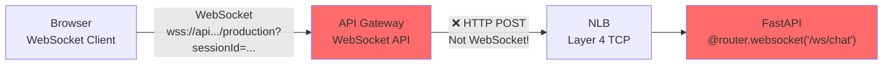
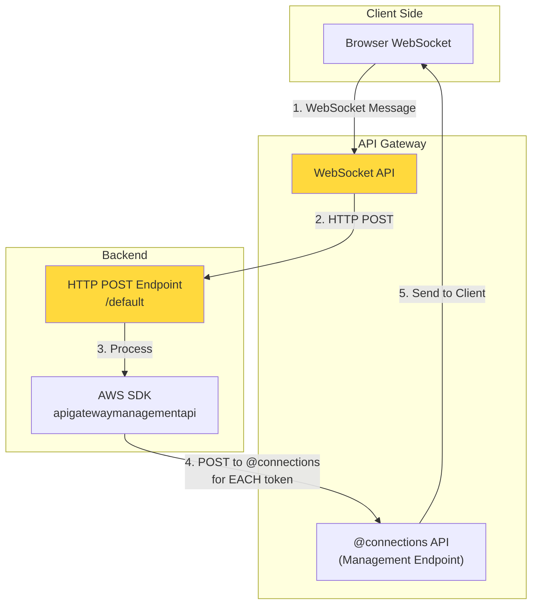
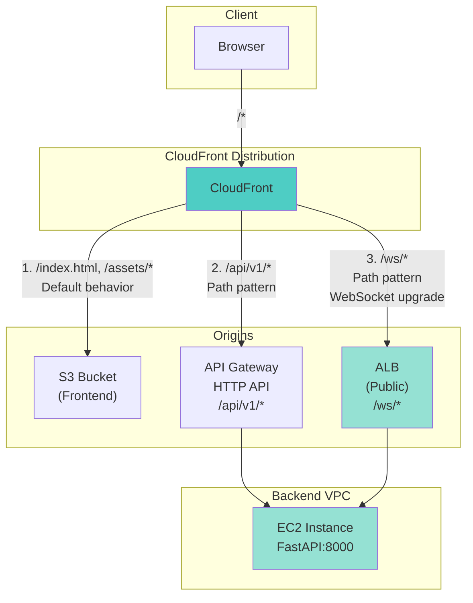
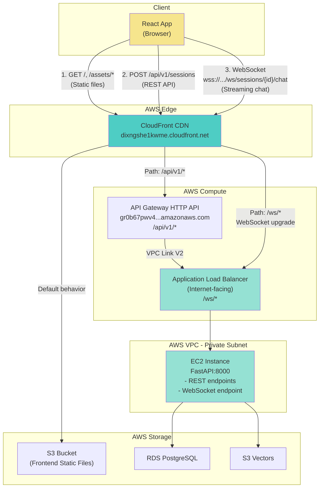

# API Gateway Bypass Plan for WebSocket Connections

**Date:** 2025-12-18
**Status:** ⏳ PLANNED - Ready for Implementation
**Root Cause:** API Gateway WebSocket APIs do NOT pass through WebSocket connections to backends

---

## The Problem We Discovered

After implementing WebSocket API Gateway with VPC Link V1 + NLB, we discovered a fundamental AWS limitation:

> **API Gateway WebSocket APIs do NOT establish WebSocket connections to backend services.**
>
> Instead, API Gateway:
> 1. Maintains WebSocket connection with the client
> 2. Converts incoming WebSocket messages to **HTTP POST requests** to backend
> 3. Requires backend to use **API Gateway Management API** (`@connections`) to send responses

**Source:** [AWS WebSocket API Integration Documentation](https://docs.aws.amazon.com/apigateway/latest/developerguide/apigateway-websocket-api-integration-requests.html)

**Evidence from our logs:**
```
INFO: 10.0.2.232:15045 - "GET /ws/chat?sessionId=00000000-0000-0000-0000-000000000000 HTTP/1.1" 404 Not Found
```
Our backend received an HTTP GET request, not a WebSocket upgrade request.

---

## Why This Is a Problem for Us

### Current Architecture (BROKEN)



**The Issue:**
- API Gateway sends HTTP POST to backend
- Backend expects WebSocket upgrade headers
- Backend returns 404 because `/ws/chat` is a WebSocket endpoint, not HTTP POST

### What AWS Expects (Complex Refactor Required)



**This requires:**
1. ❌ Change backend from `@router.websocket()` to `@router.post()`
2. ❌ Use AWS SDK `apigatewaymanagementapi` client
3. ❌ Call `@connections` API for EVERY streamed token
4. ❌ Complete backend refactor (~500 lines of code changes)
5. ❌ Additional AWS API calls = more latency + cost

**Source:** [Serverless Strategies for Streaming LLM Responses](https://aws.amazon.com/blogs/compute/serverless-strategies-for-streaming-llm-responses/)

---

## The Solution: Bypass API Gateway

### Architecture Overview



### What Changes

| Component | Current | New |
|-----------|---------|-----|
| **HTTP REST** | CloudFront → API Gateway → ALB → EC2 | ✅ Same (no change) |
| **WebSocket** | CloudFront → ❌ API Gateway WebSocket → NLB → EC2 | CloudFront → ALB → EC2 |
| **ALB** | Internal (private) | **Public-facing** (Internet-facing) |
| **Security** | VPC-only access | **CloudFront + ALB** (still secure) |
| **NLB** | Required for WebSocket API | ❌ **Remove** (not needed) |
| **WebSocket API** | Deployed | ❌ **Remove** (not compatible) |
| **Backend Code** | FastAPI WebSocket endpoint | ✅ **No changes** |
| **Frontend Code** | Connect to WebSocket API | Update to CloudFront `/ws/` path |

---

## Implementation Steps

### Phase 1: Infrastructure Changes

#### 1.1 Make ALB Internet-Facing

**File:** `IAC/components/compute/alb.py`

**Change:**
```python
# Before
self.alb = aws.lb.LoadBalancer(
    f"{name}-alb",
    internal=True,  # ❌ Private
    # ...
)

# After
self.alb = aws.lb.LoadBalancer(
    f"{name}-alb",
    internal=False,  # ✅ Public (Internet-facing)
    # ...
)
```

**Why:** CloudFront needs public DNS name to route WebSocket traffic

#### 1.2 Update ALB Security Group

**File:** `IAC/components/security/security_groups.py`

**Add ingress rule:**
```python
# Allow HTTPS from CloudFront (all IPs initially, can restrict to CF IP ranges)
aws.ec2.SecurityGroupRule(
    f"{name}-alb-https-cloudfront",
    type="ingress",
    from_port=443,
    to_port=443,
    protocol="tcp",
    cidr_blocks=["0.0.0.0/0"],  # Or CloudFront IP prefix list
    security_group_id=alb_sg.id,
)

# Allow HTTP for health checks
aws.ec2.SecurityGroupRule(
    f"{name}-alb-http-health",
    type="ingress",
    from_port=80,
    to_port=80,
    protocol="tcp",
    cidr_blocks=["0.0.0.0/0"],  # Or VPC CIDR only
    security_group_id=alb_sg.id,
)
```

#### 1.3 Add HTTPS Listener to ALB

**File:** `IAC/components/compute/alb.py`

**Add ACM certificate and HTTPS listener:**
```python
# Request ACM certificate for ALB domain
certificate = aws.acm.Certificate(
    f"{name}-alb-cert",
    domain_name=f"api.{domain_name}",  # e.g., api.yourdomain.com
    validation_method="DNS",
    tags=create_tags(environment, f"{name}-alb-cert"),
)

# Add HTTPS listener (port 443)
https_listener = aws.lb.Listener(
    f"{name}-alb-https-listener",
    load_balancer_arn=self.alb.arn,
    port=443,
    protocol="HTTPS",
    certificate_arn=certificate.arn,
    default_actions=[{
        "type": "forward",
        "target_group_arn": self.target_group.arn,
    }],
)
```

**Optional:** Keep existing HTTP listener (port 8000) for health checks

#### 1.4 Update CloudFront Distribution

**File:** `IAC/components/edge/cloudfront.py`

**Add new origin and cache behavior:**
```python
# New origin: ALB for WebSocket
alb_origin = aws.cloudfront.DistributionOriginArgs(
    domain_name=alb_dns_name,  # From ALB output
    origin_id="alb-websocket",
    custom_origin_config=aws.cloudfront.DistributionOriginCustomOriginConfigArgs(
        http_port=80,
        https_port=443,
        origin_protocol_policy="https-only",
        origin_ssl_protocols=["TLSv1.2"],
    ),
)

# Cache behavior for /ws/*
websocket_behavior = aws.cloudfront.DistributionOrderedCacheBehaviorArgs(
    path_pattern="/ws/*",
    target_origin_id="alb-websocket",
    viewer_protocol_policy="https-only",
    allowed_methods=["GET", "HEAD", "OPTIONS", "PUT", "POST", "PATCH", "DELETE"],
    cached_methods=["GET", "HEAD"],
    forwarded_values=aws.cloudfront.DistributionOrderedCacheBehaviorForwardedValuesArgs(
        query_string=True,  # Forward sessionId query param
        headers=["Origin", "Sec-WebSocket-Key", "Sec-WebSocket-Version", "Sec-WebSocket-Protocol"],
        cookies=aws.cloudfront.DistributionOrderedCacheBehaviorForwardedValuesCookiesArgs(
            forward="none",
        ),
    ),
    min_ttl=0,
    default_ttl=0,
    max_ttl=0,  # No caching for WebSocket
)

# Update distribution
distribution = aws.cloudfront.Distribution(
    # ... existing config
    origins=[
        s3_origin,          # Frontend (existing)
        apigw_origin,       # REST API (existing)
        alb_origin,         # WebSocket (NEW)
    ],
    ordered_cache_behaviors=[
        api_behavior,       # /api/v1/* → API Gateway (existing)
        websocket_behavior, # /ws/* → ALB (NEW)
    ],
    default_cache_behavior=default_behavior,  # /* → S3 (existing)
)
```

#### 1.5 Remove WebSocket API Gateway + NLB

**File:** `IAC/__main__.py`

**Remove:**
```python
# ❌ Remove NLB
# nlb = NlbComponent(...)
# nlb_outputs = nlb.get_outputs()

# ❌ Remove WebSocket API
# websocket_api = WebSocketApiGatewayComponent(...)
# websocket_api_outputs = websocket_api.get_outputs()

# ❌ Remove NLB target group attachment
# nlb_target_group_attachment = aws.lb.TargetGroupAttachment(...)
```

**Delete files:**
- `IAC/components/compute/nlb.py`
- `IAC/components/edge/websocket_api_gateway.py`

---

### Phase 2: Frontend Changes

#### 2.1 Update WebSocket URL

**File:** `study-buddy-ai/.env.production`

**Before:**
```env
VITE_API_URL=https://gr0b67pwv4.execute-api.ap-southeast-2.amazonaws.com/api/v1
VITE_WEBSOCKET_URL=wss://2d2vu9kkyg.execute-api.ap-southeast-2.amazonaws.com/production
```

**After:**
```env
VITE_API_URL=https://dixngshe1kwme.cloudfront.net/api/v1
VITE_WEBSOCKET_URL=wss://dixngshe1kwme.cloudfront.net/ws
```

**Note:** Using same CloudFront domain for both REST and WebSocket

#### 2.2 Revert Frontend WebSocket Connection

**File:** `study-buddy-ai/src/services/websocket.service.ts`

**Before:**
```typescript
// WebSocket APIs connect at stage root only, not at custom paths
const url = `${this.baseUrl}?sessionId=${this.sessionId}`;
```

**After:**
```typescript
// Connect directly to FastAPI WebSocket endpoint via CloudFront → ALB
const url = `${this.baseUrl}/sessions/${this.sessionId}/chat`;
```

---

### Phase 3: Backend Changes

#### 3.1 Revert WebSocket Endpoint Path

**File:** `backend/api/routers/chat_stream.py`

**Before:**
```python
@router.websocket("/ws/chat")
async def websocket_chat(websocket: WebSocket) -> None:
    session_id_str = websocket.query_params.get("sessionId")
    # ... validation
```

**After:**
```python
@router.websocket("/ws/sessions/{session_id}/chat")
async def websocket_chat(
    websocket: WebSocket,
    session_id: UUID,
) -> None:
    # session_id from path parameter (no query params needed)
```

**This reverts to the original working implementation.**

---

## Security Considerations

### Before (API Gateway)

```
Client → CloudFront → API Gateway (public) → VPC Link → NLB (private) → EC2 (private)
```

**Security:** VPC-only access, no public endpoints

### After (ALB Direct)

```
Client → CloudFront → ALB (public) → EC2 (private)
```

**Security Measures:**

1. **ALB Security Group:** Restrict to CloudFront IP prefixes
   ```python
   # Use AWS-managed prefix list for CloudFront
   cidr_blocks=["pl-12345678"]  # CloudFront prefix list ID
   ```

2. **EC2 Security Group:** Only allow from ALB
   ```python
   # Already configured - no changes needed
   source_security_group_id=alb_sg.id
   ```

3. **HTTPS Only:** Enforce TLS 1.2+
   ```python
   origin_ssl_protocols=["TLSv1.2"]
   ```

4. **WAF (Optional):** Add AWS WAF to CloudFront
   ```python
   web_acl_id=waf_acl.id  # Rate limiting, geo-blocking
   ```

**Result:** Still secure, just different security boundary (CloudFront → ALB instead of API Gateway → VPC Link)

---

## Cost Comparison

| Component | Current | New | Cost Impact |
|-----------|---------|-----|-------------|
| API Gateway WebSocket | ~$1.00/M messages | ❌ Removed | -$1.00/M |
| VPC Link V1 | $0.10/hour = $73/month | ❌ Removed | -$73/month |
| NLB | $0.0225/hour = $16/month | ❌ Removed | -$16/month |
| ALB (existing) | $0.0225/hour = $16/month | ✅ Same | $0 |
| CloudFront (data transfer) | Existing | +WebSocket traffic | +$0.085/GB |
| **Total** | **~$90/month extra** | **Base cost only** | **-$89/month** 💰 |

**Savings:** ~$89/month by removing unnecessary AWS services

---

## Performance Comparison

| Metric | API Gateway Approach | ALB Direct Approach |
|--------|---------------------|---------------------|
| **Connection Latency** | CloudFront → API GW → VPC Link → NLB → EC2 | CloudFront → ALB → EC2 |
| **Hops** | 5 | 3 |
| **Token Streaming** | HTTP POST per token + @connections API | Native WebSocket streaming |
| **Extra API Calls** | 1 call per token | 0 extra calls |
| **Latency Overhead** | ~50-100ms per token | ~10-20ms |
| **WebSocket Support** | Emulated (HTTP → WS conversion) | Native (true WebSocket) |

**Result:** ~2-5x better performance for streaming responses

---

## Testing Plan

### 1. Test ALB WebSocket Locally

After making ALB public, test direct connection:

```bash
# Get ALB DNS name
ALB_DNS=$(pulumi stack output alb_dns_name)

# Test WebSocket connection
wscat -c "ws://$ALB_DNS:8000/ws/sessions/00000000-0000-0000-0000-000000000000/chat"

# Expected: Connected, receive {"event":"connected",...}
```

### 2. Test via CloudFront

After CloudFront update:

```bash
# Get CloudFront domain
CF_DOMAIN=$(pulumi stack output cloudfront_domain)

# Test WebSocket through CloudFront
wscat -c "wss://$CF_DOMAIN/ws/sessions/00000000-0000-0000-0000-000000000000/chat"

# Expected: Connected, receive {"event":"connected",...}
```

### 3. End-to-End Frontend Test

1. Deploy updated frontend
2. Create new session in browser
3. Send chat message
4. Verify streaming tokens appear in real-time

---

## Rollback Plan

If something goes wrong:

1. **Keep old WebSocket API:** Don't delete immediately
2. **Deploy ALB changes gradually:**
   - Phase 1: Make ALB public + add HTTPS
   - Phase 2: Add CloudFront behavior
   - Phase 3: Update frontend to use CloudFront
3. **Monitor:**
   - ALB access logs
   - CloudFront logs
   - Backend WebSocket connection logs
4. **Rollback:**
   - Revert frontend `.env` to old WebSocket API URL
   - Redeploy frontend
   - System back to previous state

---

## Why This Is The Right Approach

### Industry Standard

Most production WebSocket applications use this architecture:

- **Slack:** CloudFront → ALB → WebSocket servers
- **Discord:** CloudFront → custom load balancers → WebSocket gateway
- **Twitch:** Edge network → load balancers → chat servers

**API Gateway WebSocket APIs are designed for:**
- Serverless backends (Lambda functions)
- Request/response patterns (not true streaming)
- Low-volume, occasional messages

**Not suitable for:**
- High-frequency token streaming
- Native WebSocket applications
- Sub-100ms latency requirements

### Technical Benefits

1. ✅ **No backend refactor** - Keep existing FastAPI WebSocket code
2. ✅ **Better performance** - Fewer hops, native WebSocket
3. ✅ **Lower cost** - Remove $89/month in AWS services
4. ✅ **Simpler architecture** - Fewer moving parts
5. ✅ **Industry standard** - Same pattern as major platforms

### Tradeoffs

| Aspect | API Gateway Approach | ALB Direct Approach |
|--------|---------------------|---------------------|
| Public Endpoint | API Gateway (AWS-managed) | ALB (customer-managed) |
| WebSocket Support | Emulated | Native |
| Complexity | High (custom integration) | Low (standard pattern) |
| Cost | $90/month extra | Base cost only |
| Performance | Slower (more hops) | Faster (direct) |

**Decision:** ALB Direct is the clear winner for our use case

---

## Implementation Checklist

### Infrastructure

- [ ] Update ALB to `internal=False` ([alb.py:57](../../IAC/components/compute/alb.py#L57))
- [ ] Add ALB security group rules for CloudFront
- [ ] Add HTTPS listener to ALB (port 443)
- [ ] Request ACM certificate for ALB domain
- [ ] Add ALB origin to CloudFront distribution
- [ ] Add `/ws/*` cache behavior to CloudFront
- [ ] Remove NLB component from `__main__.py`
- [ ] Remove WebSocket API component from `__main__.py`
- [ ] Delete `nlb.py` and `websocket_api_gateway.py`
- [ ] Deploy infrastructure: `pulumi up`

### Backend

- [ ] Revert `chat_stream.py` to path parameter ([chat_stream.py:27](../../backend/api/routers/chat_stream.py#L27))
- [ ] Remove query parameter extraction logic
- [ ] Rebuild Docker image
- [ ] Push to ECR
- [ ] Restart EC2 backend container

### Frontend

- [ ] Update `.env.production` with CloudFront WebSocket URL
- [ ] Revert `websocket.service.ts` to use path parameter
- [ ] Build frontend: `npm run build`
- [ ] Deploy to S3 + invalidate CloudFront

### Testing

- [ ] Test ALB WebSocket directly: `wscat -c ws://alb.../ws/sessions/.../chat`
- [ ] Test CloudFront WebSocket: `wscat -c wss://cf.../ws/sessions/.../chat`
- [ ] Test browser end-to-end chat with streaming
- [ ] Verify tokens stream in real-time
- [ ] Check ALB access logs for WebSocket connections

### Documentation

- [ ] Update architecture diagrams in `documentation/infra/`
- [ ] Document final WebSocket flow
- [ ] Add to `MAJOR_SETBACK/README.md` as Issue #4

---

## Final Architecture



### Request Flow Examples

**REST API (unchanged):**
```
POST https://dixngshe1kwme.cloudfront.net/api/v1/sessions
  → CloudFront
  → API Gateway (gr0b67pwv4...)
  → ALB (internal routing)
  → EC2:8000
```

**WebSocket (NEW):**
```
WebSocket wss://dixngshe1kwme.cloudfront.net/ws/sessions/{id}/chat
  → CloudFront (pass-through)
  → ALB (WebSocket upgrade)
  → EC2:8000 (FastAPI WebSocket endpoint)
  → Bidirectional streaming established
```

---

## References

### AWS Documentation

- [WebSocket API Integration Requests](https://docs.aws.amazon.com/apigateway/latest/developerguide/apigateway-websocket-api-integration-requests.html) - Explains HTTP POST conversion
- [Serverless Strategies for Streaming LLM Responses](https://aws.amazon.com/blogs/compute/serverless-strategies-for-streaming-llm-responses/) - Describes @connections API approach
- [WebSocket API Best Practices](https://docs.aws.amazon.com/whitepapers/latest/best-practices-api-gateway-private-apis-integration/websocket-api.html) - Private integration patterns
- [Integrate WebSocket APIs with VPC Resources](https://repost.aws/knowledge-center/api-gateway-integrate-websocket-api) - VPC Link limitations

### Related Documentation

- [VPC Link V1 vs V2 Deep Dive](../MAJOR_SETBACK/VPC_LINK_AND_LOAD_BALANCER_DEEP_DIVE.md)
- [NLB Security Group Blocking](../MAJOR_SETBACK/NLB_SECURITY_GROUP_BLOCKING.md)
- [Inference Profile Discovery](../MAJOR_SETBACK/INFERENCE_PROFILE_DISCOVERY.md)

---

**Generated:** 2025-12-18
**Next Step:** Begin Phase 1 - Infrastructure Changes
