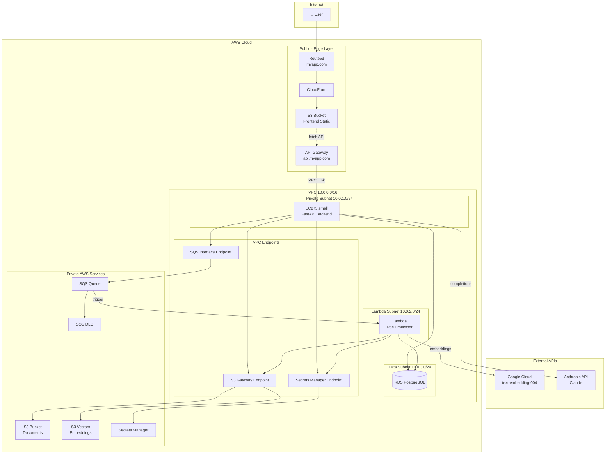

# Cloud Architecture

AWS infrastructure for the Legal Search RAG application.

## Overview

Three-tier architecture with edge services, compute layer, and managed data stores.

## Architecture Diagram

## Component Summary

| Layer | Subnet | Service | Purpose |
|-------|--------|---------|---------|
| Public | - | Route53 | DNS routing |
| Public | - | CloudFront | CDN for frontend |
| Public | - | S3 (Frontend) | Static assets |
| Public | - | API Gateway | API routing via VPC Link |
| VPC | Private | EC2 | FastAPI backend |
| VPC | Lambda | Lambda | Document processing |
| VPC | Data | RDS PostgreSQL | Sessions, jobs, metadata |
| VPC | Endpoints | S3 Gateway | Private S3 access |
| VPC | Endpoints | SQS Interface | Private SQS access |
| VPC | Endpoints | Secrets Manager | Private secrets access |
| Private AWS | - | S3 (Documents) | Uploaded PDFs |
| Private AWS | - | S3 Vectors | Vector embeddings |
| Private AWS | - | SQS + DLQ | Job queue |
| Private AWS | - | Secrets Manager | API keys |

## Security Groups

| Security Group | Inbound | Outbound |
|----------------|---------|----------|
| sg-backend | 8000 from API Gateway VPC Link | RDS, Endpoints, Anthropic API |
| sg-lambda | SQS trigger (AWS managed) | RDS, Endpoints, Google API |
| sg-database | 5432 from sg-backend, sg-lambda | None |
| sg-endpoints | 443 from sg-backend, sg-lambda | AWS Services |
