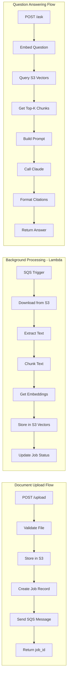

# Data Flow Architecture

Component-level data flows for document upload, processing, and query operations.

## Flow Diagram

## Flow Descriptions

### Document Upload Flow

1. **POST /upload** - User submits document via API
2. **Validate File** - Check file type, size limits
3. **Store in S3** - Upload to documents bucket
4. **Create Job Record** - Insert pending job in RDS
5. **Send SQS Message** - Queue processing task
6. **Return job_id** - Client receives tracking ID

### Background Processing Flow

1. **SQS Trigger** - Lambda invoked by queue message
2. **Download from S3** - Fetch document from bucket
3. **Extract Text** - Parse PDF content
4. **Chunk Text** - Split into semantic chunks
5. **Get Embeddings** - Call Google text-embedding-004 (3072 dims)
6. **Store in S3 Vectors** - Index vectors for retrieval
7. **Update Job Status** - Mark job complete in RDS

### Question Answering Flow

1. **POST /ask** - User submits question
2. **Embed Question** - Convert query to vector via Google Embeddings
3. **Query S3 Vectors** - Similarity search
4. **Get Top-K Chunks** - Retrieve relevant context
5. **Build Prompt** - Construct LLM prompt with context
6. **Call Claude** - Generate answer
7. **Format Citations** - Add source references
8. **Return Answer** - Respond with cited answer
