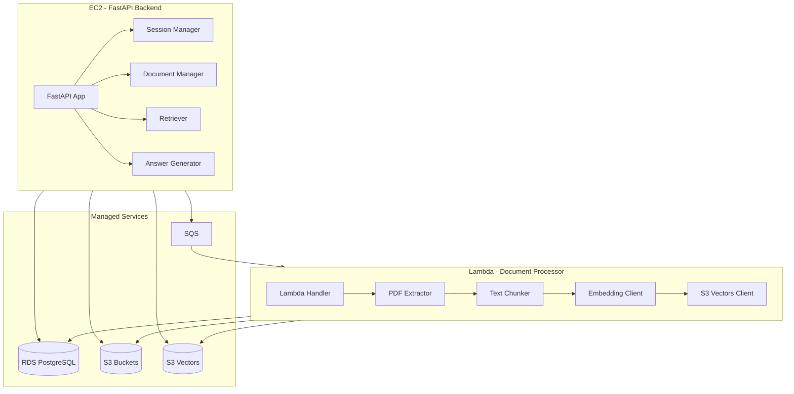

# Service Architecture

Internal service components for EC2 backend and Lambda processor.

## Service Diagram

## EC2 Backend Components

| Component | Responsibility |
|-----------|----------------|
| FastAPI App | HTTP routing, request handling |
| Session Manager | Session CRUD, state management |
| Document Manager | Upload handling, job creation |
| Retriever | Vector search, context retrieval |
| Answer Generator | Prompt building, LLM calls, citations |

## Lambda Processor Components

| Component | Responsibility |
|-----------|----------------|
| Handler | SQS event parsing, orchestration |
| PDF Extractor | Text extraction from documents |
| Text Chunker | Semantic chunking |
| Embedding Client | Google text-embedding-004 API calls |
| S3 Vectors Client | Vector indexing and storage |

## Managed Services

| Service | Purpose |
|---------|---------|
| RDS PostgreSQL | Persistent data (sessions, jobs, metadata) |
| S3 Buckets | Document and static file storage |
| S3 Vectors | Vector embedding storage and retrieval |
| SQS | Async job queue with DLQ |
