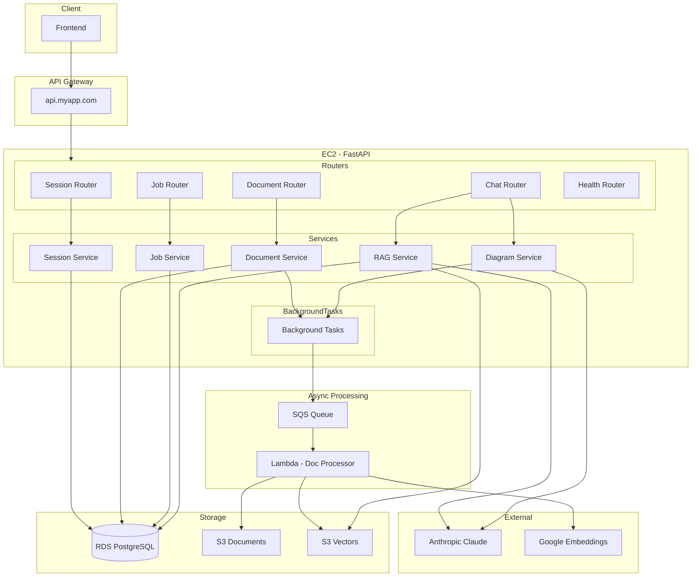
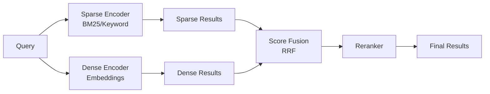

# API Specification

Backend API for the Legal Search RAG application. All endpoints invoked through API Gateway.

## Architecture Overview



## API Endpoints

All routes prefixed with `/api/v1`.

### Session Management

| Method | Endpoint | Purpose | Response |
|--------|----------|---------|----------|
| POST | `/sessions` | Create new session | `201` Session object |
| GET | `/sessions` | List all sessions | `200` Session[] |
| GET | `/sessions/{id}` | Get session details | `200` Session |
| DELETE | `/sessions/{id}` | Delete session + all associated data | `204` No content |

### Document Management

| Method | Endpoint | Purpose | Response |
|--------|----------|---------|----------|
| POST | `/sessions/{id}/documents` | Upload multiple docs (non-blocking) | `202` Job object |
| GET | `/sessions/{id}/documents` | List docs in session | `200` Document[] |
| DELETE | `/sessions/{id}/documents/{doc_id}` | Delete single doc + vectors | `204` No content |

### Jobs

| Method | Endpoint | Purpose | Response |
|--------|----------|---------|----------|
| GET | `/jobs/{id}` | Get job status | `200` Job object |

**Job States:** `queued` → `processing` → `completed` | `failed`

### Chat / RAG

| Method | Endpoint | Purpose | Response |
|--------|----------|---------|----------|
| POST | `/sessions/{id}/chat` | Streaming answer + citations | `200` SSE stream |
| POST | `/sessions/{id}/diagram` | Streaming answer + Mermaid | `200` SSE stream |
| GET | `/sessions/{id}/chat/history` | Get chat history | `200` Message[] |
| DELETE | `/sessions/{id}/chat/history` | Clear history | `204` No content |

### System

| Method | Endpoint | Purpose | Response |
|--------|----------|---------|----------|
| GET | `/health` | Health check for ALB | `200` Health status |

## Constraints

| Constraint | Value |
|------------|-------|
| Max file size | 10 MB per file |
| Bulk upload | Multiple files per request |
| Streaming | SSE for `/chat` and `/diagram` |
| Blocking operations | Background tasks (upload, diagram) |

## Cascade Delete Behavior

```
DELETE /sessions/{id}
    ├── Delete chat history (RDS)
    ├── Delete document metadata (RDS)
    ├── Delete vectors (S3 Vectors)
    ├── Delete source files (S3 Documents)
    └── Delete session record (RDS)
```

---

## Document Ingestion Patterns

### Async Job Queue

- Non-blocking HTTP requests for uploads
- SQS queue for processing pipeline
- Job status polling via `/jobs/{id}`
- Background tasks for expensive operations

### Idempotent Processing

- Same document uploaded twice = same result
- Content hashing to detect duplicates before embedding
- Skip re-embedding for unchanged content
- Deterministic chunk IDs based on content hash

### Metadata Extraction

- Metadata storage separate from vector embeddings
- Extract: title, author, date, page count, file type
- Store in RDS for fast filtering
- Link to vectors via document ID

### Version Tracking

- Track document versions when source content updates
- Content hash comparison for change detection
- Re-embed only when content actually changes
- Maintain version history for audit trail

---

## Chunking Strategy

### Recursive Character Splitting

- Default strategy for general text
- Configurable chunk size and overlap
- Respects sentence and paragraph boundaries
- Fallback when semantic chunking fails

### Semantic Chunking

- Maintains thought coherence within chunks
- Uses embedding similarity to find natural breaks
- Better retrieval relevance than fixed-size
- Higher compute cost during ingestion

### Parent-Document Retrieval

- Store small chunks for precise matching
- Retrieve parent context for LLM consumption
- Balance: small chunks for search, large for context
- Maintain parent-child relationships in metadata

### Overlapping Windows

- Prevent information loss at chunk boundaries
- Configurable overlap percentage (10-20% typical)
- Ensures context continuity across chunks
- Trade-off: more chunks = more storage/cost

### Document-Type-Specific Chunkers

| Document Type | Strategy |
|---------------|----------|
| Markdown | Split by headers, preserve hierarchy |
| Code | Respect function/class boundaries |
| Tables | Keep rows together, add header context |
| Legal docs | Split by sections, preserve citations |
| General text | Recursive character with semantic fallback |

---

## Embedding Pipeline

### Batch Embedding

- Batch API calls to reduce overhead
- Configurable batch size based on rate limits
- Retry logic with exponential backoff
- Queue management for large document sets

### Model Selection

- Google `text-embedding-004` as primary
- Domain-specific models for specialized content
- Dimension consideration (storage vs quality)
- Benchmark against golden dataset before switching

### Dimension Reduction

- Apply when storage/latency constrained
- PCA or learned projection matrices
- Trade-off: smaller dimensions = faster search, lower accuracy
- Test quality impact before production use

### Embedding Versioning

- Track which model version created each embedding
- Model change = flag for full re-embedding
- Gradual migration strategy for large corpora
- A/B testing between embedding versions

---

## Retrieval Architecture

### Hybrid Search Pattern



**Components:**

| Component | Purpose |
|-----------|---------|
| Sparse retrieval | BM25/keyword matching for exact terms |
| Dense retrieval | Embedding similarity for semantic meaning |
| Score fusion | Reciprocal Rank Fusion (RRF) to combine |
| Query expansion | Synonyms/related terms for better recall |
| Metadata filtering | Pre-filter by date, category before vector search |

### Reranking Layer

- Cross-encoder reranking after initial retrieval
- More accurate but slower than bi-encoder
- Top-K retrieval (e.g., 20) → Rerank → Top-N (e.g., 5)
- Relevance threshold cutoffs (return nothing vs bad results)

### Result Diversity

- Maximum Marginal Relevance (MMR) scoring
- Avoid redundant chunks from same section
- Source deduplication when multiple chunks match
- Balance relevance with diversity

### Context Assembly

| Step | Purpose |
|------|---------|
| Token budget | Manage tokens per model context window |
| Priority ordering | Most relevant chunks first |
| History compression | Summarize old turns for multi-turn |
| Template assembly | System prompt + context + history + query |

---

## Quality & Safety

### Hallucination Prevention

| Technique | Implementation |
|-----------|----------------|
| Confidence scoring | Threshold on retrieval similarity scores |
| "I don't know" fallback | Trigger when no chunks score above threshold |
| Citation requirement | Force grounding in prompt instructions |
| Output validation | Verify claims exist in retrieved sources |

### Prompt Injection Defense

| Layer | Defense |
|-------|---------|
| Input sanitization | Filter known injection patterns |
| Instruction hierarchy | System prompt > retrieved context > user query |
| Output filtering | Detect leaked system prompts |
| Rate limiting | Per user/session throttling |

### Evaluation Pipeline

**Golden Dataset:**
- Curated question-answer-context triples
- Representative of real usage patterns
- Updated as system evolves
- Human-validated ground truth

**Metrics:**

| Metric | Measures |
|--------|----------|
| Faithfulness | Is answer grounded in retrieved context? |
| Relevance | Does answer address the question? |
| Precision | % of retrieved chunks that are relevant |
| Recall | % of relevant chunks that were retrieved |
| MRR | Mean Reciprocal Rank of first relevant result |

**Automation:**
- Regression testing on every deployment
- A/B testing framework for retrieval changes
- Automated scoring with LLM-as-judge
- Alert on metric degradation

---

## Observability

### Logging Strategy

| Log Type | Content |
|----------|---------|
| Request tracing | Correlation IDs across all services |
| Query logging | Hashed queries + retrieval results |
| Latency breakdown | Time per pipeline stage |
| Token tracking | Usage per request (embedding + LLM) |

### Monitoring Dashboards

**Key Metrics:**

| Metric | Purpose |
|--------|---------|
| Retrieval hit rate | Queries with good matches vs poor |
| Response latency | p50, p95, p99 percentiles |
| User feedback correlation | Thumbs up/down vs retrieval scores |
| Cost tracking | Embedding + LLM API costs |
| Error rates | By endpoint, by error type |

**Alerts:**
- Latency exceeds SLA threshold
- Error rate spike
- Retrieval hit rate drops
- Cost anomaly detection
