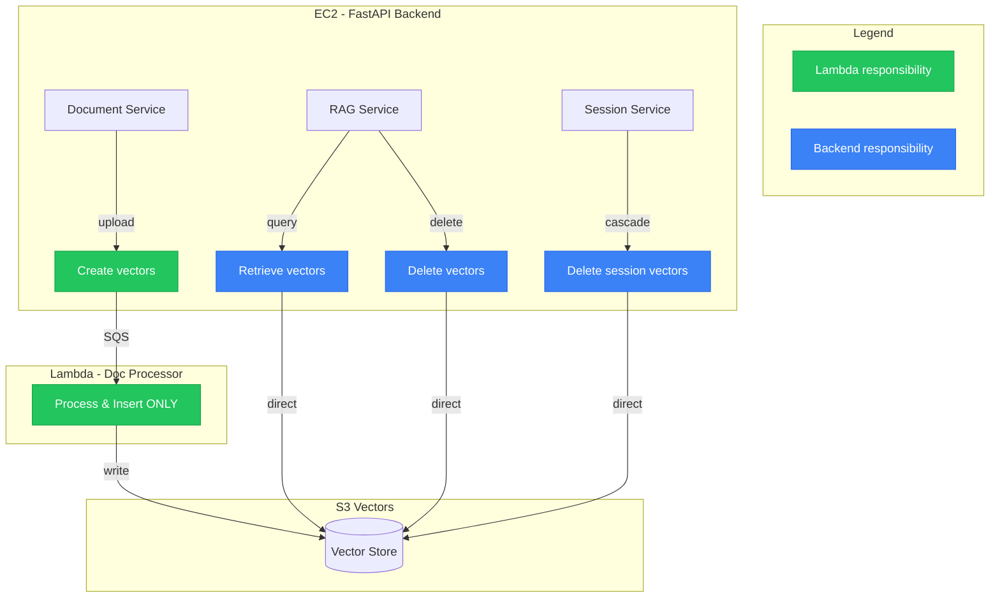
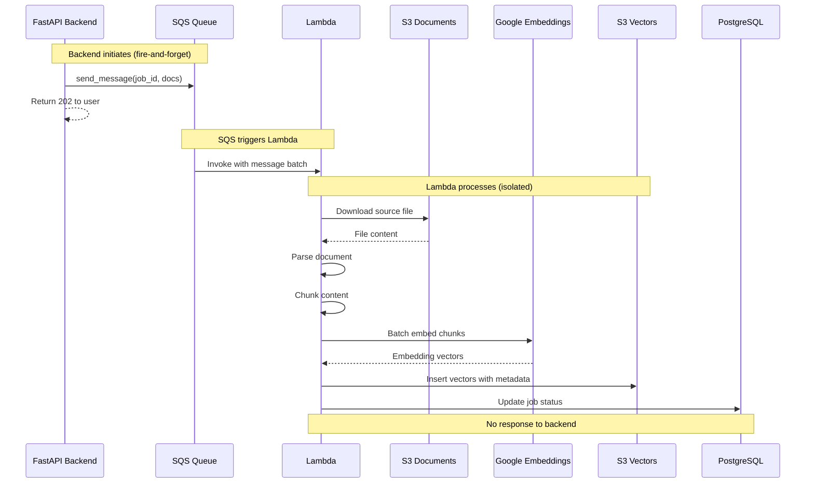
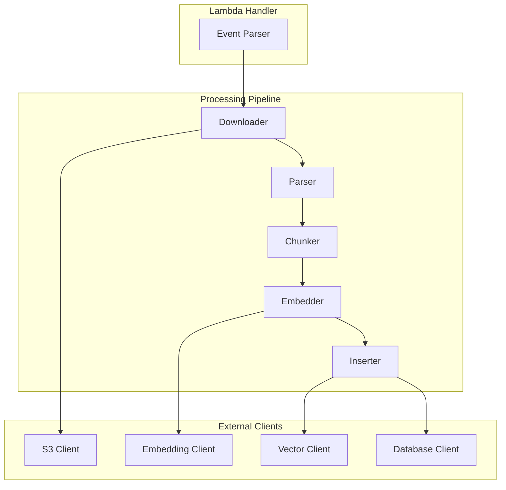
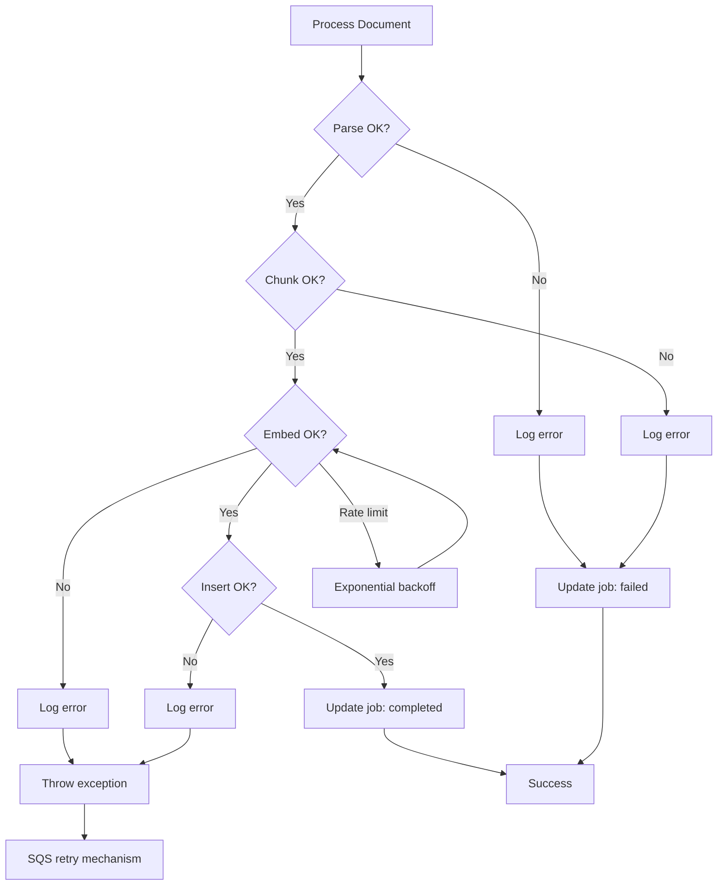
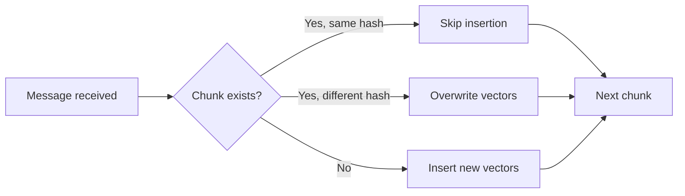

# Lambda Document Processor Architecture

Single-purpose Lambda for document processing and vector insertion.

## Responsibility Boundary



**Lambda scope:** Process documents → Generate embeddings → Insert vectors

**Backend scope:** Query, delete, cascade delete, all other vector operations

## Why This Separation?

| Concern | Lambda | Backend |
|---------|--------|---------|
| Document parsing | Yes | No |
| Chunking | Yes | No |
| Embedding generation | Yes | No |
| Vector insertion | Yes | No |
| Vector querying | No | Yes |
| Vector deletion | No | Yes |
| Session management | No | Yes |
| User-facing API | No | Yes |

**Rationale:**
- Lambda optimized for CPU/memory-intensive parsing
- Backend handles real-time user requests
- Clear ownership prevents coupling
- Easier to scale independently

## Communication Flow



## Lambda Internal Architecture



## Pipeline Stages

### 1. Event Parser

Extracts job details from SQS event:

```python
# Input: SQS event with batch of messages
{
    "Records": [
        {
            "body": {
                "job_id": "uuid",
                "session_id": "uuid",
                "documents": [...]
            }
        }
    ]
}
```

### 2. Downloader

- Fetches file from S3 Documents bucket
- Validates file exists and matches expected hash
- Streams large files to avoid memory issues

### 3. Parser

- Extracts text from file based on type
- Supported formats: PDF, DOCX, TXT, MD
- Preserves structure metadata (pages, sections)

### 4. Chunker

- Applies chunking strategy based on document type
- Generates deterministic chunk IDs (content hash)
- Preserves parent-child relationships

### 5. Embedder

- Batches chunks for efficient API calls
- Calls Google text-embedding-004
- Handles rate limits with exponential backoff

### 6. Inserter

- Writes vectors to S3 Vectors with metadata
- Updates document record in RDS
- Updates job status (completed/failed)

## Vector Metadata Schema

Each vector stored with metadata for retrieval:

```json
{
  "vector_id": "chunk_content_hash",
  "session_id": "uuid",
  "document_id": "uuid",
  "chunk_index": 0,
  "content": "chunk text content",
  "metadata": {
    "page_number": 1,
    "section": "Introduction",
    "parent_chunk_id": "optional",
    "source_file": "document.pdf"
  },
  "embedding": [0.1, 0.2, ...]
}
```

## Error Handling



**Error categories:**

| Error Type | Retryable | Action |
|------------|-----------|--------|
| Parse failure | No | Mark job failed, skip |
| Chunk failure | No | Mark job failed, skip |
| Embedding API rate limit | Yes | Exponential backoff |
| Embedding API error | Yes | Throw, let SQS retry |
| Vector insert error | Yes | Throw, let SQS retry |
| S3 download error | Yes | Throw, let SQS retry |

## Lambda Configuration

| Setting | Value | Rationale |
|---------|-------|-----------|
| Runtime | Python 3.12 | Latest stable |
| Memory | 1024 MB | PDF parsing needs RAM |
| Timeout | 50 seconds | Allows 6 retries in visibility window |
| Reserved concurrency | 10 | Prevent embedding API overload |
| Batch size | 10 | Messages per invocation |

## IAM Permissions

```json
{
  "Version": "2012-10-17",
  "Statement": [
    {
      "Effect": "Allow",
      "Action": ["s3:GetObject"],
      "Resource": "arn:aws:s3:::docs-bucket/sessions/*"
    },
    {
      "Effect": "Allow",
      "Action": ["s3:PutObject"],
      "Resource": "arn:aws:s3:::vectors-bucket/sessions/*"
    },
    {
      "Effect": "Allow",
      "Action": [
        "sqs:ReceiveMessage",
        "sqs:DeleteMessage",
        "sqs:GetQueueAttributes"
      ],
      "Resource": "arn:aws:sqs:{region}:{account}:doc-processing-queue"
    },
    {
      "Effect": "Allow",
      "Action": ["secretsmanager:GetSecretValue"],
      "Resource": "arn:aws:secretsmanager:{region}:{account}:secret:api-keys-*"
    },
    {
      "Effect": "Allow",
      "Action": [
        "rds-db:connect"
      ],
      "Resource": "arn:aws:rds-db:{region}:{account}:dbuser:*/lambda_user"
    }
  ]
}
```

## What Lambda Does NOT Do

| Operation | Why Not |
|-----------|---------|
| Vector retrieval | Real-time, user-facing → Backend |
| Vector deletion | Tied to session lifecycle → Backend |
| Chat history | User context → Backend |
| Session management | User-facing API → Backend |
| Health checks | ALB target → Backend |
| Streaming responses | SSE to client → Backend |

## Idempotency

Lambda must handle duplicate messages (at-least-once delivery):

1. **Check before insert:** Query vector store for existing chunk_id
2. **Skip if exists:** Same content hash = same vectors
3. **Upsert pattern:** Overwrite if re-processing needed
4. **Job status:** Only update if current status allows transition


