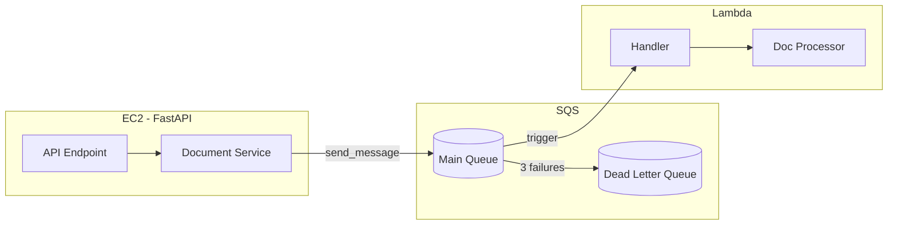
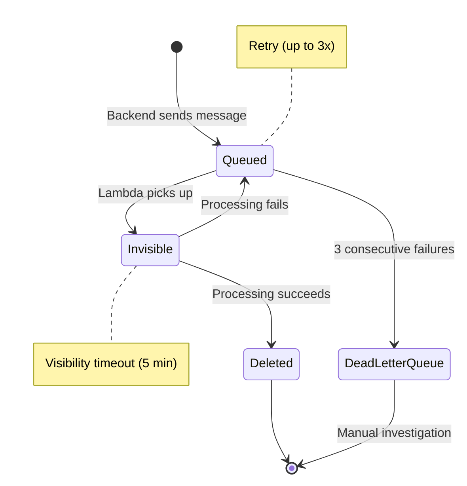
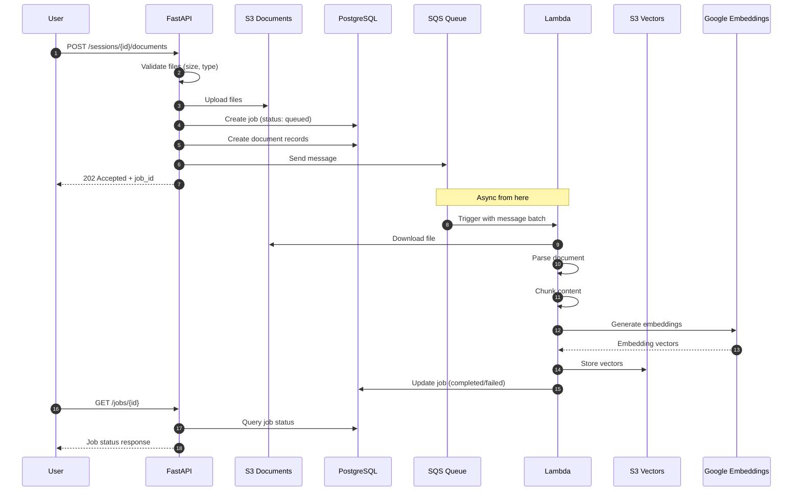
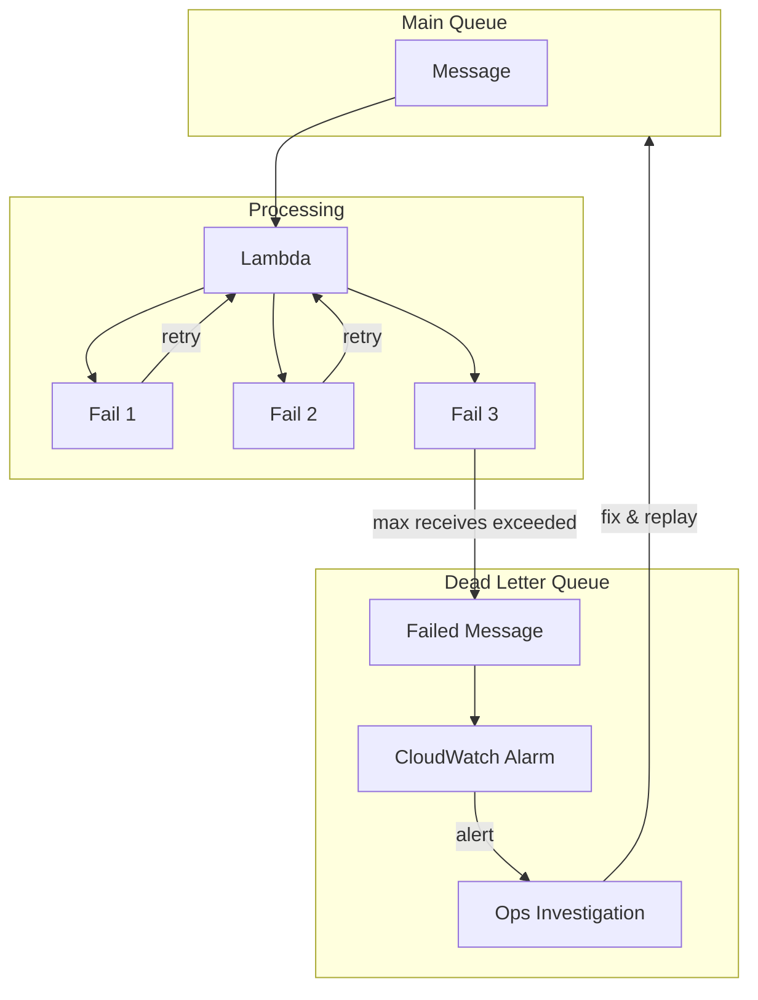

# SQS Queue Architecture

Async document processing pipeline using AWS SQS.

## Overview

SQS (Simple Queue Service) decouples the backend from document processing. The backend queues tasks and returns immediately; Lambda processes asynchronously.



## Why SQS?

| Problem | SQS Solution |
|---------|--------------|
| User waits for slow operation | Backend queues task, returns 202 immediately |
| Lambda is busy | Messages wait in queue until processed |
| Lambda crashes mid-task | Message reappears after visibility timeout |
| Poison messages | Dead Letter Queue (DLQ) catches repeated failures |

## Message Lifecycle



## Queue Configuration

| Setting | Value | Rationale |
|---------|-------|-----------|
| Visibility Timeout | 300s (5 min) | 6x Lambda timeout (50s) |
| Message Retention | 4 days | Time to fix issues before loss |
| Receive Wait Time | 20s | Long polling reduces costs |
| Max Receive Count | 3 | Retries before sending to DLQ |
| Delay Seconds | 0 | Process immediately |

## Message Schema

**Document Processing Message:**

```json
{
  "job_id": "uuid",
  "session_id": "uuid",
  "documents": [
    {
      "document_id": "uuid",
      "s3_key": "sessions/{session_id}/docs/{filename}",
      "content_hash": "sha256",
      "file_type": "pdf"
    }
  ],
  "created_at": "ISO8601 timestamp"
}
```

**Message Attributes:**

| Attribute | Type | Purpose |
|-----------|------|---------|
| JobType | String | `document_ingestion` or `diagram_generation` |
| Priority | String | `high`, `normal`, `low` |

## Backend → SQS (Send)

The backend sends messages via boto3 through the VPC endpoint (no internet):

```python
# Pseudocode - actual implementation will follow project patterns
sqs_client.send_message(
    QueueUrl=queue_url,
    MessageBody=json.dumps({
        "job_id": job_id,
        "session_id": session_id,
        "documents": [{"document_id": doc_id, "s3_key": key, ...}]
    }),
    MessageAttributes={
        "JobType": {"DataType": "String", "StringValue": "document_ingestion"}
    }
)
```

## SQS → Lambda (Receive)

Lambda is triggered automatically by SQS event source mapping:

```python
# Lambda handler receives batch of messages
def handler(event, context):
    for record in event["Records"]:
        body = json.loads(record["body"])

        job_id = body["job_id"]
        session_id = body["session_id"]

        for doc in body["documents"]:
            process_document(doc["s3_key"], doc["document_id"])

        update_job_status(job_id, "completed")
        # Success = SQS auto-deletes message
        # Exception = message returns to queue for retry
```

## IAM Permissions

**Backend (EC2) Policy:**

```json
{
  "Effect": "Allow",
  "Action": ["sqs:SendMessage"],
  "Resource": "arn:aws:sqs:{region}:{account}:doc-processing-queue"
}
```

**Lambda Policy:**

```json
{
  "Effect": "Allow",
  "Action": [
    "sqs:ReceiveMessage",
    "sqs:DeleteMessage",
    "sqs:GetQueueAttributes"
  ],
  "Resource": "arn:aws:sqs:{region}:{account}:doc-processing-queue"
}
```

## End-to-End Flow



## Error Handling

| Scenario | Handling |
|----------|----------|
| Lambda timeout | Message returns to queue, retry |
| Embedding API failure | Exponential backoff, then DLQ |
| Invalid file format | Mark job failed, no retry |
| S3 file missing | Mark job failed, log error |
| 3 consecutive failures | Move to DLQ, alert ops |

## Dead Letter Queue



**DLQ Configuration:**

- Same message schema as main queue
- 14-day retention for debugging
- CloudWatch alarm on DLQ depth > 0
- Manual replay after fixing issues
